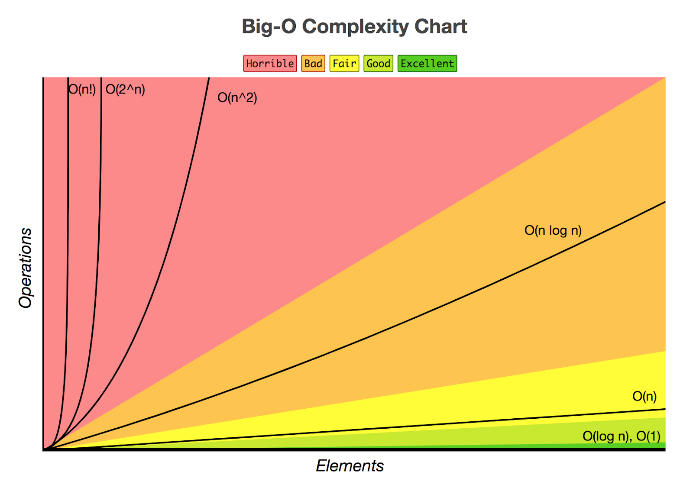
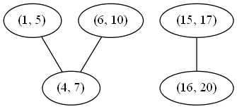

class: title

## JavaScript Interview Part II 
### Practical Assessment Questions
### .oc-blue-4.ri-twitter-fill[] AlexKorzhikov

.photo[
  
]

.right.bottom[
  ### 8 of July, 2020
]

---

# Today's Agenda

<style>
  img[alt=sort] { width: 326px;}
</style>

.right-image[
  
]

- About Interviews
- Introduction to Algorithms
  - Complexity
  - Example `merge()`
- About the Course
- Example `find() & promisify()`

### Goals

- Dive into JavaScript interview assignments and questions
- Practice with coding exercises

---

background-image: linear-gradient(150deg,rgb(142, 81, 208),rgb(174, 132, 207)), url(static/t0.gif)

# About Me

.right-image[
  
]

<style>
  h3 span {
    vertical-align: -3px;
  }
</style>

### .oc-blue-4.ri-twitter-fill[] `AlexKorzhikov`
### JavaScript, DevOps
### .oc-yellow-9[@ING]
### @Otus

### .oc-red-6.ri-mail-line[] .oc-teal-9.ri-medium-fill[] .ri-github-fill[] **korzio** 

### .center[👋]

---

# Reason

> Practical assessment questions are widely used in the interview process in all kinds of companies around the world

- pre-screening
- on-side

> However algorithms are not the most needed and frequent exercises in profession,
> Practical questions helps to understand candidate experience in:

- task solving,
- confidence in writing code,
- knowledge of a programming language,
- algorithm thinking.

---

# Conditions

.right-image[
  
]

- Limited Time - *30 min - 45 min*
- Test Cases - *logs, hidden*
- Online Editor - `console.log()`
- Algorithm Complexity - `O(n)`

---

# Complexity

### Algorithm is a set of steps to accomplish a task 

- Time complexity – how runtime operations grows
- Space complexity – how amount of memory grows 

.right-code[
### Big-O notation is a relative representation of the complexity of an algorithm
  
- `O(1)`
- `O(log n)`
- `O(n)`
- `O(n^2)`
- `O(2^n)`
]

.half-image[]

---

# Question

```js
function sum (nums) {
  let result = 0

  for (let i = 0; i < nums.length; i++) {
    result += nums[i]
  }

  return result
}
```

- Time & space complexity?

---

# Merge (Sort)

### Implement the `merge` function to join two sorted arrays into one

```javascript
const arr1 = [1, 3, 5]
const arr2 = [2, 4, 8]

function merge() {
  // ... ?
}

merge(arr1, arr2) // => [1, 2, 3, 4, 5, 8]
```

- Time & space complexity?

---

# [Merge Intervals](https://jsbin.com/ziniyiweca/3/watch?html,js,console)

> Given a collection of intervals, merge all overlapping intervals

### Example 1:

```bash
Input: [[1,3],[2,6],[8,10],[15,18]]
Output: [[1,6],[8,10],[15,18]]
```

> Explanation: Since intervals [1,3] and [2,6] overlaps, merge them into [1,6]  

### Example 2:

```bash
Input: [[1,4],[4,5]]
Output: [[1,5]]
```

> Explanation: Intervals [1,4] and [4,5] are considered overlapping  

---

# First Thoughts

- Focus on Solution - *make it work, make it right, make it fast*
- Naive Approach

- Problem - state changes during the algorithm run

- Recursive

.right-image[]

- Sort by starting point
- Functional programming style (immutability)

---

# Make It Work

```javascript
// merge-intervals.js
/**
 * @param {number[][]} intervals
 * @return {number[][]}
 */
function merge(intervals) {
  // todo sort
  // todo check edge cases
  return intervals.reduce((memo, interval) => {
    const previousInterval = memo[memo.length]
    
    // need recursion?
    if (isOverlap(previousInterval, interval)) {
      return memo
    }
    
    return memo.concat(interval)
  }, [])
}
```

---

# isOverlap()

```javascript
// merge-intervals.js
/**
 * isOverlap 
 * @description return true if a, b intervals overlap
 * @param {number[]} a
 * @param {number[]} b
 * @return {boolean}
 */
function isOverlap(a, b) {
  const [aStart, aEnd] = a
  const [bStart, bEnd] = b
  
  return bEnd < aEnd
}
```

---

# Testing & Debugging

- Manual Calculations
- Final Glance At The Code

```javascript
const assert = require('assert')
assert.deepStrictEqual([1], [1])

// Explanation: Since intervals [1,3] and [2,6] overlaps, merge them into [1,6]
assert.deepStrictEqual(merge([[1,3],[2,6],[8,10],[15,18]]), [[1,6],[8,10],[15,18]])

// Explanation: Intervals [1,4] and [4,5] are considered overlapping
assert.deepStrictEqual(merge([[1,4],[4,5]]), [[1,5]])

console.log('Ok')
```

---

# Complexity

### Time Complexity `O(n log(n))`

> Other than the sort invocation, we do a simple linear scan of the list, so the runtime is dominated by the O(n log(n)) complexity of sorting

### Space Complexity `O(1)` or `O(n)`

> If we can sort intervals in place, we do not need more than constant additional space. Otherwise, we must allocate linear space to store a copy of intervals and sort that.

---

# [Alternative Solutions](https://leetcode.com/problems/merge-intervals/)

.right-image[]

### Time complexity `O(n^2)`

> Building the graph costs `O(V + E) = O(V) + O(E) = O(n) + O(n^2) = O(n^2)` time, as in the worst case all intervals are mutually overlapping.

> Traversing the graph has the same cost (although it might appear higher at first) because our visited set guarantees that each node will be visited exactly once. Finally, because each node is part of exactly one component, the merge step costs `O(V) = O(n)` time

### Space complexity `O(n^2)`

> As previously mentioned, in the worst case, all intervals are mutually overlapping, so there will be an edge for every pair of intervals. Therefore, the memory footprint is quadratic in the input size

---

class: title

## .center[Q&A]
### .center[Merge Intervals --> About the Course]

---

background-image: linear-gradient(150deg,rgb(142, 81, 208),rgb(174, 132, 207)), url(static/t0.gif)

# About the Course +

- Alex Korzhikov *.oc-blue-4.ri-twitter-fill[] AlexKorzhikov* `JavaScript DevOps`
- Mikhail Kuznetcov *.oc-blue-4.ri-twitter-fill[] shershen08* `Team Lead FullStack`

|  |  |  |
|:--:|:--:|:--:|

- 12th July, Sundays & Saturdays, 10:00 AM (10:00) Los Angeles Time
- 24 Lessons as Webinars
- 1.5 Hours per Lesson
- 2 weeks Project Work
- 4 Months Overall (including project work, 2 weeks pause)
- [Download Full Curriculum](https://0cb745d2-f0f2-4e5b-9278-74203dc7fa00.filesusr.com/ugd/7a2068_6b56803efefb4cf39db1d0b559a75b0f.pdf)

---

class: title

## .center[Q&A]
### .center[About the Course --> find & promisify]

---

# Find Duplicate

> Array nums contains n + 1 integers where each integer is between 1 and n (inclusive).
> There is one duplicate number in array, find the duplicate one.
> There is only one duplicated number but it could be repeated more than once.

### Example:

```bash
[3,1,2,1,4] => 1
[3,6,1,2,6,4] => 6
```

---

# Make It Work

```javascript
/**
 * Time: O(n logn)
 * Space: O(1)
 */
function findDuplicated(nums) {
  nums.sort((a, b) => a - b)

  for(let i = 1; i < nums.length; i++) {
    if(nums[i] === nums[i - 1]) {
      return nums[i]
    }
  }
}
```

---

# Make It Right

```javascript
/**
 * Time: O(n)
 * Space: O(n)
 */
function findDuplicated(nums) {
  let hash = {}

  for(let i = 0; i < nums.length; i++) {
    if(hash[nums[i]] === true) {
      return nums[i]
    } else {
      hash[nums[i]] = true
    }
  }
}
```

---

# Make It Fast (Compact)

```javascript
/**
 * Time: O(n)
 * Space: O(1)
 */
function findDuplicated (nums) {
  for (let i = 0; i < nums.length; i++) {
    let value = Math.abs(nums[i])
    let index = value - 1

    if (nums[index] < 0) {
      return value
    } else {
      nums[index] = -nums[index]
    }
  }
}
```

---

# Promisification

> Implement `promisify()` function to modify callback based API function into promise based one

```javascript
const fs = require('fs')
const util = require('util')
const readFile = util.promisify(fs.readFile)

readFile('./index.js', 'utf8')
  .then((text) => {
    console.log(text)
  })
  .catch((err) => {
    console.log('Error', err)
  })
```

---

class: title

## .center[Q&A]

---

class: title

## Thanks
### please share your feedback and have a nice coding!

.right.bottom[
  ### 8 of July, 2020
]