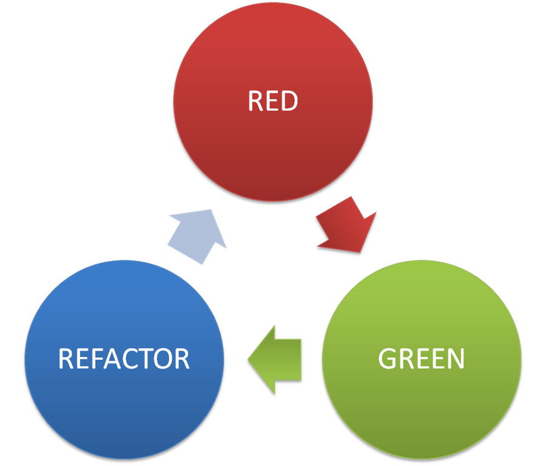

# Testing

.right-image[]

### Automated software verification and validation process

- facilitate refactoring
- improves code structure
- adds documentation and examples

---

# Types of tests

.right-image[]

- **Unit** tests are close to the source, focus on small pieces of API in isolation
- **Integration** tests validate an interaction of modules and services
- **End-to-end** (System) tests check system with user behavior replica

---

# Test structure

```javascript
it('should return undefined if object is valid', () => {
 // setup // arrange
 const env = djv()
 env.addSchema('test', jsonSchema)
 const commonObj = { type: 'common' }
 const expected = undefined

 // exercise // act
 const result = env.validate('test#/common', commonObj)
 // verification // assert
 assert.equal(result, expected)
 // teardown
})
```

---

# Keywords

```
describe('arrayContaining', () => {
  const expected = ['Alice', 'Bob']
  it('matches even if received contains additional elements', () => {
    expect(['Alice', 'Bob', 'Eve'])
      .toEqual(expect.arrayContaining(expected))
  })
})
```

- `describe()`
- `test()`
- `beforeEach()` 
- `afterEach()`
- `expect`
- `done()`
- `skip(), only()`

---

# Concepts

.left-code[
```
const video = require('./video')

test('plays video', () => {
  const spy = jest.spyOn(video, 'play')
  const isPlaying = video.play()

  expect(spy).toHaveBeenCalled()
  expect(isPlaying).toBe(true)

  spy.mockRestore()
})
```
]

- **stubs** - predefined responses
- **spies** - save calls
- **mocks** - behavior verification

---

# Tools

- jest - `React`
- jasmine, karma - `Angular`
- mocha, chai, sinon - `Polymer`
- wct - `Polymer`
- protractor - `Angular`
- webdriver i/o - ...
- cucumber

---

# Unit testing best practices

- **F**ast - tests should run fast
- **I**ndependent / Isolated - the order shouldn't matter
- **R**epeatable - deterministic or idempotent
- **S**elf-Validating - should output the result
- **T**imely - should be close to the source code

---

# Test-Driven Development

### Test-Driven Development (TDD) is a technique for building software that guides software development by writing tests

.right-image[]

- Don't write code except to pass a failing test
- Write only **enough of a test** to show the failure
- Write only **enough code to pass** the failing test

---

# TDD 

.right-image[]

## Test-driven development, or TDD, is a rapid cycle of testing, coding, and refactoring

.red[ 
  - Write a failing test 
]
.green[ - Make the test pass ]
.blue[ - Refactor ]

---

# BDD

### *to get developers, testers and business to talk to each other*

(Gherkin)

.long-left-code[
```gherkin
Feature: 
  In order to keep my product stable 
  As a developer or product manager 
  I want to make sure that everything works as expected
  
Scenario: 
  Check title of website after search 
  Given I open the url "http://google.com" 
  When I set "WebdriverIO" to the inputfield "#lst-ib" 
  And I press "Enter" 
  Then I expect that the title is "WebdriverIO - Google Search"
  
Scenario: Another test 
  Given ...
```
]

<br>

- Feature
- Scenario
- Given
- When
- Then
