.center.icon[]

---

class: white
background-image: url(assets/title.svg)
.top.icon[]

# Методический воркшоп
### Александр Коржиков

---

class: top white
background-image: url(assets/sound.svg)
.top.icon[]

.sound-top[
  # Как меня слышно и видно?
]

.sound-bottom[
  ## > Напишите в чат
  ### **+** если все хорошо
  ### **–** если есть проблемы cо звуком или с видео
]

---

# Темы

- Presentations
  - Google Slides Overview
  - Working with Markdown Notes
- Ideas
  - Arrange Materials with Folders Structure
  - Slackbot Notifications with Messages Materials

---

# Код

## Заголовок первого уровня
### Заголовок второго уровня
#### Пример кода

```
var a = 123
console.log('Hello World')
```

---

class: white
background-image: url(assets/title.svg)
.top.icon[]

# Modules Q&A

---

# Вопрос

### А Вы знаете какие модули включены в стандартный дистрибутив `Node`?

<br>

.center[
  
]

---

# На занятии

- Попрактиковали `getters / setters`
- Разобрали веб спецификацию `Custom Elements`

---

# Table

| Header1 | Header2 |
|:---:|:---|
|text1|text2|

---

# Modern JavaScript Frameworks

.mario.mario-10[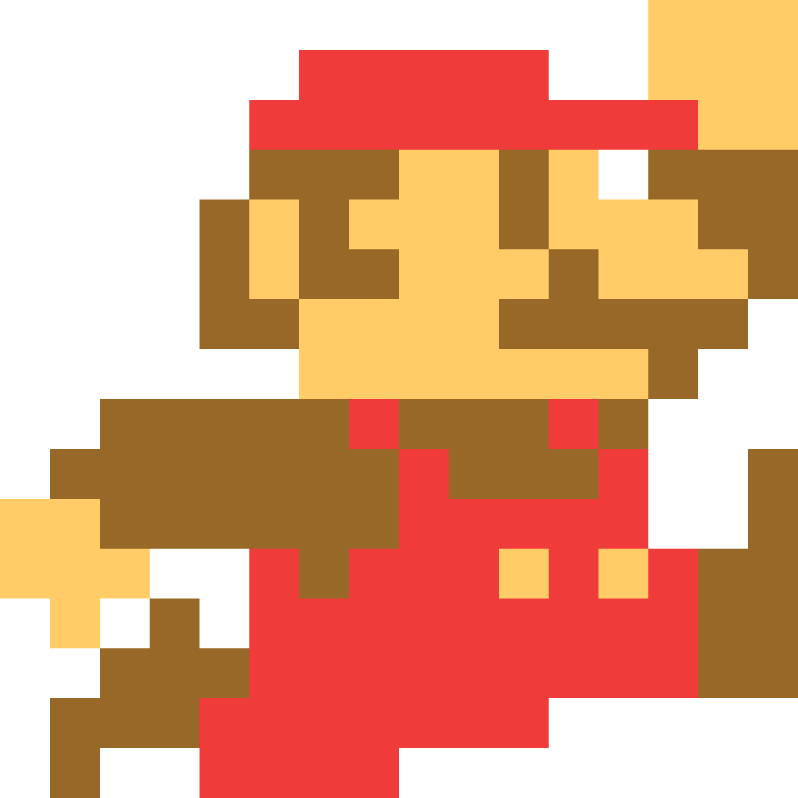]

|  |  | 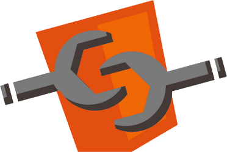 |  | 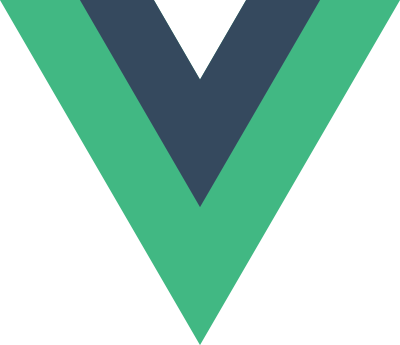 | 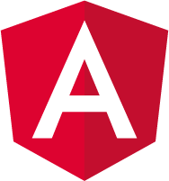 |
|:-------------:|:-------------:|:-------------:|:-------------:|:-------------:|:-------------:|
|  |  |  | 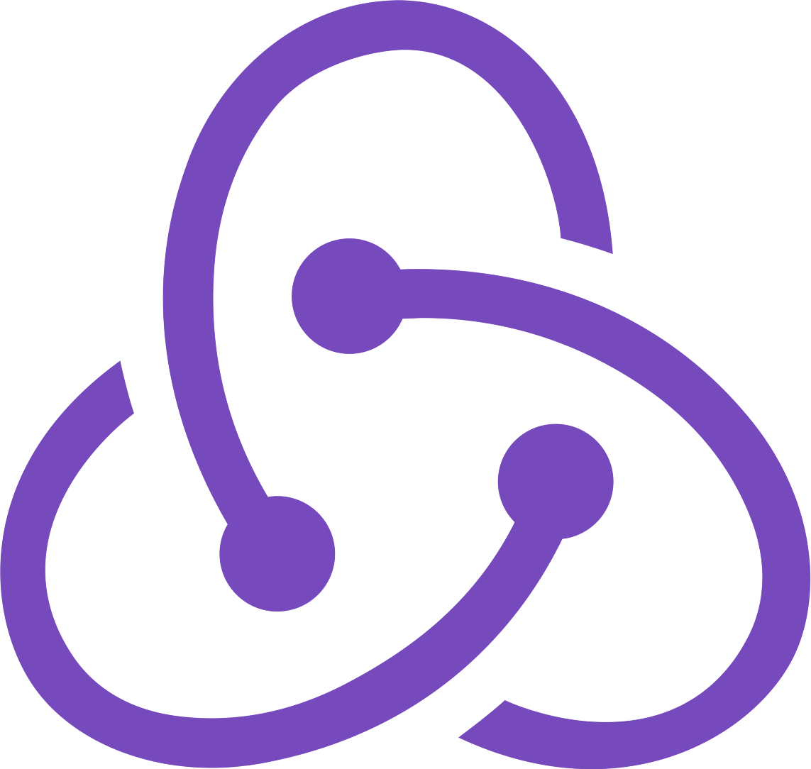 | | 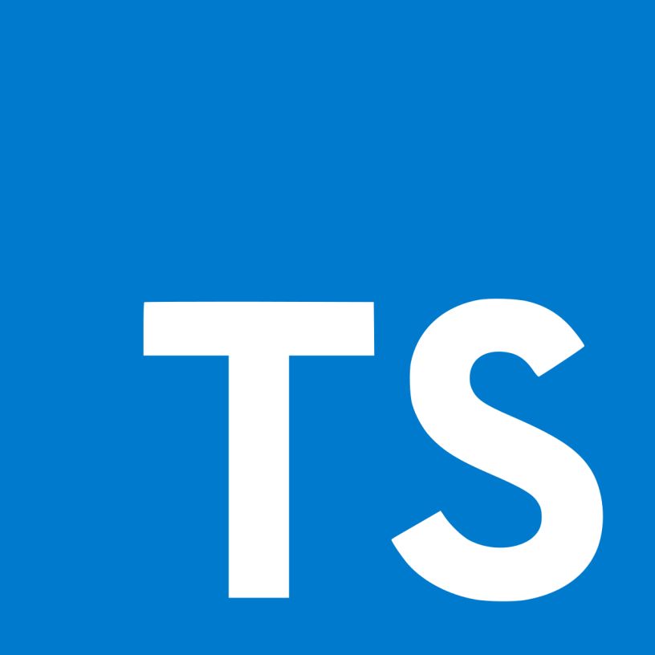 |
| | 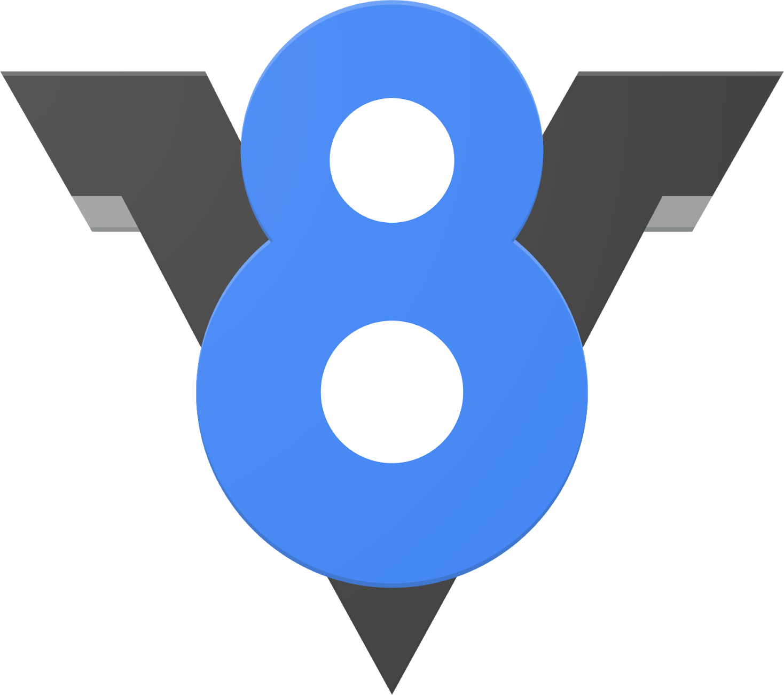 | | 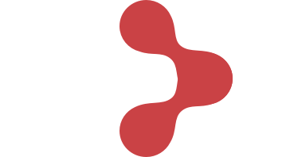 | | 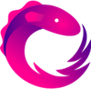 |
| |  | |
| | 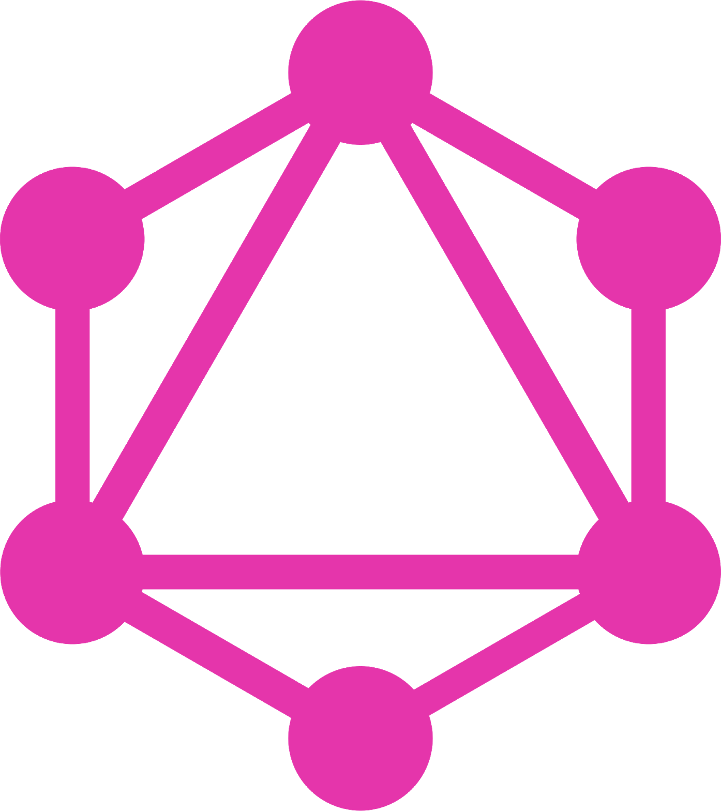 | |

---

# Самостоятельная работа

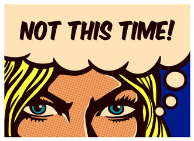

---

class: white
background-image: url(assets/title.svg)
.top.icon[]

# Спасибо за внимание!

### Вы верите в Markdown?

.black[
### Пожалуйста, пройдите [опрос](https://otus.ru/polls/2389/) в личном кабинете
]

