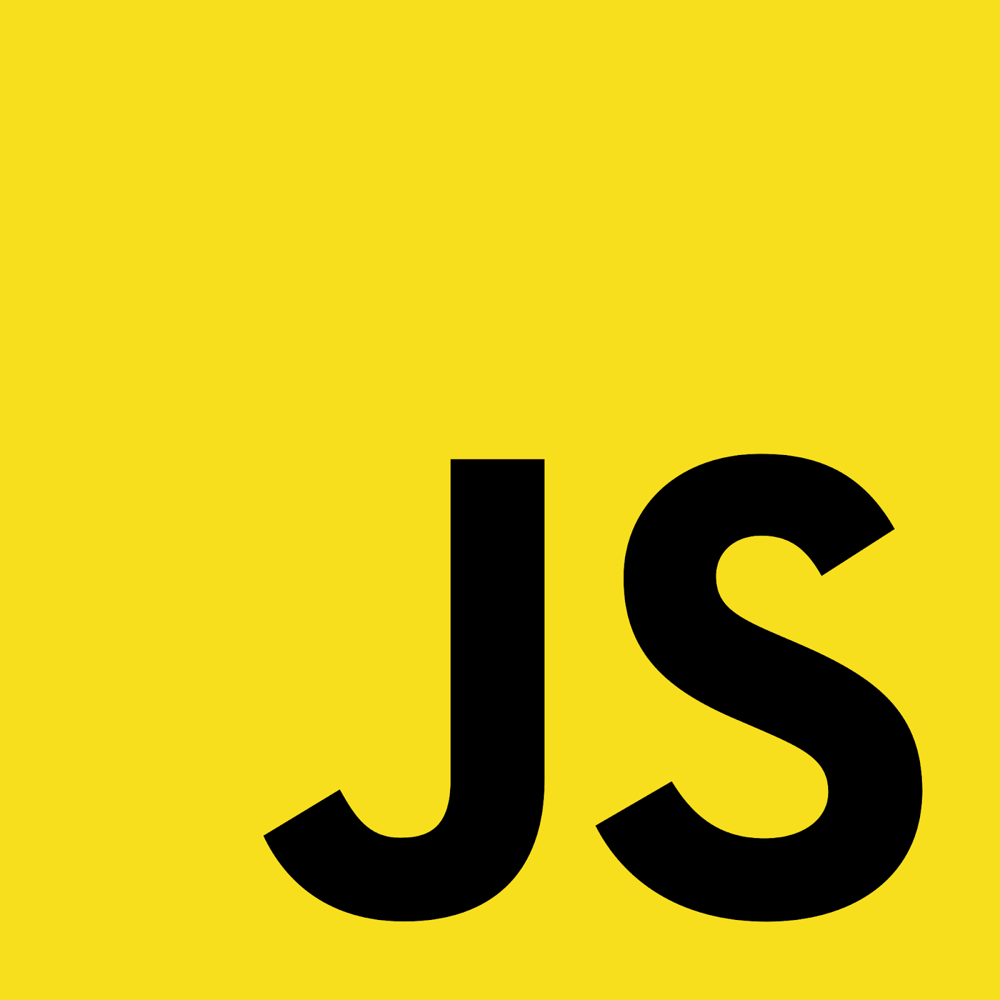

# 7? Things That JavaScript Developer Should Know

.full-image[

]

---

class: profile

# Обо Мне

.right-image[]

## Александр Коржиков
### `JavaScript` 

- Alpari
- Comindware
- Tinkoff
- Backbase
- ING
- Otus

#### https://github.com/korzio 
#### korzio@gmail.com 
---

# Мои Интервью

- Для чего?

- `~Ne2` участвовал
- `~Ne1` успешно прошел
- `~Ne2` провел

- Интересные кейсы
  - Агрессивные интервью
  - Не хотел участвовать

---

# Как я провожу интервью

- Introduction (10 min)
- JavaScript (25 min)
- Social Skills (10 min)
- Feedback (15 min)

- [Пример](https://docs.google.com/spreadsheets/d/1KRiFwmYYCuW2FRbt_Gw9Rr6hREJsyDeS6sL0Evniyhs/edit#gid=2093294749)

---

# English

> Это `*****` очевидно

---

# JavaScript

.right-image[]

- HTML & CSS
- DOM API
- Современные фреймворки
- Что еще?

---

# Результаты Опросов

- [Google Forms](https://docs.google.com/forms/d/1n-JWEcZAu6X1bTCDMQXwFhMPHHQq5pi3n8E8FMHsmtM/edit#responses)

---

# Soft Skills

- Активности
- `Be Positive`

---

# Anything Else

> Немного того, немного другого

- Бизнес процессы
- Основы Digital Marketing (A/B тесты)
- Architecture
- DevOps

---

# What JavaScript Developer Might Not Know

1. Frameworks
2. Algorithms

---

# Summary

### What JavaScript Developer Might Know

- English
- Basics
- Project
- Soft Skills
- Be Positive

---

class: white
background-image: url(assets/title.svg)
.top.icon[]

# Thanks
## Q&A