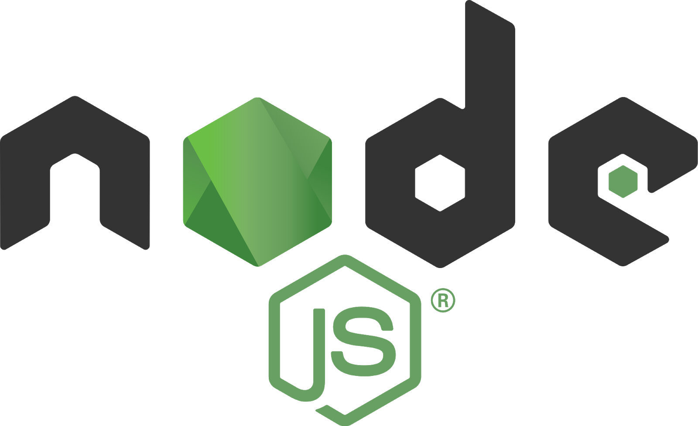

.center.icon[]

.hidden[
  https://blog.risingstack.com/building-a-node-js-app-with-typescript-tutorial/
]

---

class: white
background-image: url(assets/title.svg)
.top.icon[]

# Открытый вебинар JavaScript
## Node.js Быстрый старт
### Александр Коржиков

---

class: top white
background-image: url(assets/sound.svg)
.top.icon[]

.sound-top[
  # Как меня слышно и видно?
]

.sound-bottom[
  ## > Напишите в чат
  ### **+** если все хорошо
  ### **–** если есть проблемы cо звуком или с видео
]

---

class: profile

# Обо мне

.right-image[]

## Александр Коржиков
### `JavaScript` 

- Alpari
- Comindware
- Tinkoff
- Backbase
- ING
- Otus

.right-code[
## Расскажите о себе!
]

#### https://github.com/korzio 
#### korzio@gmail.com 

---

# Расскажите о себе!

- Какие JavaScript фреймворки Вы используете?
- Какие JavaScript библиотеки Вы используете?
- В чем отличие фреймворков от библиотек? 

.center[
  
]

---

# Содержание

- Node
  - About
  - Пример Web сервера
.right-image[]
  - Структура
  - Стандартные модули
  - Примеры Callbacks
  
- Demo с Express
  
- О курсе
  - Фреймворки и библиотеки


---

# Node

### Асинхронная среда исполнения `JavaScript`, основанная на событийной модели, для создания эффективных сетевых приложений

#### Пример web сервера

```javascript
const http = require('http') 
const hostname = '127.0.0.1'
const port = 3000
const server = http.createServer((req, res) => {
  res.statusCode = 200 
  res.setHeader('Content-Type', 'text/plain') 
  res.end('Hello World\n')
}) 

server.listen(port, hostname, () => {
  console.log(`Server running at http://${hostname}:${port}/`)
})
```

```bash
node server.js
```

- Какие особенности Вы бы отметили из этого примера?

---

# Особенности

- Исполнение `JavaScript` файлов с помощью комманды node 
  
  - REPL

- `CommonJS` формат модулей для загрузки зависимостей
  
  - `ES Modules`

.right-image[
  
]

- Стандартная библиотека модулей

- API основанное на асинхронном паттерне Callbacks

- [`ES2015` синтаксис](http://node.green/)

- Демо (VSCode + [Chrome Debug](chrome://inspect))

.hidden[
  node --inspect-brk simple.js
]

---

# История

.right-image[
  
]

- *Server side `JavaScript` Platform* - Ryan Dahl, 2009

- Asyncronous (non-blocking) I/O

- Chromium `JavaScript` Engine -> V8

- **Node.js** Foundation

---

# Структура

- Библиотека написана на `C++` и `JavaScript` 

- `V8` - платформа исполнения `JavaScript` от Google (Chromium, Chrome, Opera, Brave, Yandex Browser)

- Event Loop - асинхронный событийный цикл с `libuv`

- Модули для работы с операционной системой

.right-image[
  
]

### Patterns

- Callback
- Observer
- Module
- Reactor

---

# Задача

Установить node и npm
https://nodejs.org/en/download/

```bash
node --version
npm --version
```

Создать и запустить `server.js`

```
echo "console.log(process.argv)" > server.js
```

```bash
node server hello world
```

### Лучше использовать [`Node Version Manager (nvm)`](https://github.com/nvm-sh/nvm)

---

# Вопрос

### А Вы знаете какие модули включены в стандартный дистрибутив `Node`?

<br>

.center[
  
]

---

# Стандартные модули

.right-code[
- **Protocols**
  - http(s)
  - net
  - dns
- **System**
  - os
  - v8
  - async_hooks 
  - perf_hooks
  - trace_events
]
- **Main**
  - fs
  - timers
  - streams  
- **Utilities**
  - path
  - util
  - zlib
  - crypto
- **Processes**
  - child_process
  - cluster
  - worker_threads

---

# Globals

.right-image[
  
]

- `global` объект - аналог `window`

- объекты `JavaScript`

- *timeouts* почти как в браузере

- `console` 

- `process` репрезентация текущего процесса

---

# Callbacks

Функция, переданная в качестве аргумента коду, который предполагает исполнить его в какой-то момент времени. Исполнение может быть **синхронным** или **асинхронным**.

```javascript
const server = http.createServer((req, res) => {
  res.statusCode = 200
  res.setHeader('Content-Type', 'text/plain')
  res.end('Hello World\n')
})

server.listen(port, hostname, () => {
  console.log(`Server running at http://${hostname}:${port}/`)
})
```

В `Node` по умолчанию **callback** выполняется с "ошибкой" и результатом `асинхронно`

```
fs.readFile('/etc/passwd', (err, data) => {
  if (err) throw err
  console.log(data)
})
```

---

# Anti-Pattern - http://callbackhell.com/

```
fs.readdir(source, function (err, files) {
  if (err) {
    console.log('Error finding files: ' + err)
  } else {
    files.forEach(function (filename, fileIndex) {
      console.log(filename)
      gm(source + filename).size(function (err, values) {
        if (err) {
          console.log('Error identifying file size: ' + err)
        } else {
          console.log(filename + ' : ' + values)
          aspect = (values.width / values.height)
          widths.forEach(function (width, widthIndex) {
            height = Math.round(width / aspect)
            console.log('resizing ' + filename + 'to ' + height + 'x' + height)
            this.resize(width, height).write(dest + 'w' + width + '_' + filename, function(err) {
              if (err) console.log('Error writing file: ' + err)
            })
          }.bind(this))
        }
      })
    })
  }
})
```

---

# Задача

Создать простой веб сервер

```js
const http = require('http') 
const server = http.createServer((req, res) => {
  res.statusCode = 200
  res.setHeader('Content-Type', 'text/plain')
  res.end('Hello World\n')
})
```

Прочитать локальный `html` файл

```js
const fs = require('fs')
fs.readFile('./index.html', (err, text) => {
  console.log(text)
})
```

Отдать с сервера `html` и показать корректно для браузера

---

# Callback Types

#### Только ошибки

```
fs.access('/etc/passwd', fs.constants.R_OK, (err) => {
  console.log(err ? 'no access!' : 'read')
})
```

#### `Node` поддерживает `Promises`

```
util.promisify()
fs.promises.*
```

#### Тип возвращаемого значения

```
http.request('https://example.com', (error, response, body) => {
  ...
})
``` 

---

# Question

- Какие примеры `callback` паттерна в `JavaScript` Вы знаете?
- Вы знакомы с `promisify` функционалом?
- Есть ли разница между `Promise` и `Callback` паттернами?

<br>

.center[
  
]

---

class: white
background-image: url(assets/title.svg)
.top.icon[]

# Node Q&A

---

# Пример Express

.right-code[
```bash
mkdir example
cd example
npm init -f
npm install express
```
]

.left-code[
```ts
import express from "express";

const app = express();
const port = 3000;

app.get("/", (req, res) => {
  res.send("Hello World!");
});

app.listen(port, () => {
  console.log(`Example app listening on port ${port}!`);
});
```
]

---

# Express Demo

### Создадим пример веб сервера с [express generator](https://expressjs.com/en/starter/generator.html)
- С использованием `jade`, `cookie-session`
- Попробуем сделать наивный login logout

.center[
  
]

### TypeScript или JavaScript?

---

# Docs

### Node core concepts

- https://nodejs.org/api/
- https://nodejs.org/en/docs/guides/
- https://expressjs.com/
- https://nestjs.com/

# На занятии

- Рассмотрели встроенные модули, особенности архитектуры `Node.js`
- Запустили веб сервер с использованием `express`

---

class: white
background-image: url(assets/title.svg)
.top.icon[]

# Q&A
# `-->`
## О Курсе

---

class: profile
# Преподаватели+

- **Александр Коржиков**

JavaScript @ Alpari, Comindware, Tinkoff, Backbase, ING  
korzio@gmail.com https://github.com/korzio
  
- **Юрий Дворжецкий**

Java, JavaScript @ Luxoft  
Teaching @ 1500+ hours, 600+ developers

---

# [Курс Разработчик Node.js](https://otus.ru/lessons/node/)

|  |  |  |  |  |  |
|:-------------:|:-------------:|:-------------:|:-------------:|:-------------:|:-------------:|
|  |  |  | |  |  |
|  |  |  | |  | |
|  |  |  |
|  |  |

---

class: white
background-image: url(assets/title.svg)
.top.icon[]

# Q&A
## О Курсе

---

class: white
background-image: url(assets/title.svg)
.top.icon[]

# Спасибо за внимание!

.black[ 
### Пожалуйста, пройдите [опрос](https://otus.pw/ONbk/)
### Будем рад Вас видеть на будущих мероприятиях
]