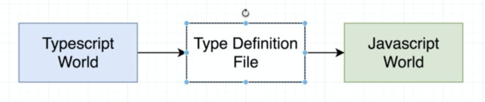

.center.icon[]

.hidden[
  https://blog.risingstack.com/building-a-node-js-app-with-typescript-tutorial/
  
]

---

class: white
background-image: url(assets/title.svg)
.top.icon[]

# Открытый вебинар JavaScript
## TypeScript в Node
### Александр Коржиков

---

class: top white
background-image: url(assets/sound.svg)
.top.icon[]

.sound-top[
  # Как меня слышно и видно?
]

.sound-bottom[
  ## > Напишите в чат
  ### **+** если все хорошо
  ### **–** если есть проблемы cо звуком или с видео
]

---

class: profile

# Обо мне

.right-image[]

## Александр Коржиков
### `JavaScript` 

- Alpari
- Comindware
- Tinkoff
- Backbase
- ING
- Otus

.right-code[
## Расскажите о себе!
]

#### https://github.com/korzio 
#### korzio@gmail.com 

---

# Расскажите о себе!

- Какие JavaScript фреймворки Вы используете?
- Какие JavaScript библиотеки Вы используете?
- В чем отличие фреймворков от библиотек? 

.center[
  
]

---

# Содержание

- `Node & TypeScript`
.right-image[]
  - Ключевые особенности
  - Технологии & Инструменты

- Пример Express
  - `ts-node, nodemon, ...`
  - @Декораторы
  - `Ts.ED, Nest.js`

- Другое 
  - CLIs
  - `Deno`, недостатки `Node`

- О курсе
  - Фреймворки и библиотеки

---

# Пример

### Что будет выведено на экран?
### Что здесь происходит?
### Как запустить этот код?

```
type Add<X> = (x: X, y: X) => X
```

### Какая может быть имплементация?

.center[
  
]

---

# Node

.full-image[

]

---

# Node

### Асинхронная среда исполнения `JavaScript`, основанная на событийной модели, для создания эффективных сетевых приложений

.right-image[
  
]

- *Server side `JavaScript` Platform* - Ryand Dahl, 2009
- `V8` интерпретатор `JavaScript`
- Asyncronous (non-blocking) I/O
- Event Loop - асинхронный событийный цикл с `libuv`
- Модули для работы с операционной системой

### Patterns

- `Reactor, Module, Observer, Callback`

---

# TypeScript

.half-image[

]

---

# Пример на TypeScript

```ts
import { LitElement, html, property, customElement } from 'lit-element'

@customElement('simple-greeting')
export class SimpleGreeting extends LitElement {
  @property() name = 'World'

  render() {
    return html`<p>Hello, ${this.name}!</p>`
  }
}
```

---

# Пример на JavaScript

```ts
import { LitElement, html } from 'lit-element'

class SimpleGreeting extends LitElement {
  static get properties() {
    return { name: { type: String } }
  }

  constructor() {
    super()
    this.name = 'World'
  }
  
  render() {
    return html`<p>Hello, ${this.name}!</p>`
  }
}

customElements.define('simple-greeting', SimpleGreeting)
```

---

# О TypeScript

.right-image[]

> JavaScript that scales.  
> TypeScript is a typed superset of JavaScript that compiles to plain JavaScript.  
> Any browser. Any host. Any OS. Open source.

- 2012 @ Microsoft
- Anders Hejlsberg - создатель `Turbo Pascal`, `С#` и `Delphi`
- Расширение ES6
- Поддерживается Microsoft и сообществом

> TypeScript is JavaScript for application-scale development

---

# Ключевые особенности

- Типы - протоколы, выявление ошибок типизации
- ООП - абстракции и паттерны
- IDE - поддержка и помощь при написании кода

## Технологии

- `TypeScript` транспилируется в `JavaScript`
- `Deno`
- `WebAssembly`

---

# Инструменты

- `typescript, tsc` - компилятор в `JavaScript`

```bash
npm install -g typescript
```

- `tslint` - статический анализ кода. 

`⚠️ TSLint is deprecated`

.right-image[

]

- [`@types`](https://www.npmjs.com/package/@types/node) - определения типов

Например, [@types/node](https://github.com/DefinitelyTyped/DefinitelyTyped/tree/master/types/node)

- `ts-node` - транспайлер на лету для `Node`

---

# tsconfig.json

```
{
  "compilerOptions": {
    "outDir": "./built",
    "allowJs": true,
    "target": "es5"
  },
  "include": [
    "./src/**/*"
  ]
}
```

### `compilerOptions` флаги из [списка поддерживаемых `tsc`](https://www.typescriptlang.org/docs/handbook/compiler-options.html) 

.hidden[
`noImplicitAny`
https://www.typescriptlang.org/docs/handbook/tsconfig-json.html
https://www.typescriptlang.org/docs/handbook/compiler-options.html
http://json.schemastore.org/tsconfig
]

---

# Типы

.right-image[]

- Позволяют улучшить качество и понимание кода
- [Позволяют избежать ошибок типизации на этапе компиляции](http://ttendency.cs.ucl.ac.uk/projects/type_study/documents/type_study.pdf)
- Документация как код
- Оптимизации

.hidden[
The main purpose of a type system is to reduce possibilities for bugs in computer programs[2] by defining interfaces between different parts of a computer program, and then checking that the parts have been connected in a consistent way. This checking can happen statically (at compile time), dynamically (at run time), or as a combination of static and dynamic checking. Type systems have other purposes as well, such as expressing business rules, enabling certain compiler optimizations, allowing for multiple dispatch, providing a form of documentation, etc.
]

---

# Задача - Быстрый старт с TypeScript

```bash
mkdir my-hello-world-cli
cd my-hello-world-cli
npm init
# answer npm questions and check package.json content
echo "const { name } = require('./package.json'); 
  console.log(`Hello from ${name}`)" > server.js
# check if environment works
npm start
# initialize typescript compiler project configuration file
npx tsc --init
# rename js file to ts
mv server.js server.ts
# @types/node 
npm install --save-dev @types/node
# compile project to typescript
npx tsc
# check if it still works
npm start
```

---

# Пример Express

.right-code[
```ts
import express from "express";

const app = express();
const port = 3000;

app.get("/", (req, res) => {
  res.send("Hello World!");
});

app.listen(port, () => {
  console.log(`Example app listening on port ${port}!`);
});
```
]

.left-code[
```bash
mkdir example
cd example
npm init -f
npm i typescript tslint -D
(npx) tsc --init
(npx) tslint --init
npm install express
```
]

.hidden[
  - [Express with TypeScript](https://medium.com/javascript-in-plain-english/typescript-with-node-and-express-js-why-when-and-how-eb6bc73edd5d)
]

---

# Express Demo

### Создадим пример с [express generator](https://expressjs.com/en/starter/generator.html)

.center[]

### Как можно использовать `TypeScript`?

.hidden[
  - body-parser
    - problems with express types, body any?
    - how to avoid?
  - cookie-session
    - login / logout example
]

---

# Инструменты

- `nodemon` - следить за изменением файлов
- `concurrently` - запустить несколько процессов одновременно с лаконичной конфигурацией
- `ts-node-dev` - `ts-node`, с перезапуском
- [Пример имплементации `ts-node`](/otus/node/modules/extensions/ts.ts)

```js
var jsHook = require.extensions['.js']
require.extensions['.js'] = function (module, file) {
  var oldCompile = module._compile
  module._compile = function (code, file) {
    code = code + '; console.log(bar)'
    module._compile = oldCompile
    module._compile(code, file)
  }
  jsHook(module, file)
}
```

⚠️ **!Important! Deprecated**

.hidden[
> the TypeScript Node (ts-node) - the on-the-fly module extension and REPL for Node.
https://github.com/microsoft/TypeScript/wiki/Using-the-Compiler-API

Deprecated. In the past, this list has been used to load non-JavaScript modules into Node.js by compiling them on-demand. However, in practice, there are much better ways to do this, such as loading modules via some other Node.js program, or compiling them to JavaScript ahead of time.
]

---

# Как использовать TypeScript с веб серверами

- Использовать типы где можно
- Добавить специальные классы для управления приложением
- Что-то еще?


<!-- ### TODO review  -->

- `Ts.ED`, `Nest.js` итд

---

# [Ts.ED](https://github.com/TypedProject/ts-express-decorators)

> A Node.js and TypeScript Framework on top of Express

```ts
import {Controller, Get} from "@tsed/common"
import * as Express from "express"

export interface Calendar{
    id: string
    name: string
}

@Controller("/calendars")
export class CalendarCtrl {
  @Post("/")
  @Authenticated()
  async post(
    @Required() @BodyParams("calendar") calendar: Calendar
  ): Promise<ICalendar> {
    return new Promise((resolve: Function, reject: Function) => {
      calendar.id = 1
      resolve(calendar)
    })
  }
}
```

---

# [Ts.ED API](https://tsed.io/api.html)

```ts
import {BodyParams, Controller, Get, Post, Session, Status} from "@tsed/common";

@Controller("/")
export class MyCtrl {
  @Get("/whoami")
  whoAmI(@Session() session: any) {
    console.log("User in session =>", session.user);
    return session.user && session.user.id ? `Hello user ${session.user.name}` : "Hello world";
  }

  @Post("/login")
  @Status(204)
  login(@BodyParams("name") name: string, @Session("user") user: any) {
    user.id = "1";
    user.name = name;
  }

  @Post("/logout")
  @Status(204)
  logout(@Session("user") user: any) {
    user.id = null;
    delete user.name;
  }
}
```

---

# [nestjs](https://nestjs.com/)

```ts
// modules
import { Module } from '@nestjs/common';
import { CatsModule } from './cats/cats.module';

@Module({
  imports: [CatsModule],
})
export class AppModule {}

// controllers
import { Controller, Get, Req } from '@nestjs/common';
import { Request } from 'express';

@Controller('cats')
export class CatsController {
  @Get()
  findAll(@Req() request: Request): string {
    return 'This action returns all cats';
  }
}
```

- Почти `Angular`...

---

# Decorators

### Что такое [декораторы](https://www.typescriptlang.org/docs/handbook/decorators.html)?

```bash
tsc --experimentalDecorators
```

.center[]

<br>

> => `JavaScript, Draft (Stage 2) TC39`

---

# Определение

### Декларативное `@выражение`, где выражение является функцией и может быть применимо к декларации класса, метода, свойства или аргумента функции

```ts
function my(target, key, descriptor) {
  console.log('my decorator called')
}

class A {
 @my
 method() {
  return 1
 }
}

new A().method()
```

```bash
tsc --target ES5 --experimentalDecorators decorators.ts
node decorators.js
my decorator called
```

---

# Как работать с декораторами?

- Фабрики
- [Порядок выполнения](https://www.typescriptlang.org/docs/handbook/decorators.html#decorator-evaluation)

```ts
function enumerable(value: boolean) {
  return function (target: any, propertyKey: string, descriptor: PropertyDescriptor) {
    descriptor.enumerable = value;
  };
}
```

- `target` - прототип объект
- `key` - ключ свойства объекта
- `objectDescriptor` - дескриптор свойств
- Пакет `reflect-metadata` для сохранения свойств

---

# Другие примеры использования

- Инструменты разработчика, библиотеки
  - [polymer-cli]()

- Фреймворки для `CLI`
  - [gluegun]()
  - [oclif]()

---

# Deno

- Какие недостатки у `Node`?

.center[]

- [Design Mistakes in Node](assets/jsconf2018.pdf)

- Deno?
- `V8, Rust, Tokio, TypeScript`

---

# Demo Deno

.half-image[

]

---

# Материалы

.right-image[]

- [Official 5 Minutes Tutorial](https://www.typescriptlang.org/docs/handbook/typescript-in-5-minutes.html)

- [TypeScript Deep Dive - Basarat Syed](http://basarat.gitbooks.io/typescript/)

- [TypeScript to JavaScript Playground](https://www.typescriptlang.org/play/)

- [TypeScript Essentials - Charly Poly](https://medium.com/@wittydeveloper/typescript-essentials-b7ae85b0f561)

- [Udemy Complete Developers Guide Course](https://www.udemy.com/course/typescript-the-complete-developers-guide/)


---

class: white
background-image: url(assets/title.svg)
.top.icon[]

# Q&A

---

class: profile
# Преподаватели+

- **Александр Коржиков**

JavaScript @ Alpari, Comindware, Tinkoff, Backbase, ING  
korzio@gmail.com https://github.com/korzio
  
- **Юрий Дворжецкий**

Java, JavaScript @ Luxoft  
Teaching @ 1500+ hours, 600+ developers

- **Михаил Кузнецов**

FullStack @ ING
https://github.com/shershen08

- **Никита Овчинников** 

EPAM Systems, Skywind Group 

---

# Modern JavaScript Frameworks

|  |  |  |  |  |  |
|:-------------:|:-------------:|:-------------:|:-------------:|:-------------:|:-------------:|
|  |  |  | |  |  |
|  |  |  | |  | |
|  |  |  |

---

class: white
background-image: url(assets/title.svg)
.top.icon[]

# Q&A
## О Курсе

---

class: white
background-image: url(assets/title.svg)
.top.icon[]

# Спасибо за внимание!

.black[ 
### Пожалуйста, пройдите [опрос](https://otus.pw/Vs4w/)
### Будем рад Вас видеть на будущих мероприятиях
]

---

# Feedback

- "из последнего у вас что-то поломалось с отображением имени-фамилии из кабинета =)"
- "проекты с ts и js"