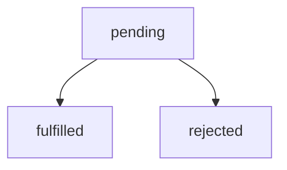

.center.icon[]

---

class: white
background-image: url(assets/title.svg)
.top.icon[]

# Открытый вебинар JavaScript
## Особенности работы с WebAssembly
### Александр Коржиков

---

class: top white
background-image: url(assets/sound.svg)
.top.icon[]

.sound-top[
  # Как меня слышно и видно?
]

.sound-bottom[
  ## > Напишите в чат
  ### **+** если все хорошо
  ### **–** если есть проблемы cо звуком или с видео
]

---

class: profile

# Обо мне

.right-image[]

## Александр Коржиков
### `JavaScript` 

- Alpari
- Comindware
- Tinkoff
- Backbase
- ING
- Otus

.right-code[
## Расскажите о себе!
]

#### https://github.com/korzio 
#### korzio@gmail.com 

---

# Содержание

- WebAssembly
  - Intro, Support
  - Use Cases
  - Design Goals, Features
  - Semantics, JavaScript API, Modules
  - Compile Flow

.right[]

- О курсе
  - Фреймворки и библиотеки

---

### Цели

- Познакомиться с `WebAssembly` - понимать задачи, основные определения и характеристики проекта
- Разобрать архитектуру `JavaScript` на примере `V8`, чтобы лучше понять, какое место занимает в нём `WebAssembly`
- Посмотреть примеры

.right[]

---

# Материалы

- [WebAssembly](https://webassembly.org/)

- [WebAssembly: Disrupting JavaScript - Dan Callahan](https://www.youtube.com/watch?v=7mBf3Gig9io)

- [Why we Need WebAssembly - An Interview with Brendan Eich - Eric Elliott](https://medium.com/javascript-scene/why-we-need-webassembly-an-interview-with-brendan-eich-7fb2a60b0723)

- [WebAssembly Explorer](https://mbebenita.github.io/WasmExplorer/)

- [Learn WebAssembly by Mike Rourke](https://learning.oreilly.com/library/view/learn-webassembly/9781788997379/618443eb-a889-4440-a605-dbd8b9404347.xhtml)

- [WebAssembly Rocks](https://www.wasmrocks.com/)

.right[]

.hidden[
  [Compiling for the Web with WebAssembly (Google I/O '17)](https://www.youtube.com/watch?v=6v4E6oksar0)
]

---

# Intro

### WebAssembly (abbreviated Wasm) is a **binary instruction format** for **a stack-based virtual machine**. Wasm is designed as a **portable target** for **compilation of high-level languages** like `C/C++/Rust`, enabling deployment on the web for client and server applications.

.right[]

---

# Example

.hidden[
  https://mbebenita.github.io/WasmExplorer/
  https://webassembly.studio/
]

```c
int add(int a) {
  return a + 5;
}
```

```wasm
(module
 (table 0 anyfunc)
 (memory $0 1)
 (export "memory" (memory $0))
 (export "_Z3addi" (func $_Z3addi))
 (func $_Z3addi (; 0 ;) (param $0 i32) (result i32)
  (i32.add
   (get_local $0)
   (i32.const 5)
  )
 )
)
```

```javascript
WebAssembly.instantiateStreaming(fetch(`program.wasm`))
  .then(prog => {
      console.log(prog.instance.exports.add(1, 2))
  })
```

.hidden[
  https://developers.google.com/web/updates/2012/06/How-to-convert-ArrayBuffer-to-and-from-String
  
  /Users/RD25XO/Developer/experiments/notes/otus/webassembly/program.wasm
  
  https://openhome.cc/eGossip/WebAssembly/Wat2Wasm.html
]

---

# History

.hidden[
  https://en.wikipedia.org/wiki/WebAssembly#History
  
  http://asmjs.org/spec/latest/
  
  https://en.wikipedia.org/wiki/Google_Native_Client
]

- Google Native Client (`NaCl` and `PNaCl`) 😅
  - `9 December 2011`
- [`asm.js`](http://asmjs.org/) - A subset of `JavaScript`
  - `11 October 2013` - `18 August 2014`
  .hidden[
  > ASM.js is a subset of JavaScript that has no objects and has no garbage collection or just in time compiler pauses. It’s a target for C/C++ — a statically typed subset of JavaScript. This was demonstrated at Mozilla in partnership with the big gaming companies like Epic Games with Unreal Engine and Unity with the Unity engine and IDE. [(c) Brendan Eich](https://medium.com/javascript-scene/why-we-need-webassembly-an-interview-with-brendan-eich-7fb2a60b0723)
  ]


- Announced in `2015` .right-code[]
  - `WebAssembly Working Group`
  - `Core Specification`, 2016
  - Official Logo, 2017 😂 
  - Cross-browser consensus and end of Browser Preview


.hidden[
  WebAssembly Working Group in April, 2015, to standardize WebAssembly and oversee the specification and proposal process. Since then, the Core Specification in April, 2015, to standardize WebAssembly and oversee the specification and proposal process. Since then, the Core Specification
]

---

# [Use Cases](https://webassembly.org/docs/use-cases/)

- **Web**
  - Media Content
  - Games
  - Low Level Protocols
  - Machine Learning
  - ...
  - > Any Possible Client Executed Code

- **Server Side ?!**
  - Encryption
  - ... 
  - > Any Stable Predictable Rich Environment

---

# Support

.right.height-400[
  
]

### [Languages](https://github.com/appcypher/awesome-wasm-langs)

## Clients

### Browsers

.half-image[
  
]

<br>
> Global - 85.57%

### [Server-Side](https://webassembly.org/docs/portability/)

---

# [Design Goals - Semantics](https://webassembly.github.io/spec/core/intro/introduction.html#design-goals)

- **Fast**: executes with near native code performance, taking advantage of capabilities common to all contemporary hardware
- **Safe**: code is validated and executes in a memory-safe [2], sandboxed environment preventing data corruption or security breaches
- **Well-defined**
- **Hardware-independent**
- **Language-independent**
- **Platform-independent**
- **Open**: programs can interoperate with their environment in a simple and universal manner

---

# [Design Goals - Representation](https://webassembly.github.io/spec/core/intro/introduction.html#design-goals)

- **Compact**: has a binary format that is fast to transmit by being smaller than typical text or native code formats
- **Modular**: programs can be split up in smaller parts that can be transmitted, cached, and consumed separately
- **Efficient**: can be decoded, validated, and compiled in a fast single pass, equally with either just-in-time (JIT) or ahead-of-time (AOT) compilation.
- **Streamable**
- **Parallelizable**
- **Portable**

---

# [Features of MVP](https://webassembly.org/docs/mvp/)

- `Module` with `JavaScript API` - memory-safe sandboxed environment
- `Binary format (wasm)` - size, load-time efficient format
- `Text format [(wat)](https://www.destroyallsoftware.com/talks/wat)` - a textual projection of a module’s structure and code ()
- `wasm` Interpreter

- [WebAssembly High-Level Goals](https://webassembly.org/docs/high-level-goals/)
  - *execute in the same semantic universe as JavaScript* 🤔
  
- **Limitations (so far)**
  - No garbage collector (Proposal) 
  - No direct DOM access
  - Don't support old browsers
  - No threads
  
.hidden[
  # Elements Of WebAssembly 
  - Text Format (wat)
]

---

# Definitions

- Что такое `Virtual Machine`?
- Что такое `Stack-based Virtual Machine`?

.right-image[
  
]
.half-image[

]

.hidden[
  Stack-based virtual machine 
  https://andreabergia.com/stack-based-virtual-machines/
  
  > What’s a stack based virtual machine then? It’s an abstraction of a computer, that emulates a real machine. Generally it is built as an interpreter of a special bytecode, that translates its in real time for execution on the CPU.
  
  JVM is stack-based
  
  Also possible a register based vm
  
  > structured stack machine; a machine where most computations use a stack of values, but control flow is expressed in structured constructs such as blocks, ifs, and loops

  - Stack 
  - Instructions
  - Linear Memory
  
  https://jaytaylor.com/notes/assets/6b15f756-cec3-4402-997b-d04b76acd87e-0.pdf
]

---

# WebAssembly in a Nutshell

.right-code[
- Data Operations
  - i32: + - * / % << >> >>> etc
  - i64: + - * / % << >> >>> etc
  - f32: + - * / sqrt ceil floor
  - f64: + - * / sqrt ceil floor
  - conversions
  - load store
  - call_direct call_indirect
- Structured Control Flow
  - if loop block br switch
]

- Data Types
  - void i32 i64 f32 f64
- Functions
  - Flat, single global table
  - Static binding
  - Indirect calls through table
- State: linear memory
  - large, bounds-checked array
- Trusted execution stack

---

# JavaScript API

.hidden[
  > A JavaScript API is provided which allows JavaScript to compile WebAssembly modules, perform limited reflection on compiled modules, store and retrieve compiled modules from offline storage, instantiate compiled modules with JavaScript imports, call the exported functions of instantiated modules, alias the exported memory of instantiated modules, etc.
  
  https://webassembly.org/docs/web/
  
  http://webassembly.github.io/spec/js-api/index.html
  
  /Users/RD25XO/Developer/experiments/notes/otus/webassembly/test2.wasm
]

- `WebAssembly` object
  - `Module`, `Instance`, `Memory`, `Table`
  - `validate()` 
  - `compile()`
  - `instantiate()`

```bridge-example.js
var importObj = {js: {
  import1: () => console.log("hello,"),
  import2: () => console.log("world!"),
}};
fetch('demo.wasm').then(response =>
  response.arrayBuffer()
).then(buffer =>
  WebAssembly.instantiate(buffer, importObj)
).then(({module, instance}) =>
  instance.exports.f()
);
```

---

# [Modules](https://webassembly.org/docs/modules/)

> The distributable, loadable, and executable unit of code in WebAssembly

- `imports`: `js, env, table, memory`

```wamp
(module
    (import "js" "import1" (func $i1))
    (import "js" "import2" (func $i2))
    (func $main (call $i1))
    (start $main)
    (func (export "f") (call $i2))
)
```

- <a href="https://github.com/WebAssembly/design/issues/1087">🛤 ECMAScript module integration#12</a>

```
<script type="module" src="proposal.wasm"></script>
```

---

# Compile Flow

- `Emscripten` - a tool to compile languages to WebAssembly

```
C/C++/Rust -> AST -> Binary (.wasm) -> AST -> ...Module
```

.right-image[
  
]

.half-image[
  
]


.hidden[

> WebAssembly code in text format is serialized into an AST and compiled to the binary format (as a .wasm file), which is fetched, loaded, and utilized by a web page. When the module is loaded, the browser's JavaScript engine utilizes a decoding stack to decode the .wasm file into an AST, perform type checking, and interpret it to execute functions.
]

---

# Real World Examples

- `ZIP` for `WebAssembly` ?!
  - [Almost](https://github.com/YuJianrong/node-unrar.js)
  
- [Doom 3](http://www.continuation-labs.com/projects/d3wasm/)
  - [Demo](http://wasm.continuation-labs.com/d3demo/)

### Use Cases

- `SASS` for `WebAssembly`
- Dynamic [`Polyfills` not only for `Web`](https://developer.mozilla.org/en-US/docs/WebAssembly/existing_C_to_wasm)
- [Video / Image Filters](http://tiny.cc/webdsp)
- [Games](https://hackernoon.com/games-build-on-webassembly-3679b3962a19)

.hidden[
---
# Demo

```c
#define EXIT_STATUS EXIT_FAILURE
#include "true.c"
```
]

---

# Summary

- `WebAssembly` is a common bridge from other programming languages to `JavaScript` executed in safe sandbox available on any environment. Especially effective with algorithms, numeric operations.

- A very performant inter language protocol

### Question

- Are the clients for other than `JavaScript` languages?

.hidden[
  > Non-Web environments may include JavaScript VMs (e.g. node.js), however WebAssembly is also being designed to be capable of being executed without a JavaScript VM present.
]

---

class: white
background-image: url(assets/title.svg)
.top.icon[]

# Q&A

---

class: profile
# О Нас

.right-image[]
## Александр Коржиков
### `JavaScript` 

#### https://github.com/korzio 
#### korzio@gmail.com 

---

class: profile
# О Нас

.right-image[]
## Юрий Дворжецкий
### `Java, JavaScript` 

- Luxoft
- Курсы 1500+ часов, 600+ разработчико

---

class: profile
# О Нас

.right-image[]
## Владимир Клепов
### `FullStack` 

- Яндекс
- Российские Суперкомпьютеры

#### https://thoughtspile.github.io
#### v.klepov@gmail.com

---

class: profile
# О Нас

.right-image[]
## Михаил Кузнецов
### `JavaScript, FullStack, Java, Python` 

- ING
- `Vue.js`
- Speaker

#### https://github.com/shershen08
#### michail.kuznetsov@gmail.com

---

class: profile
# О Нас

.right-image[]
## Павел Асташкин
### `JavaScript, Vue`

- Vladivostok
- `Vue.js`
- Выпускник курса

.hidden[
#### https://github.com/sterallion/
#### sterallion@gmail.com
]

---

class: white
background-image: url(assets/title.svg)
.top.icon[]

# Нас больше

---

# Вопрос

- Какие JavaScript фреймворки Вы используете?
- Какие JavaScript библиотеки Вы используете?
- В чем отличие фреймворков от библиотек? 

.center[
  
]

---

# Modern JavaScript Frameworks

|  |  |  |  |  |  |
|:-------------:|:-------------:|:-------------:|:-------------:|:-------------:|:-------------:|
|  |  |  |  | |  |
| |  | |  | |  |
| |  | |
| |  | |

---

class: white
background-image: url(assets/title.svg)
.top.icon[]

# Q&A
# `-->`
## О Курсе

---

class: white
background-image: url(assets/title.svg)
.top.icon[]

# Спасибо за внимание!

.black[ 
### Пожалуйста, пройдите [опрос](https://otus.pw/7mdH/)
### Будем рад Вас видеть на 
### **День Открытых Дверей - 19 Июня**
]

.hidden[
  https://flaviocopes.com/webassembly/
  
  https://hacks.mozilla.org/author/lclarkmozilla-com/
  
  https://arxiv.org/pdf/1901.09056.pdf

  https://codelabs.developers.google.com/codelabs/web-assembly-intro/index.html#0
  
  https://www.w3.org/TR/wasm-core-1/
]