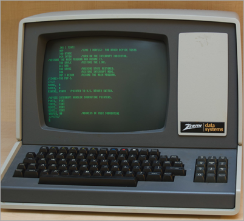
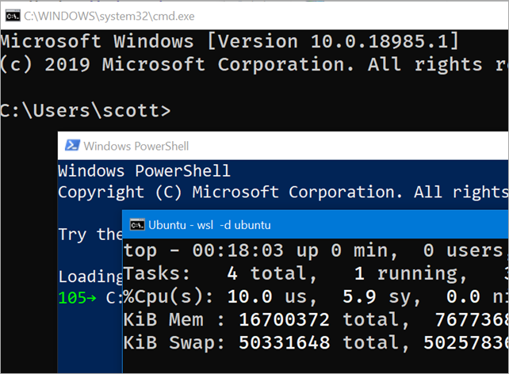
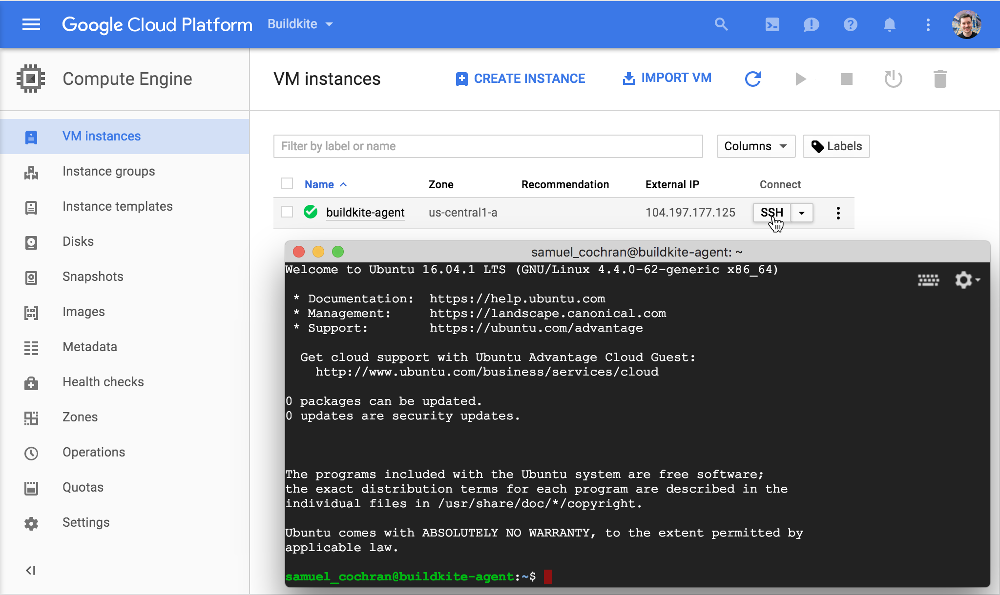

class: title

## CLI в Node.js
### .oc-blue-4.ri-twitter-fill[] AlexKorzhikov

.photo[
  
]

.right.bottom[
  ### 17 июня 2020
]

---

class: top white
background-image: url(assets/sound.svg)
.top.icon[]

.sound-top[
  # Как меня слышно и видно?
]

.sound-bottom[
  ## > Напишите в чат
  ### **+** если все хорошо
  ### **–** если есть проблемы cо звуком или с видео
]

---

background-image: linear-gradient(150deg,rgb(142, 81, 208),rgb(174, 132, 207)), url(static/t0.gif)

# Обо мне

.right-image[
  
]

<style>
  h3 span {
    vertical-align: -3px;
  }
</style>

### .oc-blue-4.ri-twitter-fill[] `AlexKorzhikov`
### JavaScript, DevOps
### .oc-yellow-9[@ING]
### @Otus

### .oc-red-6.ri-mail-line[] .oc-teal-9.ri-medium-fill[] .ri-github-fill[] **korzio** 


### .center[👋]

.right-code[
## Расскажите о себе!
]

---

# CLI в Node.js

<style>
  img[alt=node] { width: 300px;}
  img[alt=oclif] { width: 200px;}
</style>

- Введение
  - Почему CLI?
.right.image[
  
]
  - Почему Node.js?
  - Общие принципы, другие технологии

.right-image[
  
]
  
- Примеры - npm, git
  - `package.json`
- Hello CLI
- Обзор фреймворков
  - Commander.js, Inquirer, Vorpal

.right-image[
  
]
  
- CLI с `oclif`
  - Конфигураци проекта, команды, плагины
  - Аргументы и флаги, эффекты

---

# CLIs are back!

<style>
.rect img {
  height: 180px;
}

.rect.width-100 {
  margin-left: -50px;
}
</style>

### **Интерфейс командной строки, Command Line Interface, CLI**
### программа с текстовым интерфейсом ввода вывода инструкций или команд

.rect.width-100.height-33[

.hline.gray.width-90.relative-layout.top-23[
]
.rect.width-23[
.circle.blue.border.width-10[]

**1960**

]
.rect.width-23[
.circle.green.border.width-16[]

**1990**  

]
.rect.width-23[
.circle.blue.border.width-10[]

**2010**

]
]

---

# Почему?

### Какая CLI программа
- Вам нравится?
- Вы используете больше всего?
- Почему Node.js?

.center[
  
]

---

# Популярные CLI

.right-code[
- `cd, ls, curl`
- `ps, htop`
- `node, tsc, go`
]

- `git`
- `docker`
- `kubectl`

.right-code[]

- `npm`

### Генерация фронтенд проекта, настройка окружения

.right-code[
- `yeoman`
- `webpack`
- `gulp, grunt`
]

- `create-react-app`
- `angular-cli`
- `vue-cli`

---

# Почему CLI?

### .green[`+`]

- **Инструменты** 
  - для улучшения и
  - автоматизации работы 
  - разработчиков,
- *которые позволяют достичь большего!*
- *It's fun!*

### .red[`-`]?

---

# Почему Node.js?

### .green[`+`]

- Попрактиковаться с `JavaScript`
- [Принцип Этвуда](https://blog.codinghorror.com/the-principle-of-least-power/) - *Любое приложение, которое может быть написано на JavaScript, обязательно будет написано на JavaScript*
- Быстрая и простая разработка
- Множество готовых пакетов и библиотек, богатая инфраструктура `npm` 
- Модульность
- Лучшее решение для фронтенда

.hidden[
- We build for Fronted developers, they have node installed already
]

### .red[`-`]?

---

# Принципы

.right-image[]

### Какие принципы дизайна `CLI` программы вы знаете?

```bash
npx cowsay hello cow
 ___________
< hello cow >
 -----------
        \   ^__^
         \  (oo)\_______
            (__)\       )\/\
                ||----w |
                ||     ||
```

---

# Принципы

- Пользователь должен понимать, что происходит
  - `help`
  - `version`
  - `logs, messages, errors`
  
.right-image[]

- [Философия UNIX](https://ru.wikipedia.org/wiki/%D0%A4%D0%B8%D0%BB%D0%BE%D1%81%D0%BE%D1%84%D0%B8%D1%8F_Unix)
  - `Пусть каждая программа делает что-то одно, но хорошо`
  - `KISS`
  - `Модульность, композиция`

- Рабочее окружение
  - `linux, mac os, windows`
  - `package`

---

class: title

## .center[Q&A]
### .center[Introduction --> Hello CLI]

---

# Hello CLI

## Demo

```bash
mkdir my-test-cli
npm init
echo "console.log('Hello CLI')" > index.js
npm start
npm install --global .
my-test-cli
```

---

# package.json

```json
{
  "name": "my-test-cli",
  "version": "1.0.0",
  "description": "Hello CLI",
  "main": "server.js",
  "bin": "server.js",
  "scripts": {
    "test": "echo \"Error: no test specified\" && exit 1"
  },
  "keywords": [],
  "author": "",
  "license": "ISC",
  "man" : "./man/doc.1"
}
```

- `main` - экспорт
- `bin` - сделать исполняемый `symlink` в `PATH`, `./node_modules/.bin/`
- `url` - [`npm bugs`](https://docs.npmjs.com/files/package.json#bugs) - сообщить куда следует 🤗

---

# Особенности Исполнения

- `shebang` повзоляет указать интерпретатор в `*nix`

```js
#!/usr/bin/env node
```

> для `windows` [cmd-shim](https://github.com/npm/cmd-shim#readme) 

- `process.argv` аргументы, переданные программе

Что произойдет при запуске программы `server.js`?

```javascript
console.log(process.argv)
```

```bash
node server hello world
```

- [`repl`](https://nodejs.org/api/repl.html) встроенные возможности

---

# help & version

## Demo

```bash
> my-test-cli

Usage: 
--help    Help documentation
--version Installed package version
```

---

# Commander.js

```javascript
var program = require('commander');

program
  .version('0.1.0')
  .option('-p, --peppers', 'Add peppers')
  .option('-P, --pineapple', 'Add pineapple')
  .option('-b, --bbq-sauce', 'Add bbq sauce')
  .parse(process.argv);

console.log('you ordered a pizza with:');
if (program.peppers) console.log('  - peppers');
if (program.pineapple) console.log('  - pineapple');
if (program.bbqSauce) console.log('  - bbq');
console.log('  - %s cheese', program.cheese);
```

- Парсинг аргументов
- Модульность
- Автоматическая документация интерфейса

---

# Inquirer

### Стильный ввод данных пользователя


#### Альтернативы
- `cli-ux`
- `prompt`
- `enquirer`

---

# Vorpal

#### https://vorpal.js.org/ <br><br>

.right-code[
- Непрервный CLI
- Документация
- Парсинг аргументов
- Ввод данных
- Автодополнение
]

.half-image[
   <br><br>
  
]

https://www.telerik.com/blogs/creating-node-js-command-line-utilities-improve-workflow

---

# .half-image[ [](https://oclif.io/) ]

- Framework от *Heroku, SalesForce* для построения CLI
- `TypeScript`
- Генерация кода
- Стандартная структура папок
- Хуки
- Документация
- Парсинг аргументов

```bash
$ npx oclif single mynewcli
? npm package name (mynewcli): mynewcli
$ cd mynewcli
$ ./bin/run
hello world from ./src/index.js!
```

---

# Demo oclif + TypeScript = watch

- Add [`--watch` flag](https://nodejs.org/docs/latest/api/fs.html#fs_fs_watch_filename_options_listener)
- Transpile TypeScript

### **!Important! Deprecated**
### Define interpreter for other file extensions

```js
const oldHook = require.extensions['.js']
const tsc = require('typescript')

require.extensions['.ts'] = function (module, file) {
  const oldCompile = module._compile
  module._compile = function (code, file) {
    code = tsc.transpileModule(code, { compilerOptions: {} }).outputText + '; console.log("barhook:", bar)'
    module._compile = oldCompile
    module._compile(code, file)
  }
  oldHook(module, file)
}

require('./ts.ts')
```

.hidden[
> the TypeScript Node (ts-node) - the on-the-fly module extension and REPL for Node.
https://github.com/microsoft/TypeScript/wiki/Using-the-Compiler-API
]

---

# Другие библиотеки

- `chalk` разноцветный вывод
- `clui` вывод таблиц, статус, графики
- `progress` статус
- `cli-table` таблица
- `figlet` ASCII вывод
- `clear` почистить терминал
- `cli-ux` oclif утилиты для ввода и вывода
- [Gluegun](https://github.com/infinitered/gluegun)

---

# Docs

- [Evolution of the Heroku CLI: 2008-2017](https://blog.heroku.com/evolution-of-heroku-cli-2008-2017)

- [12 Factor CLI Apps - Heroku](https://medium.com/@jdxcode/12-factor-cli-apps-dd3c227a0e46)

- [Building Great CLI Experiences in Node.js - Jeff Dickey, Heroku](https://www.youtube.com/watch?v=Izx3-KSuaM8)

- [Build a JavaScript Command Line Interface (CLI) with Node.js — SitePoint](https://www.sitepoint.com/javascript-command-line-interface-cli-node-js/)

- [My CLI Stories](https://medium.com/@korzio) 

- [Full CLI In TypeScript Online Workshop](http://cli-in-ts.dev/)

### На занятии

- Разобрали базовые концепции разработки CLI с `Node.js`
- Попробовали возможности фреймворков и библиотек

---

class: title

## .center[Q&A --> О Курсе]

---

background-image: linear-gradient(150deg,rgb(142, 81, 208),rgb(174, 132, 207)), url(static/t0.gif)

class: profile
# Преподаватели+

- **Александр Коржиков**

JavaScript @ Alpari, Comindware, Tinkoff, Backbase, ING  
korzio@gmail.com https://github.com/korzio
  
- **Юрий Дворжецкий**

Java, JavaScript @ Luxoft  
Teaching @ 1500+ hours, 600+ developers

- **Михаил Кузнецов**

FullStack @ ING
https://github.com/shershen08

- **Никита Овчинников** 

EPAM Systems, Skywind Group 

- **Нас больше!**

---

# Modern JavaScript Frameworks

|  |  |  |  |  |  |
|:-------------:|:-------------:|:-------------:|:-------------:|:-------------:|:-------------:|
|  |  |  | |  |  |
|  |  |  | |  | |
|  |  |  |

---

class: title

## .center[Q&A О Курсе]

---

class: title

.right.bottom[
  ### 17 июня 2020
]

## Спасибо за внимание!
### Пожалуйста, пройдите [опрос](https://otus.pw/ZlEl/)
