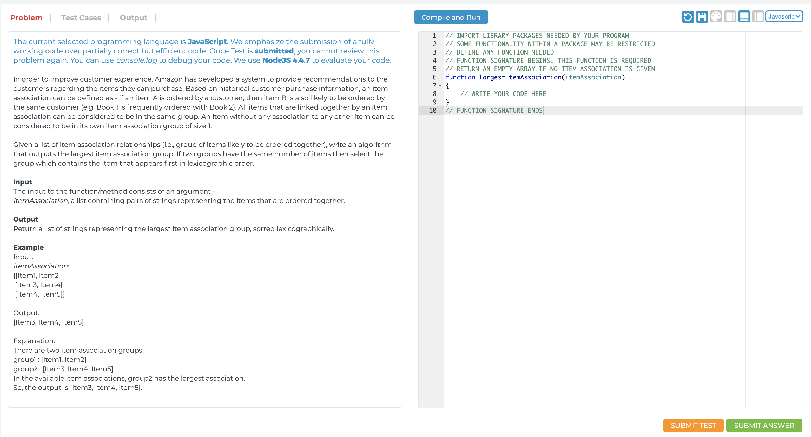

class: title

## Введение в курс
### .oc-blue-4.ri-twitter-fill[] AlexKorzhikov

.photo[
  
]

.right.bottom[
  ### 28 сентября 2020
]

.hidden[
  Привет! Я преподаватель и один из авторов нашего JS курса. Сегодня стартует новый (10?!!!) поток и это очень круто. Мы постоянно обновляем программу и материалы курса, у нас появляются новые преподаватели. Я проведу сегодняшнее введение, на котором расскажу о себе и о курсе. Буду рад ответить на вопросы до и после занятия. Ну а начнем мы традиционно с JavaScript Best Parts :smile_cat:
  https://www.destroyallsoftware.com/talks/wat
]

---

class: top white
background-image: url(assets/sound.svg)
.top.icon[]

.sound-top[
  # Как меня слышно и видно?
]

.sound-bottom[
  ## > Напишите в чат
  ### **+** если все хорошо
  ### **–** если есть проблемы cо звуком или с видео
]

---

# Цели занятия

- Познакомиться с преподавателями и программой курса, понимать как она построена
- Вспомнить и применять основные техники языка `JavaScript`, которые помогут при изучении фреймворков

---

# Вопрос

- Расскажите о себе 😀 , можно в [слаке](https://join.slack.com/t/otus-js/shared_invite/enQtMjc5ODE0NDA0ODE3LTA4NTJjYzNlOWI5ZDNmMGNkZjRmNGNiNzM2NjhlMzc2MjYxY2IzZDVlMjY0YjJhZTNlZjRiNTcwNmRjYzZjYzk
)

  - Кто Вы?
  - Какой Ваш опыт в программировании?
  - Какие `JavaScript` фреймворки Вы используете? 
  - Какие `JavaScript` библиотеки Вы используете? 
  - Что Вы ждете от курса?
  
.green[
## Для отправки сообщений в Zoom используйте
]
.red[
## **All panelists and attendees**
## **Ведущие и участники**
]

---

# Technologies

|  |  |  |  |  |  |
|:-------------:|:-------------:|:-------------:|:-------------:|:-------------:|:-------------:|
|  |  |  |  |  |  |
|  |  |  | |  | |
|  | |  |

---

class: purple
# Цели курса

- Понимать для чего нужны веб фреймворки
- Уметь применять паттерны проектирования (Virtual DOM, Dependency Injection, Observables, Event Loop)
- Знать подходы при проектировании, организации, контроля состояния и тестирования приложений
- Выбирать подходящие инструменты для проекта
- Создавать веб-приложения с использованием современных технологий 

---

class: purple
# Организационные вопросы по курсу

- Тема “Modern JavaScript Frameworks”
- 43 + 3 занятия / 1.5 часа / понедельник / четверг
- Вебинары, материалы, теория и практика
- Домашние задания
- Выпускной проект
- Общение в slack

---

# Преподаватели+

<style>
  img[alt=JS] { width: 200px;}
</style>

.right[]

- **Александр Коржиков**

JavaScript @ Tinkoff, Backbase, ING  
  
- **Юрий Дворжецкий**

Java, JavaScript @ Luxoft  

.right-code[
- **Антон Морев**

Wormsoft, основатель и IT-директор

- **Маргарита Образцова** 

Nitor, Senior Software Engineer

]

- **Михаил Кузнецов**

FullStack @ ING

- **Никита Овчинников** 

EPAM Systems, Skywind Group 

---

class: qa

## Программа курса Q&A

---

# [Несколько вопросов](https://github.com/denysdovhan/wtfjs)

- `setTimeout` и `setInterval` - часть `JavaScript`?

- ?

```js
console.log.call.call.call.call.call.apply(
  a => a, 
  'what is gonna be printed in the console?'.split(' ')
) 
```

- "b" + "a" + +"a" ?

<!-- - typeof document.all? -->

```js
function anc(){
<!-- valid comment too
  return 1
}

anc()
```

---

# Темы

.right-image[]

- Типы данных
- Переменные 
- Функции
- Замыкания

---

# Типы данных

`JavaScript` динамически типизированный язык

### **Примитивные** типы данных

- number
- string
- boolean 
- null
- undefined
- *Symbol*
- *BigInt*

---

# Типы данных

- number `1, 2, 3.5, 0x8? , 0b11?`
- string '1' , "2", \`oh\`, my\`fn\`
- boolean `true || false`
- null
- undefined // === undefined ?
- *Symbol - Вы знаете, для чего они нужны и как их использовать?* 

```javascript
var n = 4
n.a = 5
n.a // ?

parseInt("f*") // -> ?
parseInt('0x11', 16)
```

<!-- // Number.prototype.isOne = function() {
//   return Number(this) === 1
// }

// (1.0).isOne() // ? -->

---

# Типы данных

Все другие типы данных в `JavaScript` - объекты

### Objects

```javascript
typeof null === // 1 ? 
typeof {} === // 2 ?
typeof function() {} === // 3 ?
typeof typeof null === // 4 ?
```

---

# Вопрос

### Может ли это выражение быть инстинным?

```javascript
a == 1 && a == 2 && a == 3 
=== true // ?
```

.center[]

---

# Приведение типов

- `valueOf()` возвращает простое представление объекта
- `toString()` возвращает строковое представление объекта

```javascript
a == 1 && a == 2 && a == 3 
=== true // ?

var a = (function() { 
  var i = 1 
  return { 
    valueOf: function() { 
      return i++ 
    } 
  }
})()
```

---

# Переменные

### Области видимости 
- `var` доступны во всем теле функции
- `let` и `const` определены в блоке `{...}`

```javascript
if (true) { 
  var b = 1
}

console.log(b) // 1

if (!false) { 
  const c = 2
}

// console.log(c) 
// ReferenceError: c is not defined
```

---

# Скрытие и всплытие

```
var x = "global"
function f() {
  var x = "local"
  console.log(x) // ?
}
f()
console.log(x) // ?
```

- **`var`** обрабытывается до исполнения кода `<=> hoisting`
- **`let`** и **`const`** определены в блоке  `{...}`

```javascript
console.log(b) // undefined

// console.log(c)
// ReferenceError: c is not defined
var b = 1
const c = 2
```

---

# Destructuring

### Определение и присвоение переменных из объектов

```javascript
function h ({ name, val }) { 
  console.log(name, val)
}

var { 
 op: a, lhs: { op: b } = {} 
} = {} // A
```

### Вопрос

Какая может быть структура у объекта `A`, чтобы `a` и `b` были определены?

---

# Вопрос

- Будет ли это работать? 
- Что здесь происходит?

```javascript
var a = { a }
let b = { b }
const c = { c }
```

---

# Переменные

```javascript
var a = { a }
// Ok!

let b = { b } 
// Uncaught ReferenceError: 
// b is not defined
const c = { c } 
// Uncaught ReferenceError: 
// c is not defined
```

- `var` (hoisting + shorthand)
- `let`
- `const`

---

# Best Practices

.hidden[
  
]

- .green[Правильное именование переменных]
- .green[Декларация переменных до их использования]

```
"use strict";
```

- .red[Не публиковать локальные переменные]

- `const` .green[-->] `let` .red[-?->] `var`


---

# Функции

.right-code[
```javascript
function a() {} // 1

new Function('a, b', 'return a')
// 2

const a = function () {} // 3
const a = () => {} // 4
```
]

- Этот код будет работать?
- Какие из примеров являются 
  - `function expression`, 
  - `function declaration`, 
  - `function constructor`?
- Что такое IIFE?

### Отличия

- Контекст исполнения `this`
- Arguments
- Constructor

---

# Задача

### Что будет выведено в консоль?

```javascript
var obj = { 
  a: function (){ 
    console.log(this.prop) 
  }, 
  prop: 1 
} 

obj.a.prop = 2 
obj.a() // ? 
var fn = obj.a
fn() // ?
```

---

# Замыкания

### Область видимости определяется функцией

```javascript
function outer() { 
  var outerVar 
  
  var func = function() { 
    var innerVar = innerVar + outerVar 
  } 
  
  return func
}
```

---

# Замыкания

- Что будет в консоли? 
- Как это исправить?

```javascript
for (var i = 0; i < 10; i++) { 
  setTimeout(function() { 
    console.log(i) 
  }, 1000)
}
```

---

# Замыкания

### let

```javascript
for (let i = 0; i < 10; i++) { 
  setTimeout(function() { 
    console.log(i) 
  }, 1000)
}
```

---

# Замыкания

### bind

```javascript
for (var i = 0; i < 10; i++) { 
  setTimeout(function() { 
    console.log(this)
  }.bind(i), 1000)
}
```

```javascript
for (var i = 0; i < 10; i++) { 
  setTimeout(function(i) { 
    console.log(i)
  }.bind(null, i), 1000)
}
```

---

# Задание

### Какой контекст будет у функции, если к ней применить `bind()` дважды?

```
var fn = function() {
  console.log(this)
}

var a = fn.bind(1)
a() // a?

var b = a.bind(2)
b() // b?
```

### Почему?

---

class: qa

## Q&A

---

# Что почитать

.right-image[]

### ECMAScript 6 (2015)
- http://es6-features.org/ <br> (кратко)
- http://exploringjs.com/es6/ <br> (подробно)
- https://developer.mozilla.org/ <br> (справочник)
- http://javascript.ru/ <br> (Илья Кантор)

---

class: purple
# На занятии

- Познакомились с преподавателем и с программой курса
- Вспомнили теорию - типы данных и переменные, функции и замыкания
- Попрактиковали различные `JavaScript` техники

---

# Modern JavaScript Frameworks

.mario.mario-1[]

|  |  |  |  |  |  |
|:-------------:|:-------------:|:-------------:|:-------------:|:-------------:|:-------------:|
|  |  |  |  |  |  |
|  |  |  | |  | |
|  | |  |

---

# Самостоятельные работы

- https://github.com/
- single repo lastname-name(-otus) - `korzhikov-alex-otus`
- `master` branch
- MR from `block-lesson-number` to `master` (`javascript-1` -> `master`, `react-4` -> `master`)
- exclude `node_modules`, `bower_components`, `editor`, scaffolding
- https://github.com/korzio/modern_javascript_frameworks
- Добавить ссылку на MR в чат с преподавателем внутри ЛК Отуса

---

# Самостоятельная работа

### Написать алгоритм для нахождения максимального списка рекомендаций

.half-image[

]

---

class: title

## Спасибо за внимание!
### Пожалуйста, пройдите [опрос](https://otus.ru/polls/16649/) в личном кабинете

.right.bottom[
  ### 28 сентября 2020
]