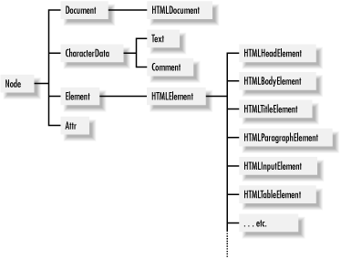

.center.icon[]

---

class: white
background-image: url(assets/title.svg)
.top.icon[]

# Modern JavaScript Frameworks
## Все суть компоненты
### Александр Коржиков

---

class: top white
background-image: url(assets/sound.svg)
.top.icon[]

.sound-top[
  # Как меня слышно и видно?
]

.sound-bottom[
  ## > Напишите в чат
  ### **+** если все хорошо
  ### **–** если есть проблемы cо звуком или с видео
]

---

# Changelog

- Занятия в новогодние праздники?

> занятие 27.12 (четверг)  
> потом каникулы  
> возвращаемся 10.01 (четверг)

---

# Темы предыдущего занятия

.right-image[]

- Введение в Polymer
- Hello Polymer
- Web Standards
  - Ajax
  - ES6 Templates literals
  - Type Module
- Обзор инструментов
- Lit-HTML
  - Lit Element
  - pwa-starter-kit

---

# Темы

- Getters / Setters
- Custom Elements
  - Standalone
  - Built-in
  - LifeCycle

### Цели

- Понимать и работать с веб спецификацией `Custom Elements`

---

# Docs

- [WHATWG Specification](https://html.spec.whatwg.org/multipage/custom-elements.html)

- [Polymer Guide](https://www.polymer-project.org/3.0/docs/devguide/custom-elements)

- [A short introduction to Web Components](https://github.com/ruphin/webcomponents)

- [Google I/O 2014 - Polymer and Web Components change everything you know about Web development](https://www.youtube.com/watch?v=8OJ7ih8EE7s)

---


# Object.defineProperty

- obj - объект применения
- prop - имя свойста
- descriptor - описание свойства

```
var obj = {}
var descriptor = { /* TBD */ }

Object.defineProperty(
  obj, 
  'prop', 
  descriptor
)
```

- `Object.defineProperties()`
- `Object.create()`

---

# Descriptors

- `configurable, enumerable, value, writable` - свойства доступа

```
Object.defineProperty(obj, 'prop', { 
  configurable: false,
})
Object.defineProperty(obj, 'prop', { 
  configurable: true 
})

// Uncaught TypeError: Cannot redefine property: prop1
```

---

# Descriptors

- `configurable, enumerable, value, writable` - свойства доступа
- `get, set` - функции доступа

```
var descriptor = { 
  get: function() { return 1 },
  set: function() {},
  value: 2,
}

// Uncaught TypeError: Invalid property descriptor. 
// Cannot both specify accessors and a value or writable attribute
```

---

# Самостоятельная работа

Использовать `Object.defineProperty()` для хранения и получения значений объекта

```
a.b // 1
a.b = 4 // 1 + 4
a.b // 5
```

---

# Getter / Setter

```
// get prop() {} 
// set prop(p) {}

// on object / prototype
var descriptor = { 
  get value() { return 1 },
  set value(param) {},
}

class Example { 
  get hello() { 
    return 'world' 
  }
}
```

---

# Custom Elements

### "Custom elements provide a way for authors to build their own fully-featured DOM elements"

### "A custom element is an element that is custom" 
 
© WHATWG

---

# Все суть компоненты

### Например, select, input & form

```html
<select>
<option value="1">7</option>
</select>
```

### Что если нам нужен multi-select?

```html
<multi-select>
  <option value="1">8</option>
  <option value="2">13</option>
</multi-select>
```

---

# Пример 1

```html
<script>
class HelloWorldElement extends HTMLElement {
  connectedCallback() {
    this.textContent = "Hello World"
  }
}
customElements.define('hello-world-element', HelloWorldElement);
</script>
```

### Как использовать?

---
# Пример 2

```
class FlagIcon extends HTMLElement {
  constructor() {
    super();
    this._countryCode = null;
  }
  attributeChangedCallback(name, oldValue, newValue) {
    this._countryCode = newValue;
  }
  connectedCallback() { /* ... */ }
  get country() {
    return this._countryCode;
  }
  set country(v) {
    this.setAttribute("country", v);
  }
}
```

---

# Декларация

```
customElements.define("flag-icon", FlagIcon) 
// [a-z](PCENChar)* '-' (PCENChar)*

// use createElement
const flagIcon = document.createElement("flag-icon")
flagIcon.country = "jp"
document.body.appendChild(flagIcon)

// use new
const flagIcon = new FlagIcon()
flagIcon.country = "jp"
document.body.appendChild(flagIcon)
// use HTML document 
```

---

# Самостоятельная работа

### Создать `hello-component` элемент, который покажет `alert` на странице

```
class HelloComponent extends HTMLElement { // ?}

// customElements.define ? 

<!-- ? -->
```

### Какое значение у `display hello-component` элемента в `DOM`?

---

# Вопрос

- Сложно ли создать собственный `button`?
- Что для этого нужно сделать?

.center[]

---

# HTMLElement

```
class HelloComponent extends HTMLElement { }
```



---

# Customized built-in elements

- reuse && extend - встроенное поведение
- extends && is - обязательные аттрибуты

```
class PlasticButton extends HTMLButtonElement {
  constructor() {
    super() // ... 
  }
}

customElements.define("plastic-button",
  PlasticButton, { extends: "button" }
)

document.createElement("button", {
  is: "plastic-button"
}) 
```

```html
<button is="plastic-button">Click Me!</button>
```

---

# Демо

Создать custom label для активации ссылки

---

# Вопросы

- Напоминает что-нибудь?
- Что бы Вы предложили реализовать для примера `customized built-in elements`?
- Что будет, если декларировать `custom element` после его создания?

---

# CustomElementRegistry

- `window.customElements` - registry instance
- `define()`
- `get()`
- `whenDefined()`
- `upgrade()`

---

# Flow

```html
<example-element></example-element>
```

```
const inDocument = document.querySelector('example-element')
const outOfDocument = document.createElement('example-element')

console.assert(inDocument instanceof HTMLElement)
console.assert(outOfDocument instanceof HTMLElement)

class ExampleElement extends HTMLElement {}
customElements.define('example-element', ExampleElement)

console.assert(inDocument instanceof ExampleElement)
console.assert(!(outOfDocument instanceof ExampleElement))

// upgraded
document.body.appendChild(outOfDocument)
console.assert(outOfDocument instanceof ExampleElement)
```

---

# LifeCycle

- `connectedCallback` (2) - `DOM`
- `disconnectedCallback` (N) - `DOM`
- `attributeChangedCallback` (1) <= static `observedAttributes()`
- `adoptedCallback` (?) => "new document"
- `constructor` (0)

---

#  Attribute Change

```
class HelloWorldElement extends HTMLElement {
  static get observedAttributes() {
    return ['name']
  }
  attributeChangedCallback(name, oldValue, newValue) {
    this._name = newValue
  }
  connectedCallback() {
    this.name = this.getAttribute('name') || 'World'
  }
  get name() {
    return this._name
  }
  set name(name) {
    this.setAttribute('name', name)
    this.render()
  }
  render() {
    this.textContent = `Hello ${this.name}`
  }
}
```

---

# Самостоятельная работа

### Убедиться что все хуки исполнились (с помощью консоли и ...?)

- connectedCallback
- disconnectedCallback
- attributeChangedCallback
- adoptedCallback
- constructor

---

# Features & Requirements

- `Custom Elements` can be upgraded
- call `super()`
- work to be deferred to `connectedCallback()`
- constructor for state, default values, event listeners & shadow root

---

# Вопрос

### Как передавать данные для дочерних Custom Elements?

---

# На занятии

- Попрактиковали `getters / setters`
- Разобрали веб спецификацию `Custom Elements`

---

# Modern JavaScript Frameworks

.mario.mario-10[]

|  |  |  |  |  |  |
|:-------------:|:-------------:|:-------------:|:-------------:|:-------------:|:-------------:|
|  |  |  |  | |  |
| |  | |  | |  |
| |  | |
| |  | |

---

# Самостоятельная работа


---

class: white
background-image: url(assets/title.svg)
.top.icon[]

# Спасибо за внимание!

### Вы верите в Web Components?

.black[ 
### Пожалуйста, пройдите [опрос](https://otus.ru/polls/2389/) в личном кабинете 
]

