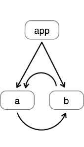
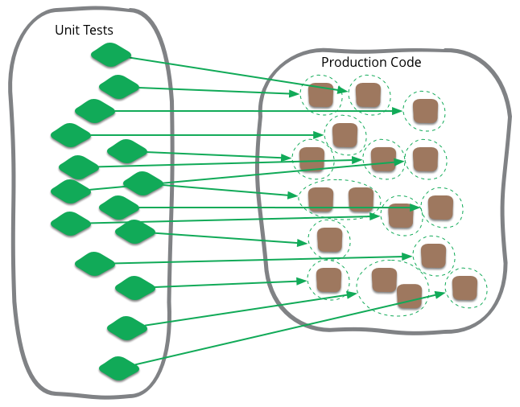
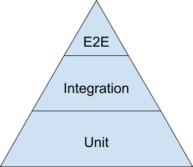
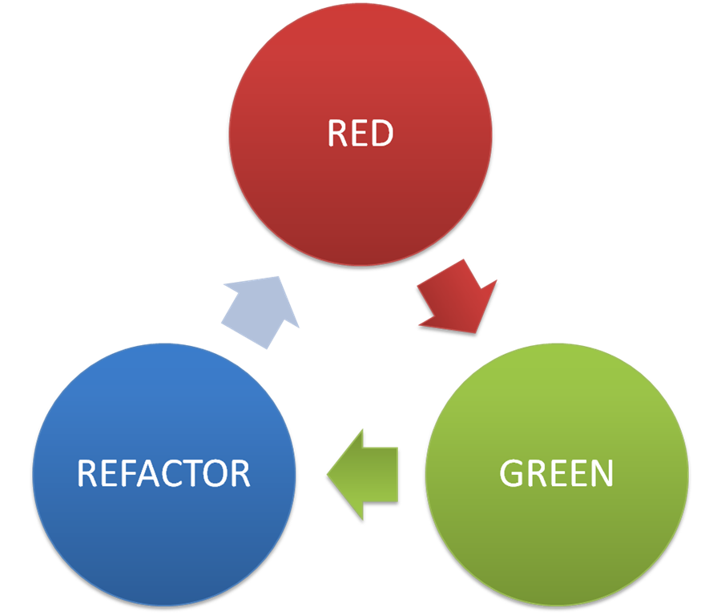

.center.icon[]

---

class: white
background-image: url(assets/title.svg)
.top.icon[]

# Modern JavaScript Frameworks
## Стандартная библиотека Node
### Александр Коржиков

---

class: top white
background-image: url(assets/sound.svg)
.top.icon[]

.sound-top[
  # Как меня слышно и видно?
]

.sound-bottom[
  ## > Напишите в чат
  ### **+** если все хорошо
  ### **–** если есть проблемы cо звуком или с видео
]

---

# Changelog

- NodeConf EU 2018 - Kilkenny, Ireland

### https://www.nodeconf.eu/

- N-API?

- https://developer.chrome.com/devsummit/schedule

### chrome dev summit 2018

---

# Темы предыдущего занятия
.right-image[]

- Node
  - About
  - Пример Web сервера
  - Структура
  - Стандартные модули
  - Пример Callbacks
- NPM
  - package.json
  - cli

---

# Цели занятия

- Разобраться с шаблоном проектирования `Module` и вариантами его имплементации в `JavaScript`

- Использовать require и `ES Modules` для экспорта и импорта зависимостей

- Повторить основы и попробовать примеры с `TDD`

---

# Содержание

.right-image[]

- Modules
  - Pattern
  - Classic
  - AMD 
  - CommonJS
  - ES Modules
  - Native ES Modules - Gil Tayar
- TDD
- BDD

---

# Docs

- https://nodejs.org/api/modules.html 

### Node Modules API

- https://addyosmani.com/resources/essentialjsdesignpatterns/book/ 

### Learning JavaScript Design Patterns Addy Osmani

- https://martinfowler.com/articles/mocksArentStubs.html 

### Mocks Aren't Stubs - Martin Fowler

---

# Module

### Архитектурный шаблон проектирования, помогающий организовать отдельные части кода 

- Classic
- AMD 
- CommonJS
- ES Modules

---

# Classic 

```javascript
// Global module
var myModule = (function (jQ, _) {
  function privateMethod1() {
    jQ(".container").html("test")
  }
  return {
    publicMethod: function () {
      privateMethod1()
    }
  }
})(jQuery, _) 

myModule.publicMethod()
```

- Immediately-Invoked Function Expression (IIFE)
- Object Notation
- Namespace with `init()` method

---

# AMD - RequireJS


```javascript
define('myModule', // name
  ['jQuery'], // dependencies
  function myModuleFactory($) { // factory
    function writeTest() {
      $('.container').html('test')
    }
    return {
      init: () => {
        writeTest()
      }
    }
  }
)
// or
define(function (require, exports, module) {
  // ...
})
```

- `require()`
- `define()`

---

# CommonJS

.right-code[
```
// require
const circle =
  require('./circle.js')
// exports
exports.square =
  (r) => r ** 2
```
]

### Node

- `require()` - импорт
- `exports, module.exports` - экспорт API из модуля

```
exports.version = 123
module.exports = { build, version }
```

---

# Module Wrapper

- `require()` - импорт глобальных и локальных зависимостей
- `module, module.exports`

```
(function (
  exports, 
  require, 
  module, 
  __filename, 
  __dirname
) {
  const circle = require('./circle.js') 
  exports.square = (r) => r ** 2
})
```


---

# require

- `require()` кэширует модуль
- `require.cache` хранит загрузки
- `require.resolve()` возвращает путь до зависимости

```
const cachedGlob = require('glob')
delete 
  require.cache[require.resolve('glob')]
 
const originalGlob = require('glob')
cachedGlob.Glob = originalGlob.Glob
```

---

# Вопрос

Что будет выведено в консоль?

```
const empty = require('./empty.js')
empty.test = 123
console.log(require('./empty.js').test)
console.log('finished')
```

Что здесь происходит?

```
const cachedGlob = require('glob')
delete 
  require.cache[require.resolve('glob')]
 
const originalGlob = require('glob')
cachedGlob.Glob = originalGlob.Glob
```

---

# Порядок загрузки

### https://nodejs.org/api/modules.html#modules_all_together 

- `require('core')` - встроенные модули
- `require('/')` или './', '../' - откуда 
- `file, .js, .json, .node` - расширения файлов
- `X/index.js` - index
- `X/package.json` - "модуль"
- `node_modules` - загрузка по иерархии

---

# Циклические зависимости

- `b.js` > `require('./a')`
- `a.js` > `require('./b')`



Код первого модуля внутри второго будет *"незавершенным"*

---

# Вопрос

Что будет выведено в консоль? 

.right-code[
```
// b.js
const a = require('./a')
console.log(a.a)
exports.b = 'b'
```
]

```
// a.js
const b = require('./b')
console.log(b.b)
exports.a = 'a'
console.log('finished')
```

```bash
node a
```

---

# ES6 Modules

Поддерживается в расширении `*.mjs`

.left-code[
```
export default 'ui.router'
import * as core from 
  '@uirouter/core'
 
export { core }

import('./a').then(({ a }) => {
 console.log(a)
})
```
]

- export
- import
- import(...)
- default / as

---

# 3rd party presentation

- [Native ES Modules - something almost, but not quite entirely unlike CommonJS](https://docs.google.com/presentation/d/1dFnr27ksIfYi7VHY4lqeEOiV7qpjhLSRnk4gQW5oaPI/edit#slide=id.p)

- Gil Tayar, November 2018, @giltayar

- https://github.com/giltayar/node-esm-tea

- https://www.videoclip.site/video/44kvI2W0Mww/node-es-modules-something-almost-but-not-quite-entirely-unlike-commonjs-gil-tayar/

- https://medium.com/@giltayar/native-es-modules-in-nodejs-status-and-future-directions-part-i-ee5ea3001f71

---

# Задача

### Использовать Node@10

- Импортировать `default export` из CJS в MJS
- Импортировать значение с помощью `dynamic import` из MJS в CJS

---

class: white
background-image: url(assets/title.svg)
.top.icon[]

# Modules Q&A

---

# Testing

.right-image[]

### Automated software verification and validation process

- facilitate refactoring
- improves code structure
- adds documentation and examples

---

# Types of tests

.right-image[]

- **Unit** tests are close to the source, focus on small pieces of API in isolation
- **Integration** tests validate an interaction of modules and services
- **End-to-end** (System) tests check system with user behavior replica

---

# Test structure

```javascript
it('should return undefined if object is valid', () => {
 // setup // arrange
 const env = djv()
 env.addSchema('test', jsonSchema)
 const commonObj = { type: 'common' }
 const expected = undefined

 // exercise // act
 const result = env.validate('test#/common', commonObj)
 // verification // assert
 assert.equal(result, expected)
 // teardown
})
```

---

# Keywords

```
describe('arrayContaining', () => {
  const expected = ['Alice', 'Bob']
  it('matches even if received contains additional elements', () => {
    expect(['Alice', 'Bob', 'Eve'])
      .toEqual(expect.arrayContaining(expected))
  })
})
```

- `describe()`
- `test()`
- `beforeEach()` 
- `afterEach()`
- `expect`
- `done()`
- `skip(), only()`

---

# Concepts

.left-code[
```
const video = require('./video')

test('plays video', () => {
  const spy = jest.spyOn(video, 'play')
  const isPlaying = video.play()

  expect(spy).toHaveBeenCalled()
  expect(isPlaying).toBe(true)

  spy.mockRestore()
})
```
]

- **stubs** - predefined responses
- **spies** - save calls
- **mocks** - behavior verification

---

# Tools

- jest - `React`
- jasmine, karma - `Angular`
- mocha, chai, sinon - `Polymer`
- wct - `Polymer`
- protractor - `Angular`
- webdriver i/o - ...
- cucumber

---

# Unit testing best practices

- **F**ast - tests should run fast
- **I**ndependent / Isolated - the order shouldn't matter
- **R**epeatable - deterministic or idempotent
- **S**elf-Validating - should output the result
- **T**imely - should be close to the source code

---

# Test-Driven Development

### Test-Driven Development (TDD) is a technique for building software that guides software development by writing tests

.right-image[]

- Don't write code except to pass a failing test
- Write only **enough of a test** to show the failure
- Write only **enough code to pass** the failing test

---

# TDD 

.right-image[]

## Test-driven development, or TDD, is a rapid cycle of testing, coding, and refactoring

.red[ 
  - Write a failing test 
]
.green[ - Make the test pass ]
.blue[ - Refactor ]

---

# BDD

### *to get developers, testers and business to talk to each other*

(Gherkin)

.long-left-code[
```gherkin
Feature: 
  In order to keep my product stable 
  As a developer or product manager 
  I want to make sure that everything works as expected
  
Scenario: 
  Check title of website after search 
  Given I open the url "http://google.com" 
  When I set "WebdriverIO" to the inputfield "#lst-ib" 
  And I press "Enter" 
  Then I expect that the title is "WebdriverIO - Google Search"
  
Scenario: Another test 
  Given ...
```
]

<br>

- Feature
- Scenario
- Given
- When
- Then

---

class: white
background-image: url(assets/title.svg)
.top.icon[]

# Q&A

---

# На занятии

- Разобрали различие `CommonJS` и `ES Modules`

- Поняли как работают `require` и `exports` для экспорта и импорта зависимостей

- Разобрали основные концепции TDD

---

# Modern JavaScript Frameworks

.mario.mario-3[]
<!-- .mario.mushroom[] -->

|  |  |  |  |  |  |
|:-------------:|:-------------:|:-------------:|:-------------:|:-------------:|:-------------:|
|  |  |  |  | |  |
| |  | |  | |  |
| |  | |
| |  | |

---

# Самостоятельная работа


---

class: white
background-image: url(assets/title.svg)
.top.icon[]

# Спасибо за внимание!
.black[ 
## Пожалуйста, пройдите опрос 
## в личном кабинете 
]

- Все ли темы были понятны? (да - нет)
- Легкий материал или нет? (1 просто - 10 сложно)

.hidden[

Node
Сборщики
Webpack
Rollup
...
]