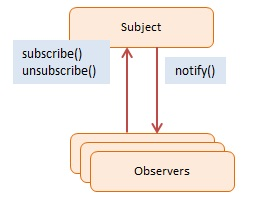
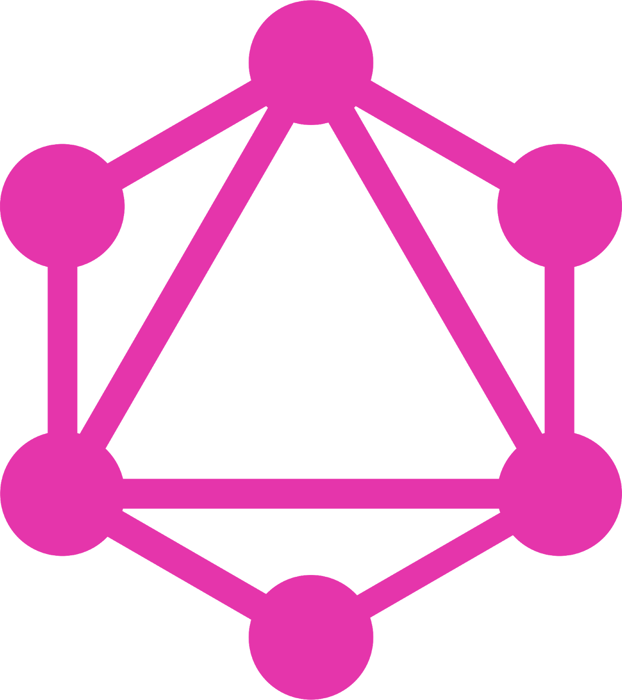

.center.icon[]

---

class: white
background-image: url(assets/title.svg)
.top.icon[]

# Modern JavaScript Frameworks
## TDD, Events, Timers, Event Loop
### Александр Коржиков

---

class: top white
background-image: url(assets/sound.svg)
.top.icon[]

.sound-top[
  # Как меня слышно и видно?
]

.sound-bottom[
  ## > Напишите в чат
  ### **+** если все хорошо
  ### **–** если есть проблемы cо звуком или с видео
]

---

# Changelog

- Chrome Dev Summit
- Web Summit
- Material in English?

---

# Темы предыдущего занятия

- Modules
  - Pattern
  - Classic
  - AMD 
  - CommonJS
  - ES Modules
  - Native ES Modules - Gil Tayar

---

# Цели

- Повторить основы и попробовать примеры с `TDD`

- Ориентироваться в понятии `Event Loop` и особенностях работы `Timers` в окружении `Node`


---

# Темы

.right-image[]

- TDD
  - BDD
- Events
- Event Loop
- Timers

---

#  Docs

- https://nodejs.org/en/docs/guides/event-loop-timers-and-nexttick/ 

### The Node.js Event Loop, Timers, and process.nextTick()

- https://jakearchibald.com/2015/tasks-microtasks-queues-and-schedules/ 

### Jake Archibald - Tasks, microtasks, queues and schedules 

- https://martinfowler.com/articles/mocksArentStubs.html 

### Mocks Aren't Stubs - Martin Fowler

---

# Testing

.right-image[]

### Automated software verification and validation process

- facilitate refactoring
- improves code structure & API
- adds documentation and examples

---

# Types of tests

.right-image[]

- **Unit** tests are close to the source, focus on small pieces of API in isolation
- **Integration** tests validate an interaction of modules and services
- **End-to-end** (System) tests check system with user behavior replica

---

# Test structure

```javascript
it('should return undefined if object is valid', () => {
 // setup // arrange
 const env = djv()
 env.addSchema('test', jsonSchema)
 const commonObj = { type: 'common' }
 const expected = undefined

 // exercise // act
 const result = env.validate('test#/common', commonObj)
 // verification // assert
 assert.equal(result, expected)
 // teardown
})
```

---

# Keywords

```
describe('arrayContaining', () => {
  const expected = ['Alice', 'Bob']
  it('matches even if received contains additional elements', () => {
    expect(['Alice', 'Bob', 'Eve'])
      .toEqual(expect.arrayContaining(expected))
  })
})
```

- `describe()`
- `test()`
- `beforeEach()` 
- `afterEach()`
- `expect`
- `done()`
- `skip(), only()`

---

# Concepts

.left-code[
```
const video = require('./video')

test('plays video', () => {
  const spy = jest.spyOn(video, 'play')
  const isPlaying = video.play()

  expect(spy).toHaveBeenCalled()
  expect(isPlaying).toBe(true)

  spy.mockRestore()
})
```
]

- **stubs** - predefined responses
- **spies** - save calls
- **mocks** - behavior verification

---

# Tools

- jest - `React`
- jasmine, karma - `Angular`
- mocha, chai, sinon - `Polymer`
- wct - `Polymer`
- protractor - `Angular`
- webdriver i/o - ...
- cucumber

---

# Unit testing best practices

- **F**ast - tests should run fast
- **I**ndependent / Isolated - the order shouldn't matter
- **R**epeatable - deterministic or idempotent
- **S**elf-Validating - should output the result
- **T**imely - should be close to the source code

---

# Test-Driven Development

### Test-Driven Development (TDD) is a technique for building software that guides software development by writing tests

.right-image[]

- Don't write code except to pass a failing test
- Write only **enough of a test** to show the failure
- Write only **enough code to pass** the failing test

---

# TDD 

.right-image[]

## Test-driven development, or TDD, is a rapid cycle of testing, coding, and refactoring

.red[ 
  - Write a failing test 
]
.green[ - Make the test pass ]
.blue[ - Refactor ]

---

# BDD

### *to get developers, testers and business to talk to each other*

(Gherkin)

.long-left-code[
```gherkin
Feature: 
  In order to keep my product stable 
  As a developer or product manager 
  I want to make sure that everything works as expected
  
Scenario: 
  Check title of website after search 
  Given I open the url "http://google.com" 
  When I set "WebdriverIO" to the inputfield "#lst-ib" 
  And I press "Enter" 
  Then I expect that the title is "WebdriverIO - Google Search"
  
Scenario: Another test 
  Given ...
```
]

<br>

- Feature
- Scenario
- Given
- When
- Then

---

# Задача

```javascript
const util = require('util')
/**
 * Takes a function following the common error-first callback style, 
 * i.e. taking an 
 * (err, value) => ... callback 
 * as the last argument, 
 * and returns a version that returns promises
 **/

util.promisify((err, value) => {/*...*/})
```

---

class: white
background-image: url(assets/title.svg)
.top.icon[]

# TDD Q&A

---

# Events

.right-code[
- Паттерн `Observer` - подписка на события и уведомления
- Синхронное исполнение хэндлеров
]

.left-image[
  
]

```
const EventEmitter = require('events')
class MyEmitter extends EventEmitter {}
const myEmitter = new MyEmitter()
myEmitter.on('event', () => {
  console.log('an event occurred!')
})
myEmitter.emit('event') 
console.log('after')
```

---

# Events

### Специальные события

- `error` - произошла ошибка
- `newListener` - добавился новый подписчик
- `removeListener` - подписчик удалился 

```
const EventEmitter = require('events')
class MyEmitter extends EventEmitter {}
const myEmitter = new MyEmitter()
myEmitter.emit('error')
```

---

# Events API

- `on(), once(), prependListener()` - подписаться на события
- `emit()` - триггерить событие
- `removeListener()` - удалить подписку
- `listeners()` - вывести список хэндлеров

```
const EventEmitter = require('events')
const myEmitter = new EventEmitter()
myEmitter.on('event', (a, b) => { 
  console.log(a, b, this) 
  // prints a b {}
})

myEmitter.emit('event', 'a', 'b')
```

---

class: white
background-image: url(assets/title.svg)
.top.icon[]

# Events Q&A

---

# Event Driven

### Событийно ориентированная парадигма - приложение подписывается на события и когда событие происходит, исполняются обработчики

.right-image[

]

### Вопрос
### `JavaScript` однопоточный?

---

# Вопрос

### Что будет выведено в консоль?

```
console.log('script start')

setTimeout(function () {
  console.log('setTimeout')
}, 0)

Promise.resolve()
  .then(function () {
    console.log('promise1')
  })
  .then(function () {
    console.log('promise2')
  })
  
console.log('script end')
```

---

# Event Loop

### При старте `Node` инициализируется `Event Loop`, исполняется переданный скрипт вместе с синхронными вызовами (`API, setTimeout, process.nextTick`), после чего происходит работа `Event Loop`

```javascript
const http = require('http') 
const hostname = '127.0.0.1'
const port = 3000
const server = http.createServer((req, res) => {
  res.statusCode = 200 
  res.setHeader('Content-Type', 'text/plain') 
  res.end('Hello World\n')
}) 

server.listen(port, hostname, () => {
  console.log(`Server running at http://${hostname}:${port}/`)
})
```

- В чем преимущество?

---

# События

- Файл доступен для чтения
- Время ожидания таймера закончилось
- Что еще?

```
while there are still events to process: 
  e = get the next event if there is a callback associated with e: 
  call the callback
 
while (queue.waitForMessage()) { 
  queue.processNextMessage()
}
```
© libuv

---

# Phases

<!-- Исполнение очереди операций / callbacks на каждой фазе -->

```
   ┌───────────────────────────┐
┌─>│           timers          │ // setTimeout, setInterval
│  └─────────────┬─────────────┘
│  ┌─────────────┴─────────────┐
│  │     pending callbacks     │
│  └─────────────┬─────────────┘
│  ┌─────────────┴─────────────┐
│  │       idle, prepare       │ // system
│  └─────────────┬─────────────┘      ┌───────────────┐
│  ┌─────────────┴─────────────┐      │   incoming:   │
│  │           poll            │<─────┤  connections, │
│  └─────────────┬─────────────┘      │   data, etc.  │
│  ┌─────────────┴─────────────┐      └───────────────┘
│  │           check           │ // setImmediate
│  └─────────────┬─────────────┘
│  ┌─────────────┴─────────────┐
└──┤      close callbacks      │
   └───────────────────────────┘
```

---

# The algorithm 

1. Is still something to do? Is Event Loop alive?
2. Update time - now()
3. Run timers if they are due
4. Run pending callbacks - callbacks from previous operations that have completed, f.e. to write on a `TCP` socket
5. Run pending handlers
6. Prepare handlers - always running before `I/O`
7. Block for `I/O` and poll from it
8. Check like prepare but after `I/O`
9. Close callbacks for objects disposal

---

# Timers

- `setTimeout(), setInterval()` - как обычно
- `setImmediate()` - специальный таймер, работает в фазе `poll`

```
const timeoutObj = setTimeout(() => {
  console.log('timeout')
}, 1500)

const immediateObj = setImmediate(() => {
  console.log('immediate')
})

const intervalObj = setInterval(() => {
  console.log('interval')
}, 500)

clearImmediate(immediateObj)
```

---

# Cancel timers

- `clearTimeout(), clearImmediate(), clearInterval()`
- `ref(), unref()` - установка / отмена таймеров по ссылке

```
const timerObj = setTimeout(() => {
  console.log('will i run?')
}) 

clearTimeout(timerObj)

timerObj.unref() 

setImmediate(() => {
  timerObj.ref()
})
```

---

# nextTick

### "Наиболее быстрое" исполнение асинхронных операций 
### "вне `Event Loop`"

```
console.log('start')

process.nextTick(() => { 
  console.log('nextTick')
})

console.log('scheduled')

// start
// scheduled
// nextTick
```

---

# 3rd party presentation

- [Node.js](https://otus.ru/media/a9/ec/356-7490-a9ec37.pdf?filename=356.pdf)

- Alexander Lobashev, RaiffeisenBank, 2018, t.me/alobashev

---

# Timers vs Immediate

### Что будет выведено в консоль?

```
setTimeout(() => { 
  console.log('timeout')
}, 0)
setImmediate(() => { 
  console.log('immediate')
})
```

### А здесь?

```
const fs = require('fs')
fs.readFile(__filename, () => { 
  setTimeout(() => { console.log('timeout') }, 0) 
  setImmediate(() => { console.log('immediate') })
})
```

---

# Вопрос

### Что будет выведено в консоль?

```
const fs = require('fs')
setTimeout(() => console.log('timeout'))
setImmediate(() => console.log('immediate'))
fs.readFile('./events.js', () => console.log('fs'))
```

### А здесь?

```
const fs = require('fs')
fs.readFile('./events.js', () => { 
  console.log('fs') 
  setTimeout(() => console.log('timeout')) 
  setImmediate(() => console.log('immediate'))
})
```

---

# Вопрос

### Что будет выведено в консоль?

```
const fs = require('fs')

setTimeout(() => console.log('timeout out'))
setImmediate(() => console.log('immediate out'))

fs.readFile('./events.js', (err, data) => {
  console.log('fs')
  process.nextTick(() => console.log('next in'))
  setTimeout(() => console.log('timeout in'))
  setImmediate(() => console.log('immediate in'))
})

const next = () => {
  console.log('next')
}

process.nextTick(next)
```

---

# На занятии

- Разобрали основные концепции TDD
- Познакомились с понятием Event Loop 
- Разобрали особенности работы Events, Timers и nextTick

---

# Modern JavaScript Frameworks

.mario.mario-4[]
<!-- .mario.mushroom[] -->

|  |  |  |  |  |  |
|:-------------:|:-------------:|:-------------:|:-------------:|:-------------:|:-------------:|
|  |  |  |  | |  |
| |  | |  | |  |
| |  | |
| |  | |

---

# Самостоятельная работа

### Напишите скрипт `tree` для вывода списка файлов и папок файловой системы. 

.left-code[
```
foo/ 
├── bar/ 
│├── bar1.txt
│├── bar2.txt 
│└── baz/ 
├── f1.txt 
└── f2.txt
```
]

.right-code[
```js
{
  "files": [
    "foo/f1.txt",
    "foo/f2.txt",
    "foo/bar/bar1.txt",
    "foo/bar/bar2.txt"
  ],
  "dirs": [
    "foo",
    "foo/bar",
    "foo/bar/baz"
  ]
}
```
]

---

class: white
background-image: url(assets/title.svg)
.top.icon[]

# Спасибо за внимание!
.black[ 
## Пожалуйста, пройдите опрос 
## в личном кабинете 
]

- Все ли темы были понятны? (да - нет)
- Легкий материал или нет? (1 просто - 10 сложно)