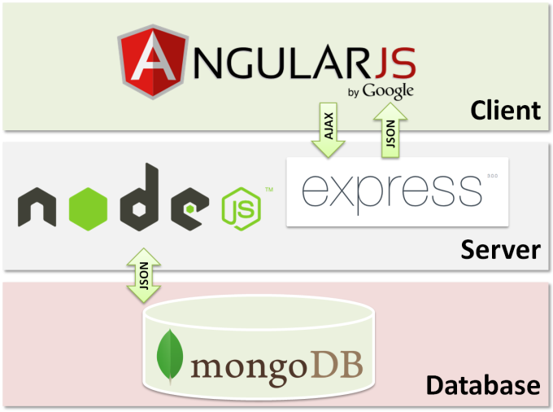
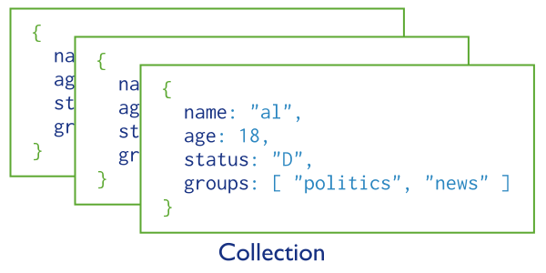

.hidden[
  https://github.com/azat-co/expressworks
  https://www.youtube.com/watch?v=HSWYOwtHBuw
  https://medium.freecodecamp.org/going-out-to-eat-and-understanding-the-basics-of-express-js-f034a029fb66
  https://github.com/rajikaimal/awesome-express
  https://blog.risingstack.com/node-js-security-tips/
  https://blog.risingstack.com/node-js-security-checklist/
  https://github.com/helmetjs/helmet
]

.center.icon[]

---

class: white
background-image: url(assets/title.svg)
.top.icon[]

# Modern JavaScript Frameworks
## Errors, Express, MEAN
### Александр Коржиков

---

class: top white
background-image: url(assets/sound.svg)
.top.icon[]

.sound-top[
  # Как меня слышно и видно?
]

.sound-bottom[
  ## > Напишите в чат
  ### **+** если все хорошо
  ### **–** если есть проблемы cо звуком или с видео
]

---

# Changelog

- Делаем каникулы после первого месяца обучения? 

  Последнее занятие первого месяца 
  - `29.11` (четверг), неделя перерыв, продолжаем с `10.12`

- `Homeworks` - 13 заданий ожидают проверки

---

# Темы предыдущего занятия

.right-image[]

- Streams
  - Writable
  - Readable
  - `pipe()`
- Node Best Practices

---

# Цели

- Работать с ошибками при написании серверного `JavaScript` кода
- Использовать классы, объекты и функции модуля `Express`

---

# Темы

.right-image[]

- Errors
- Express
  - Introduction
  - Concepts
  - Routing
  - Middleware
  - Template
- MEAN

.right-image[]


---

# Docs

- https://expressjs.com/

### Express Official Documentation

- https://blog.risingstack.com/node-js-security-checklist/

### Node.js Security Checklist

---

# Errors

- Стандартные типы ошибок JavaScript
- Системные ошибки при использовании системного API
- Assertion Errors
- User Errors

### .green[OR]

- Operational Errors
- Programmer Errors

---

# Вопрос - Стандартные ошибки

### Что к чему относится?

.left-code[
```
1. EvalError 
2. SyntaxError
3. RangeError
4. ReferenceError
5. TypeError
6. URIError
```
]

.right-code[
```
/*a*/ var a = undefinedVariable
/*b*/ throw new EvalError('error')
/*c*/ decodeURIComponent('%')
/*d*/ eval('hoo bar')
/*e*/ undefined.not()
/*f*/ [].length = 'Wat?'
```
]

---

# Вопрос

Какие способы обработки ошибок вы знаете?

```
require('fs')
  .readdir('not exist', () => { 
    throw new Error('test') 
  })
```

---

# Способы обработки ошибок

- try / catch / finally
- callback(err, res) - *error first*
- on('error') - *event based*
- Promise.reject()

```
try { 
  require('not exist')
} 
catch(e) { 
  debugger
} 
finally { 
  console.log('go on')
}
```

- .red[domain]

---

# Вопрос

### Что здесь не так?

```
try {
  require('fs')
    .readdir('not exist', () => {
      throw new Error('test')
    })
} catch (e) {
  console.log('error')
}
```

---

# Создание ошибок

### Конструктор
- .red[new Error(message)]

### Свойства
- error.message
- error.code - строка константа `E_ERROR_TITLE`
- error.stack с .green[Error.captureStackTrace(error)]

---

# Process Events

.right-image[]

### EventEmitter
- .blue['error'] - всегда определять обработчик

### Process
- .blue['uncaughtException'] - возможность последнего слова
- .blue['unhandledRejection'] - необработанные Promise

---

# Задача

С помощью `process.on('uncaughtException')` перехватить и залогировать собственный тип ошибки (без использования конструктора `Error`, но включая стэк)

```bash
node error.js
Error
./errors/error.js:2:9)
    at emitOne (events.js:116:13)
    at process.emit (events.js:211:7)
    at process._fatalException (bootstrap_node.js:374:26)
```

---

# How To Error

- .green[DO] use Promises / async / await with catch() 
- .green[DO] use Error class
- .red[DO NOT] throw 'strings or something'
- .green[DO] use central error handling and logging
- .red[DO NOT] continue with unknown 'uncaughtException'
- .green[DO] 'unhandledRejection' handling

---

class: white
background-image: url(assets/title.svg)
.top.icon[]

# Errors Q&A

---

# Introduction

.right-image[]

## MEAN
- `MongoDB`
- `Express`
- `Angular`
- `Node`

## LAMP - ?

---

# Задача

### Установить Express

```bash
npm init -f
npm i express
```

### Запустить сервер

```
// server.js
var express = require('express')
var app = express()

app.get('/', function (req, res) {
  res.send('Hello World!')
})

app.listen(3000)
```

```bash
npm start
```

---

# Example

.left-code[
```
var express = require('express')
var app = express()

app.get('/', function (req, res) {
  res.send('Hello World!')
})

app.listen(3000)
```
]

.right-code[
```
const http = require('http')

const server = 
  http.createServer((req, res) => {
    res.end('Hello, World!')
  })

server.listen(8000)
```
]

- Зачем `express` вообще нужен?

---

# Concepts & Features

- `Utils` - headers, response type
- `Routing` - helpers, configurable routes
- `Middleware` - business logic, layers
- `Template` - views

---

# Routing

.hidden[
https://expressjs.com/en/guide/routing.html
https://tools.ietf.org/html/rfc7231#section-4.2.1
https://tools.ietf.org/html/rfc5789#section-2
]

### `app.METHOD(path, callback [, callback ...])`

```
app.get('/', function (req, res) {
  res.send('GET request to the homepage')
})
```

| |                                   
|:---|:---|:---|
| GET     | Transfer a current representation of the target resource
| HEAD    | Same as GET, but only transfer the status line and header section
| POST    | Perform resource-specific processing on the request payload
| PUT     | Replace all current representations of the target resource with request payload
| DELETE  | Remove all current representations of the target resource
| OPTIONS | Describe the communication options for the target resource
| PATCH   | A set of changes described in the request entity be applied to the resource

<br>
   
### `app.all()` for all types of requests

---

# Paths

### Query

- `req.query` для `GET` параметров

### Strings+

- .red['/ab?cd']
- .red['/ab*cd']
- .red['/ab(cd)?e']

### || RegExp

- .green[/test/]

---

# Задача

### Вывести **значения** всех GET параметров

```
app.get('/hello', function (req, res) {
  res.send(`Hello ${/*  */}!`)
})
```

// GET /hello?order=desc&shoe[color]=blue&shoe[type]=converse

---

# Parameters

- `:([A-Za-z0-9_])` as `req.params`

```bash
/users/:userId/books/:bookId?
```

- `/user/:userId(\d+)`

```
app.get('/hello/:name', function (req, res) {
  res.send(`Hello ${req.params.name}!`)
})
```

---

# Demo

### Создать, сохранить и вернуть объект `User`

```
GET /user/1
RESPONSE { id: 1, name: 'Ivan', age: 25 }

POST /user/?name=Alex&age=17
RESPONSE { id: 2, name: 'Alex', age: 17 }
```

---

# Router

- `express.Router` - modular routing and middlewares
- `app.route()`

```
app.route('/test') // Router object
  .get(/* ... */)
  .post(/* ... */)
```

.green[OR]

```
app.use(routerConfiguration)
```

---

# Middleware

- Executes intermediate logic and objects
- Controls request and response flow

```
app.get('/example/b', function (req, res, next) {
  console.log('the response will be sent by the next function ...')
  next()
}, function (req, res) {
  res.send('Hello from B!')
})
```

- `next()` as the last route handler argument
- `next('router')` to skip other handlers in a stack

---

# Вопрос

### Какие `middlewares` могут быть полезны для приложений?

.center[]

---

# List

- `express.static` - HTML, images, etc.
- `express.json` - parses requests with JSON payloads
- `express.urlencoded`
- logs, authenticate, authorization?

```
// npm install express-session
app.use(session({ secret: 'keyboard cat', cookie: { maxAge: 60000 }}))
app.get('/', function(req, res, next) {
  if (req.session.views) {
    req.session.views++
    res.write('<p>views: ' + req.session.views + '</p>')
    res.end()
  } else {
    req.session.views = 1
    res.end('welcome to the session demo. refresh!')
  }
})
```

---

# Error-handling middleware

- `err, req, res, next`

```gherkin
Given an express application
When a router handler `throw new Error()` in syncronous operations
# or
When `next(new Error())` in asyncronous operations
Then all non-error handling middleware will be skiped
```

```
app.use(function(err, req, res, next) {
  console.error(err.stack)
  res.status(500).send('Something broke!')
})
```

.hidden[
---

# Самостоятельная работа

### Создать middleware для 

- хранения сессии
- вывода аудит логов
- валидации параметров
]

---

# Templates

```
app.set('view engine', 'pug')

app.get('/test', (req, res) => {
  res.render('index')
})
```

- ejs
- pug
- nunjucks
- jade
- mustache

---

# Other

- Process Manager (pm2)

### Management for `Node` applications, enables to reload and run them forever

- Security
  - https://blog.risingstack.com/node-js-security-tips/
  - https://blog.risingstack.com/node-js-security-checklist/
  - https://github.com/helmetjs/helmet

- Alternatives
  - Koa
  - Restify
  - HApi

---

class: white
background-image: url(assets/title.svg)
.top.icon[]

# Express Q&A

---

# MongoDB

### Document oriented database

.right-image[]

- Collections
- Documents

### Features

- Supports `JavaScript`, `JSON`
- Aggregation frameworks
- Infrastructure

---

# Demo

- `mongod, mongo`

```bash
show dbs
use db
show collections
db.collection_name.insert({ /* some */ })
db.collection_name.find({ /* some */ })
```

---

# Mongoose

### elegant mongodb object modeling for node.js

```
const mongoose = require('mongoose')
mongoose.connect('mongodb://localhost/test')

const Cat = mongoose.model('Cat', { name: String })

const kitty = new Cat({ name: 'Zildjian' })
kitty.save().then(() => console.log('meow'))
```

---

# На занятии

- Разобрали различные стратегии работы с ошибками при написании серверного `JavaScript` кода
- Практиковали и теоретизировали основные понятия библиотеки `Express` - `middleware`, `routing`, `template`

---

# Modern JavaScript Frameworks

.mario.mario-5[]
.mario.mushroom[]

|  |  |  |  |  |  |
|:-------------:|:-------------:|:-------------:|:-------------:|:-------------:|:-------------:|
|  |  |  |  | |  |
| |  | |  | |  |
| |  | |
| |  | |

---

# Самостоятельная работа

- Есть ли домашнее задание к сегодняшнему занятию?


---

class: white
background-image: url(assets/title.svg)
.top.icon[]

# Спасибо за внимание!
.black[ 
## Пожалуйста, пройдите опрос 
## в личном кабинете 
]
