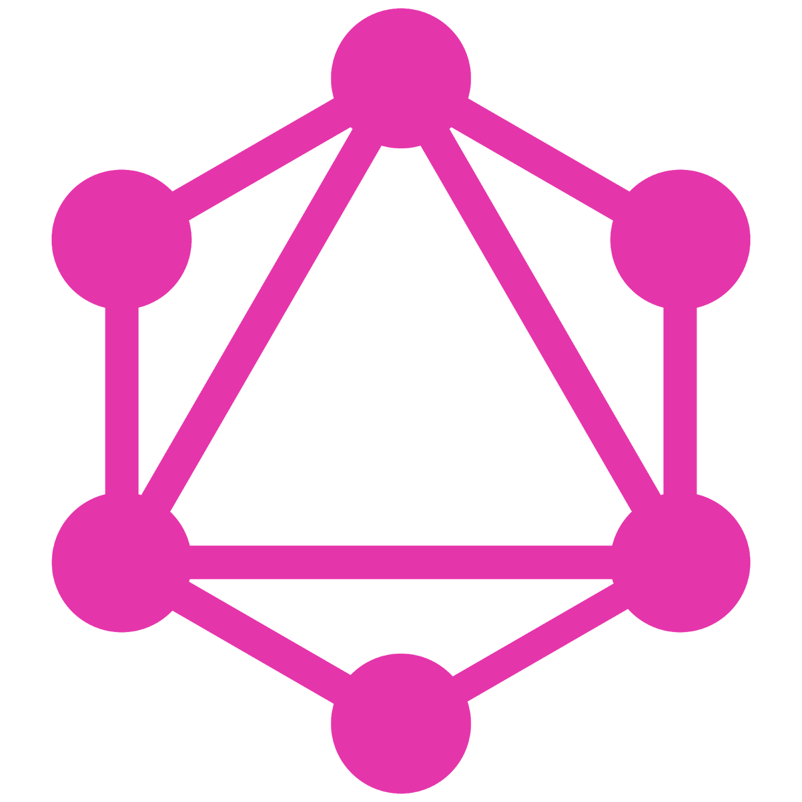

.hidden[
  [Constructing the Object Model](https://developers.google.com/web/fundamentals/performance/critical-rendering-path/constructing-the-object-model)

  [How is specificity calculated?](https://developer.mozilla.org/en-US/docs/Web/CSS/Specificity)  
  
  https://developers.google.com/web/updates/2018/06/feature-policy
  https://developer.mozilla.org/en-US/docs/Web/CSS/Specificity
  https://developers.google.com/web/fundamentals/security/csp/
  https://javascript.info/browser-environment
  
  https://developers.google.com/web/tools/chrome-devtools/ 
  http://learn.javascript.ru/document 
  https://classroom.udacity.com/courses/ud860
  https://classroom.udacity.com/courses/ud884
  
  Всем привет! Сегодняшнее занятие "JavaScript in Browser", но чтобы подвести итоги по Node
  https://www.youtube.com/watch?v=M3BM9TB-8yA
]

.center.icon[]

---

class: white
background-image: url(assets/title.svg)
.top.icon[]

# Modern JavaScript Frameworks
## JavaScript - Работа с браузером
### Александр Коржиков

---

class: top white
background-image: url(assets/sound.svg)
.top.icon[]

.sound-top[
  # Как меня слышно и видно?
]

.sound-bottom[
  ## > Напишите в чат
  ### **+** если все хорошо
  ### **–** если есть проблемы cо звуком или с видео
]

---

# Changelog

- Финальное занятие и консультации в `2018-07`  
  - Проверочный тест?
  - Планирование и декомпозиция подзадач проекта  
- Занятия в новогодние праздники?

> занятие 27.12 (четверг)  
> потом каникулы  
> возвращаемся 10.01 (четверг)

---

# Темы предыдущего занятия

.right-image[]

- GraphQL
- Apollo

---

# Темы

- Вспомнить и освоить теорию и практические задачи, специфичные для браузерной разработки на языке JavaScript
- Попрактиковаться с Chrome DevTools

|  |  |  |
|:-----------:|:-----------:|:-----------:|
| Node Summary | DOM API | DevTools |
|  | Events |  |

---

# Docs

- https://developers.google.com/web/tools/chrome-devtools/ 

### Chrome DevTools

- http://learn.javascript.ru/document 

### Документ и объекты страницы

- https://classroom.udacity.com/courses/ud860

### Browser Rendering Optimization

- https://classroom.udacity.com/courses/ud884

### Website Performance Optimization

---

# Node Summary

- Какие недостатки у `Node`?

.center[]

<br>
<br>
- [Design Mistakes in Node](assets/jsconf2018.pdf)

---

# Browser Environment

.right-image[]

- `DOM` - модель `HTML` документа
- `window` - глобальный объект в браузере
- `JavaScript` 😀

---

# Вопрос

### Что к чему относится?

.left-code[
```
1. DOM
2. window
3. JavaScript
```
]

.right-code[
```
/*a*/ console.log(123)
/*b*/ document.querySelector('div')
/*c*/ new Date()
```
]

---

# DOM

### Модель HTML документа

.right-code[
```html
<div id="test">
  <div>
    <p></p>
  </div>
  <span></span>
</div>
```
]

- BOM
- CSSOM
- AOM

[Constructing the Object Model](https://developers.google.com/web/fundamentals/performance/critical-rendering-path/constructing-the-object-model)

<br>

.half-image[]

---

# CSS Selectors

```html
<div id="id">
  <div class="class">
    <p class="c1 c2"></p>
  </div>
  <span></span>
</div>

<style>
  #id { color: red; }
  .class { color: blue; }
  div { color: white; }
</style>
```

### [How is specificity calculated?](https://developer.mozilla.org/en-US/docs/Web/CSS/Specificity) 

---

# CSS Selectors

```html
<div id="id">
  <div class="class">
    <p class="c1 c2"></p>
  </div>
  <span></span>
</div>
```

### [How is specificity calculated?](https://developer.mozilla.org/en-US/docs/Web/CSS/Specificity) 

.right-code[
- cascade
- inline styles
- !important
]

- div, p, div > span
- .class, .c1.c2
- `#id`

---

# DOM API

### Поиск элементов

- `querySelector()`
- `querySelectorAll()`
- `getElementById()`
- ...?

```
document.querySelectorAll('div') 
===
document.getElementsByTagName('div')?
```

---

# Вопрос

### Что будет выбрано?

```
document.getElementById("test")
  .querySelectorAll(":first-child")
```

```html
<div id="test">
  <div>
    <p></p>
  </div>
  <span></span>
</div>
```

---

# HTMLElement

- .blue[getAttribute(), setAttribute()] - управление атрибутами
- .green[className, classList] - класс элемента
- .green[innerHTML, value, parentNode] - свойства
- .blue[appendChild(), insertBefore(), ...] - структурные методы 

---

# Events

.right-code[
```
element.addEventListener(
 eventType, handler, phase
) 

element.removeEventListener(
 eventType, handler, phase
)

// 'on' + eventType
element.onclick = handler 
```
]

- click
- mousedown, mouseup, ...
- submit, input, focus
- ...?

### Спуск и всплытие

- Сначала спуск (`capturing`), потом всплытие (`bubbling`)
- `Delegation`

---

# Вопрос

- Какие события не всплывают?
- Как это проверить?
- Что с этим делать?

---

# Events

- Какие события не всплывают?
- Как это проверить?
- Что с этим делать?

```
var n = document.getElementById("numPeople"),
    r = document.getElementById("result")

document.addEventListener("focus", (e) => {
  r.innerHTML += "focus event triggered"
}, true)

n.addEventListener("focus", (e) => {
  r.innerHTML += "focus event triggered on element"
}, false)
```

---

# Events

- .green[type] - тип события
- .green[target, currentTarget] - элементы
- .blue[preventDefault()] - отмена стандартного поведения
- .blue[stopPropagation(), stopImmediatePropagation()] - отомена всплытия

### В чем отличие `stopPropagation()` от `stopImmediatePropagation()`?

---

# Chrome DevTools

- http://learn.javascript.ru/debugging-chrome 
### (кратко)

- https://developers.google.com/web/tools/chrome-devtools/ 
### (полная)

---

# Chrome DevTools - Демонстация

- Console
- Sources
- Network
- Application
- Device Mode
- ...

---

# Console Tricks

- debugger
- $0
- [$0]
- copy
- table
- Copy > Copy as cURL
- ...?

---

# Задача

## Какая функция отработает быстрее?

## http://output.jsbin.com/feloni/3/quiet 

---

# На занятии

- Рассмотрели инструменты доступные разработчику для отладки web страниц
- Разобрали теорию и задачи, возникающие при работе с браузерной средой 
- Вспомнили что такое DOM API, как работают события в браузере

---

# Modern JavaScript Frameworks

.mario.mario-9[]
.mario.mushroom[]

|  |  |  |  |  |  |
|:-------------:|:-------------:|:-------------:|:-------------:|:-------------:|:-------------:|
|  |  |  |  | |  |
| |  | |  | |  |
| |  | |
| |  | |

---

# Самостоятельная работа

Написать алгоритм и функцию `getPath()`, находяющую уникальный css-селектор для элемента в документе.
Уникальный селектор может быть использован `document.querySelector()` и возвращать исходный элемент. 
`document.querySelectorAll()`, вызванный с этим селектором, не должен находить никаких элементов, кроме исходного.

```
$0 // HTMLElement
getPath($0) // => "..."
```

---

class: white
background-image: url(assets/title.svg)
.top.icon[]

# Спасибо за внимание!
.black[ 
## Пожалуйста, пройдите опрос 
## в личном кабинете 
]

- Сколько времени Вы тратите на самостоятельную работу?