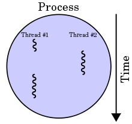

.center.icon[]

.hidden[
  - otus linux processes - https://youtu.be/lvdmOQKDJjk?list=PLAPBs-YOtkxUpMctJJVhwLfh7Nn4QRQKK 
  pstree
  http://man7.org/linux/man-pages/man2/setsid.2.html
  
  libuv book http://nikhilm.github.io/uvbook/
]

---

class: white
background-image: url(assets/title.svg)
.top.icon[]

# Modern JavaScript Frameworks
## Node in Production
<!-- ## Node in Production, Node Summary -->
### Александр Коржиков

---

class: top white
background-image: url(assets/sound.svg)
.top.icon[]

.sound-top[
  # Как меня слышно и видно?
]

.sound-bottom[
  ## > Напишите в чат
  ### **+** если все хорошо
  ### **–** если есть проблемы cо звуком или с видео
]

---

# Modern JavaScript Frameworks

.mario.mario-11[]
<!-- .mario.mushroom[] -->

|  |  |  |  |  |  |
|:-------------:|:-------------:|:-------------:|:-------------:|:-------------:|:-------------:|
|  |  |  |  | |  |
| |  | |  | |  |
| |  | |
| |  | |

---

# Changelog

Предложение

- Среда `15.05` - JavaScript - Работа с браузером (было `16.05`)
- Пятница `17.05` - встреча в Отусе "Что должен знать разработчик JavaScript"
  - Рассмотрим основные требования, актуальные для трудоустройства
  - Разберем популярные вопросы по технологиям для интервью"
- Понедельник `21.05` "Custom Elements" (было `20.05` "Обзор Web Components")

---

# Темы предыдущего занятия

.right-image[]

- GraphQL
- Apollo

---

# Темы

.right-image[]

- Web Assembly 
- Processes
  - Process
  - child_process
  - fork, exec, spawn
  - PM2
- Node Summary

---

# Docs

- [WebAssembly.org](https://webassembly.org/)

- [Node.js Official Documentation](https://nodejs.org/api/child_process.html)

- [An Introduction to libuv](http://nikhilm.github.io/uvbook/)


---

# Web Assembly

### Павел Асташкин - выпускник первого потока

---

class: white
background-image: url(assets/title.svg)
.top.icon[]

# Web Assembly Q&A

---

# Single Thread

### При старте `Node` инициализируется `Event Loop`, исполняется переданный скрипт вместе с синхронными вызовами (`API, setTimeout, process.nextTick`), после чего происходит работа `Event Loop`


.center.half-image[
  
]

.hidden[
> Thread-safety is one less concern for developers to waste time worrying about

> Performance measures the speed with which a single request can be executed, while scalability measures the ability of a request to maintain its performance under increasing load.
]

---

# Terminology

.hidden[
  otus linux processes https://youtu.be/lvdmOQKDJjk?list=PLAPBs-YOtkxUpMctJJVhwLfh7Nn4QRQKK
]
.todo[
  
  shell?
  
  > The GNU/Linux shell is a special interactive utility. It provides a way for users to start programs, manage files on the filesystem, and manage processes running on the Linux system. The core of the shell is the command prompt. The command prompt is the interactive part of the shell. It allows you to enter text commands, and then it interprets the commands and executes them in the kernel.
  https://learning.oreilly.com/library/view/Linux+Command+Line+and+Shell+Scripting+Bible,+3rd+Edition/9781118983843/11_chapter01.html#chap1
]

- **Process** - программа, которая выполняется в текущий момент
- **System Call** - запросы в процесс ядра для получения сервиса
  - Process Creation & Management
.right-code[]
  - File Access
  - Networking
  - Memory Management
- **Thread** - частичная копия исходного процесса с доступом к его ресурсам


---

# Process

.right-code[
### Tools

- kill - отправка сигнала процессу

Дерево процессов:
- htop
- ps
- pstree

.hidden[
  https://www.geeksforgeeks.org/operating-system-introduction-system-call/

  Services Provided by System Calls :
  - Process creation and management
  - Main memory management
  - File Access, Directory and File system management
  - Device handling(I/O)
  - Protection
  - Networking, etc.

  Types of System Calls : There are 5 different categories of system calls –
  - Process control: end, abort, create, terminate, allocate and free memory.
  - File management: create, open, close, delete, read file etc.
  - Device management
  - Information maintenance
  - Communication
]
]

### Properties

- `pid` - процесса 
- `ppid` - родительского процесса
- `gid, uid`
- environment variables
- `cwd`
- terminal, priority
- `state`

---

# Fork

.hidden[
  http://man7.org/linux/man-pages/man2/fork.2.html
  http://man7.org/linux/man-pages/man2/clone.2.html
]

- popen() - создание нового процесса
- fork() - создание копии родительского процесса
- exec() - замещение текущего процесса
- clone() - создание потока (thread)

```c
#include <stdio.h>
#include <stdlib.h>
#include <unistd.h>

int main() {
  int status
  printf("before \n")
  int id = fork()
  printf("parent id %d\n", getppid())
  printf("my id %d\n", getpid())
  printf("child id %d\n", id)
  printf("--- \n")                   // что будет выведено на экран?
  return 0
}
```

<!-- - Что будет на экране? -->

---

# Child Process

Модуль `child_process` экспортирует

.right-image[]
- `spawn()`, 
- `fork()`, 
- `exec()`, 
- `execFile()` и синхронные альтернативные функции 

Методы возвращают `ChildProcess` объект, являющийся `EventEmitter`

---

# Spawn

.right-code[
```
const { spawn } 
  = require('child_process')
  
spawn('ps', ['ax'])
```
]

- `command`
- `[arguments]` - command-line arguments
- `[options]` - `spawn()` settings

Options:
- `cwd` - (current) working directory
- `env` - переменные окружения
- `detached` - отцепить от родительского процесса
- `stdio` - отношение потоков ввода вывода между процессами

---

# Вопрос

```
const spawn = require('child_process').spawn
let ls = spawn('ls', ['-lh', '.'])
ls.stdout.on('readable', function() {
    let d = this.read()
    d && console.log(d.toString())
})
ls.on('close', code => {
    console.log(`child process exited with code: ${code}`)
})
```

### Что здесь происходит?

.center[]

.hidden[
  Here, we spawn the ls process (list directory), and read from the resulting readable Stream, receiving something like this:

  -rw-r--r-- 1 root root 43 Jul 9 19:44 index.html
  -rw-rw-r-- 1 root root 278 Jul 15 16:36 child_example.js
  -rw-r--r-- 1 root root 1.2K Jul 14 19:08 server.js
  child process exited with code 0
]

---

# ChildProcess

- `stdio` - потоки `stdin, stdout, stderr` - `'pipe', 'inherit', 'ignore'`, `'ipc'`
- `unref(), ref()` - отношение с родительским Event Loop
- `send(), on()` - отправить, подписаться на сообщения
- `kill()` - `'SIGTERM'`

### Events

- `'exit'` - процесс заканчивается
- `'close'` - закрываются потоки
- `'message'` - сообщение от `process.send()`

---

# Demo Signal

```
setInterval(() => {
  console.log('hello')
}, 500);

process.addListener('SIGINT', () => {
  console.log('got it')
  process.exit(0)
})
```

---

# Fork & Exec


- `spawn[Sync]()` - `pipe + fork + shell`
- `fork()`
.right-image[]
  - `IPC` communication channel

- `exec[Sync]()` - полная команда с аргументами
  - `[callback]`
  - `timeout` - ограничить время исполнения
- `execFile[Sync]()` - без `shell`
  - `[callback]`

.hidden[
  > Like spawn, fork starts a child process, but is designed for running Node programs with the added benefit of having a communication channel built in
  
  > Unlike the fork(2) POSIX system call, child_process.fork() does not clone the current process.

### exec
> the complete buffered output of a child process
> command with arguments `ps aux | grep node` instead of executable

- timeout
]

---

# Demo Fork

```js
console.log('before')

const { fork } = require('child_process')

const pid = process.pid

if (process.argv[process.argv.length - 1] === 'true') return

const childId = fork('./fork', [true])

console.log('parent id %d', process.ppid)
console.log('my id', pid)
console.log('child id', childId.pid)

console.log('after')
```

---

# Вопрос

### Что делать с `promisify()`?

```
const util = require('util')
const exec = util.promisify(require('child_process').exec)

async function lsExample() {
  const { stdout, stderr } = await exec('ls')
  console.log('stdout:', stdout)
  console.log('stderr:', stderr)
}
lsExample()
```

---

# Cluster

### Встроенная возможность расшаривать ресурсы 

```
const cluster = require('cluster')
const http = require('http')
const numCPUs = require('os').cpus().length

if(cluster.isMaster) {
   for(let i = 0; i < numCPUs; i++) {
      cluster.fork()
   }
}

if(cluster.isWorker) {
   http.createServer((req, res) => {
      res.writeHead(200)
      res.end(`Hello from ${cluster.worker.id}`)
   }).listen(8080)
}
```

---

# Worker Threads

```
const { Worker, isMainThread } = require('worker_threads')

if (isMainThread) {
  new Worker(__filename)
  console.log(process.pid)
} else {
  console.log(isMainThread)
  setTimeout(() => {
    console.log('Inside Worker!')
    console.log(process.pid)
  }, 1e4)
}
```

- `workerData` - копия данных, переданных в `constructor`
- `ArrayBuffer, SharedArrayBuffer` для общих данных

---

# PM2

> Advanced, production process manager for Node.js

```
pm2 start http.js -i max
```

```
var http = require('http')

var server = http.createServer(function(req, res) {
  res.writeHead(200)
  res.end('hey')
}).listen(process.env.PORT || 8000, function() {
  console.log('App listening on port %d', server.address().port)
})
```

---

class: white
background-image: url(assets/title.svg)
.top.icon[]

# Q&A

---

# Node Summary

- Какие недостатки у `Node`?

.center[]

<br>
<br>
- [Design Mistakes in Node](assets/jsconf2018.pdf)

---

# Самостоятельная работа


---

class: white
background-image: url(assets/title.svg)
.top.icon[]

# Спасибо за внимание!
.black[ 
## Пожалуйста, пройдите опрос 
## в личном кабинете 
]

- Сколько времени Вы тратите на самостоятельную работу?