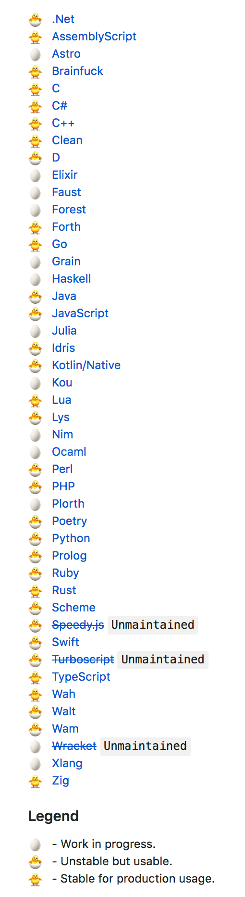
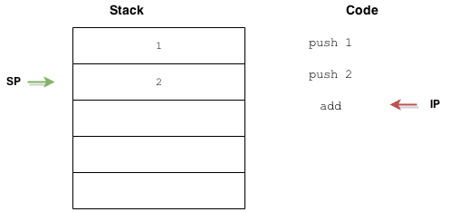
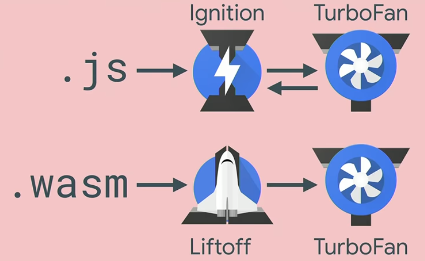
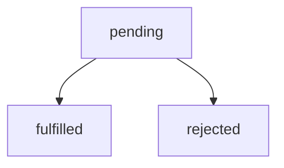
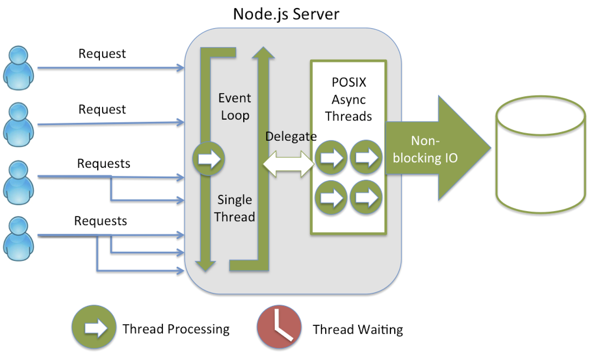
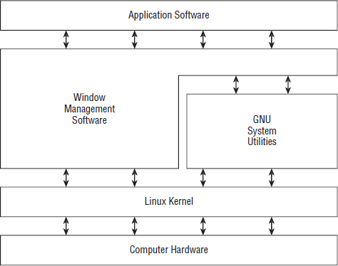
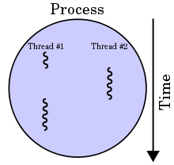

.center.icon[]

.hidden[
  - otus linux processes - https://youtu.be/lvdmOQKDJjk?list=PLAPBs-YOtkxUpMctJJVhwLfh7Nn4QRQKK 
  pstree
  http://man7.org/linux/man-pages/man2/setsid.2.html
  
  libuv book http://nikhilm.github.io/uvbook/
]

---

class: white
background-image: url(assets/title.svg)
.top.icon[]

# Modern JavaScript Frameworks
## Node in Production, Web Assembly
### Александр Коржиков

---

class: top white
background-image: url(assets/sound.svg)
.top.icon[]

.sound-top[
  # Как меня слышно и видно?
]

.sound-bottom[
  ## > Напишите в чат
  ### **+** если все хорошо
  ### **–** если есть проблемы cо звуком или с видео
]

---

# Темы предыдущего занятия

.right-image[]

- GraphQL
- Apollo

---

# Темы

- `WebAssembly`
  - Введение
  - Примеры
  - Дизайн, Возможности
  - Семантика, `JavaScript API, Modules`
  - Исполнение кода в `V8`
.right-image[]
- Processes
  - Process
  - child_process
  - fork, exec, spawn
  - PM2
- Node Summary

---

# Цели

.right-image[]

- Познакомиться с `WebAssembly` - понимать задачи, основные определения и характеристики проекта
- Разобрать архитектуру `JavaScript` на примере `V8`, чтобы лучше понять, какое место занимает в нём `WebAssembly`
- Посмотреть примеры
- Научиться работать с процессами в `Node`
- Подвести итоги для технологий `Node`


---

# Материалы


- [WebAssembly](https://webassembly.org/)

- [WebAssembly: Disrupting JavaScript - Dan Callahan](https://www.youtube.com/watch?v=7mBf3Gig9io)

- [WebAssembly Explorer](https://mbebenita.github.io/WasmExplorer/)

- [WebAssembly Rocks](https://www.wasmrocks.com/)

- [Node.js Official Documentation](https://nodejs.org/api/child_process.html)

- [An Introduction to libuv](http://nikhilm.github.io/uvbook/)

.right[]

.hidden[
  [Compiling for the Web with WebAssembly (Google I/O '17)](https://www.youtube.com/watch?v=6v4E6oksar0)
]

---

# Intro

### WebAssembly (abbreviated Wasm) is a **binary instruction format** for **a stack-based virtual machine**. Wasm is designed as a **portable target** for **compilation of high-level languages** like `C/C++/Rust`, enabling deployment on the web for client and server applications.

.right[]

---

# Пример

.hidden[
  https://mbebenita.github.io/WasmExplorer/
  https://webassembly.studio/
]

```c
int add(int a) {
  return a + 5;
}
```

```wasm
(module
 (table 0 anyfunc)
 (memory $0 1)
 (export "memory" (memory $0))
 (export "_Z3addi" (func $_Z3addi))
 (func $_Z3addi (; 0 ;) (param $0 i32) (result i32)
  (i32.add
   (get_local $0)
   (i32.const 5)
  )
 )
)
```

```javascript
WebAssembly.instantiateStreaming(fetch(`program.wasm`))
  .then(prog => {
      console.log(prog.instance.exports.add(1, 2))
  })
```

.hidden[
  https://developers.google.com/web/updates/2012/06/How-to-convert-ArrayBuffer-to-and-from-String
  
  /Users/RD25XO/Developer/experiments/notes/otus/webassembly/program.wasm
  
  https://openhome.cc/eGossip/WebAssembly/Wat2Wasm.html
]

---

# История

.hidden[
  https://en.wikipedia.org/wiki/WebAssembly#History
  
  http://asmjs.org/spec/latest/
  
  https://en.wikipedia.org/wiki/Google_Native_Client
]

- [Google Native Client](https://developer.chrome.com/native-client) (`NaCl` and `PNaCl`) 😅
  - `9 December 2011`
- [`asm.js`](http://asmjs.org/) - подмножество `JavaScript`
  - `11 October 2013` - `18 August 2014`
  .hidden[
  > ASM.js is a subset of JavaScript that has no objects and has no garbage collection or just in time compiler pauses. It’s a target for C/C++ — a statically typed subset of JavaScript. This was demonstrated at Mozilla in partnership with the big gaming companies like Epic Games with Unreal Engine and Unity with the Unity engine and IDE. [(c) Brendan Eich](https://medium.com/javascript-scene/why-we-need-webassembly-an-interview-with-brendan-eich-7fb2a60b0723)
  ]


- Анонс в `2015` .right-code[]
  - `WebAssembly Working Group`
  - `Core Specification`, 2016
  - Официальный лого, 2017 😂 
  - *Browser Preview*


.hidden[
  WebAssembly Working Group in April, 2015, to standardize WebAssembly and oversee the specification and proposal process. Since then, the Core Specification in April, 2015, to standardize WebAssembly and oversee the specification and proposal process. Since then, the Core Specification
]

---

# [Примеры](https://webassembly.org/docs/use-cases/)

- **Web**
  - Медиа
  - Игры
  - Протоколы низкого уровня
  - Machine Learning
  - ...
  - > Any Possible Client Executed Code

- **Server Side ?!**
  - Шифрование
  - ... 
  - > Any Stable Predictable Rich Environment

---

# Поддержка

.right.height-400[
  
]

### [Языки](https://github.com/appcypher/awesome-wasm-langs)

### Браузеры

.half-image[
  
]

<br>
> Global - 85.57%

### [Server-Side](https://webassembly.org/docs/portability/)

---

# [Design Goals - Semantics](https://webassembly.github.io/spec/core/intro/introduction.html#design-goals)

- **Fast**: executes with near native code performance, taking advantage of capabilities common to all contemporary hardware
- **Safe**: code is validated and executes in a memory-safe [2], sandboxed environment preventing data corruption or security breaches
- **Well-defined**
- **Hardware-independent**
- **Language-independent**
- **Platform-independent**
- **Open**: programs can interoperate with their environment in a simple and universal manner

---

# [Design Goals - Representation](https://webassembly.github.io/spec/core/intro/introduction.html#design-goals)

- **Compact**: has a binary format that is fast to transmit by being smaller than typical text or native code formats
- **Modular**: programs can be split up in smaller parts that can be transmitted, cached, and consumed separately
- **Efficient**: can be decoded, validated, and compiled in a fast single pass, equally with either just-in-time (JIT) or ahead-of-time (AOT) compilation.
- **Streamable**
- **Parallelizable**
- **Portable**

---

# [Возможности MVP](https://webassembly.org/docs/mvp/)

- `Module` с `JavaScript API` - безопасное окружение
- `Binary format (wasm)` - меньший размер и быстрый парсинг
- `Text format`, [wat](https://www.destroyallsoftware.com/talks/wat) - текстовая репрезентация бинарного формата
- `wasm` интерпретатор
- [WebAssembly High-Level Goals](https://webassembly.org/docs/high-level-goals/)
  - *execute in the same semantic universe as JavaScript* 🤔
  
- **Нет поддержки (пока)**
  - Garbage collector (Proposal) 
  - DOM access
  - Старые браузеры
  - Threads
  
.hidden[
  # Elements Of WebAssembly 
  - Text Format (wat)
]

---

# Definitions

- Что такое `Virtual Machine`?
- Что такое `Stack-based Virtual Machine`?

.right-image[
  
]
.half-image[

]

.hidden[
  Stack-based virtual machine 
  https://andreabergia.com/stack-based-virtual-machines/
  
  > What’s a stack based virtual machine then? It’s an abstraction of a computer, that emulates a real machine. Generally it is built as an interpreter of a special bytecode, that translates its in real time for execution on the CPU.
  
  JVM is stack-based
  
  Also possible a register based vm
  
  > structured stack machine; a machine where most computations use a stack of values, but control flow is expressed in structured constructs such as blocks, ifs, and loops

  - Stack 
  - Instructions
  - Linear Memory
  
  https://jaytaylor.com/notes/assets/6b15f756-cec3-4402-997b-d04b76acd87e-0.pdf
]

---

# WebAssembly

.right-code[
- Data Operations
  - i32: + - * / % << >> >>> etc
  - i64: + - * / % << >> >>> etc
  - f32: + - * / sqrt ceil floor
  - f64: + - * / sqrt ceil floor
  - conversions
  - load store
  - call_direct call_indirect
- Structured Control Flow
  - if loop block br switch
]

- Data Types
  - void i32 i64 f32 f64
- Functions
  - Flat, single global table
  - Static binding
  - Indirect calls through table
- State: linear memory
  - large, bounds-checked array
- Trusted execution stack

---

# JavaScript API

.hidden[
  > A JavaScript API is provided which allows JavaScript to compile WebAssembly modules, perform limited reflection on compiled modules, store and retrieve compiled modules from offline storage, instantiate compiled modules with JavaScript imports, call the exported functions of instantiated modules, alias the exported memory of instantiated modules, etc.
  
  https://webassembly.org/docs/web/
  
  http://webassembly.github.io/spec/js-api/index.html
  
  /Users/RD25XO/Developer/experiments/notes/otus/webassembly/test2.wasm
]

- `WebAssembly` object
  - `Module`, `Instance`, `Memory`, `Table`
  - `validate()` 
  - `compile()`
  - `instantiate()`

```
var importObj = {js: {
  import1: () => console.log("hello,"),
  import2: () => console.log("world!"),
}};
fetch('demo.wasm').then(response =>
  response.arrayBuffer()
).then(buffer =>
  WebAssembly.instantiate(buffer, importObj)
).then(({module, instance}) =>
  instance.exports.f()
);
```

---

# [Modules](https://webassembly.org/docs/modules/)

> The distributable, loadable, and executable unit of code in WebAssembly

- `imports`: `js, env, table, memory`

```wamp
(module
    (import "js" "import1" (func $i1))
    (import "js" "import2" (func $i2))
    (func $main (call $i1))
    (start $main)
    (func (export "f") (call $i2))
)
```

- <a href="https://github.com/WebAssembly/design/issues/1087">🛤 ECMAScript module integration#12</a>

```
<script type="module" src="proposal.wasm"></script>
```

---

# Demo

- [PNaCl Getting Started](https://developer.chrome.com/native-client/devguide/tutorial/tutorial-part1) 

- [Simple Add Function](otus/webassembly/add.wat) 
- [Call Imported API](otus/webassembly/import.wat) 
- [Store API](otus/webassembly/store.wat) 
- [Add with C and WASM Explorer](otus/webassembly/c-add.wasm, https://mbebenita.github.io/WasmExplorer/) 

---

# Compile Flow

- `Emscripten` - компилятор в `WebAssembly`

```
C/C++/Rust -> AST -> Binary (.wasm) -> AST -> ...Module
```

.right-image[
  
]

.half-image[
  
]


.hidden[

> WebAssembly code in text format is serialized into an AST and compiled to the binary format (as a .wasm file), which is fetched, loaded, and utilized by a web page. When the module is loaded, the browser's JavaScript engine utilizes a decoding stack to decode the .wasm file into an AST, perform type checking, and interpret it to execute functions.
]

---

# Real World Examples

- `ZIP` for `WebAssembly` ?!
  - [Almost](https://github.com/YuJianrong/node-unrar.js)
  
- [Doom 3](http://www.continuation-labs.com/projects/d3wasm/)
- [Windows 95](https://win95.ajf.me/win95.html)

### Другие примеры

- `SASS` for `WebAssembly`
- Dynamic [`Polyfills` not only for `Web`](https://developer.mozilla.org/en-US/docs/WebAssembly/existing_C_to_wasm)
- [Video / Image Filters](http://tiny.cc/webdsp)
- [Games](https://hackernoon.com/games-build-on-webassembly-3679b3962a19)

.hidden[
---
# Demo

```c
#define EXIT_STATUS EXIT_FAILURE
#include "true.c"
```
]

---

# Резюме

- `WebAssembly` связывает другие языки программирования с `JavaScript` и исполняется в безопасном контексте независимо от окружения. Эффективен для работы с алгоритмами и операциями с числами

- Производительный межязыковой протокол

### Question

- Есть ли другие клиенты кроме `JavaScript`?

.hidden[
  > Non-Web environments may include JavaScript VMs (e.g. node.js), however WebAssembly is also being designed to be capable of being executed without a JavaScript VM present.
]

---

class: white
background-image: url(assets/title.svg)
.top.icon[]

# Web Assembly Q&A

---

# Single Thread

### При старте `Node` инициализируется `Event Loop`, исполняется переданный скрипт вместе с синхронными вызовами (`API, setTimeout, process.nextTick`), после чего происходит работа `Event Loop`


.center.half-image[
  
]

.hidden[
> Thread-safety is one less concern for developers to waste time worrying about

> Performance measures the speed with which a single request can be executed, while scalability measures the ability of a request to maintain its performance under increasing load.
]

---

# Terminology

.hidden[
  otus linux processes https://youtu.be/lvdmOQKDJjk?list=PLAPBs-YOtkxUpMctJJVhwLfh7Nn4QRQKK
]

.hidden[
  TODO
  
  
  shell?
  
  > The GNU/Linux shell is a special interactive utility. It provides a way for users to start programs, manage files on the filesystem, and manage processes running on the Linux system. The core of the shell is the command prompt. The command prompt is the interactive part of the shell. It allows you to enter text commands, and then it interprets the commands and executes them in the kernel.
  https://learning.oreilly.com/library/view/Linux+Command+Line+and+Shell+Scripting+Bible,+3rd+Edition/9781118983843/11_chapter01.html#chap1
]

- **Process** - программа, которая выполняется в текущий момент
- **System Call** - запросы в процесс ядра для получения сервиса
  - Process Creation & Management
.right-code[]
  - File Access
  - Networking
  - Memory Management
- **Thread** - частичная копия исходного процесса с доступом к его ресурсам

---

# Process

.right-code[
### Tools

- kill - отправка сигнала процессу

Дерево процессов:
- htop
- ps
- pstree

.hidden[
  https://www.geeksforgeeks.org/operating-system-introduction-system-call/

  Services Provided by System Calls :
  - Process creation and management
  - Main memory management
  - File Access, Directory and File system management
  - Device handling(I/O)
  - Protection
  - Networking, etc.

  Types of System Calls : There are 5 different categories of system calls –
  - Process control: end, abort, create, terminate, allocate and free memory.
  - File management: create, open, close, delete, read file etc.
  - Device management
  - Information maintenance
  - Communication
]
]

### Properties

- `pid` - процесса 
- `ppid` - родительского процесса
- `gid, uid`
- environment variables
- `cwd`
- terminal, priority
- `state`

---

# Fork

.hidden[
  http://man7.org/linux/man-pages/man2/fork.2.html
  http://man7.org/linux/man-pages/man2/clone.2.html
]

- popen() - создание нового процесса
- fork() - создание копии родительского процесса
- exec() - замещение текущего процесса
- clone() - создание потока (thread)

```c
#include <stdio.h>
#include <stdlib.h>
#include <unistd.h>

int main() {
  int status
  printf("before \n")
  int id = fork()
  printf("parent id %d\n", getppid())
  printf("my id %d\n", getpid())
  printf("child id %d\n", id)
  printf("--- \n")                   // что будет выведено на экран?
  return 0
}
```

<!-- - Что будет на экране? -->

---

# Child Process

Модуль `child_process` экспортирует

.right-image[]
- `spawn()`, 
- `fork()`, 
- `exec()`, 
- `execFile()` и синхронные альтернативные функции 

Методы возвращают `ChildProcess` объект, являющийся `EventEmitter`

---

# Spawn

.right-code[
```
const { spawn } 
  = require('child_process')
  
spawn('ps', ['ax'])
```
]

- `command`
- `[arguments]` - command-line arguments
- `[options]` - `spawn()` settings

Options:
- `cwd` - (current) working directory
- `env` - переменные окружения
- `detached` - отцепить от родительского процесса
- `stdio` - отношение потоков ввода вывода между процессами

---

# Вопрос

```
const spawn = require('child_process').spawn
let ls = spawn('ls', ['-lh', '.'])
ls.stdout.on('readable', function() {
    let d = this.read()
    d && console.log(d.toString())
})
ls.on('close', code => {
    console.log(`child process exited with code: ${code}`)
})
```

### Что здесь происходит?

.center[]

.hidden[
  Here, we spawn the ls process (list directory), and read from the resulting readable Stream, receiving something like this:

  -rw-r--r-- 1 root root 43 Jul 9 19:44 index.html
  -rw-rw-r-- 1 root root 278 Jul 15 16:36 child_example.js
  -rw-r--r-- 1 root root 1.2K Jul 14 19:08 server.js
  child process exited with code 0
]

---

# ChildProcess

- `stdio` - потоки `stdin, stdout, stderr` - `'pipe', 'inherit', 'ignore'`, `'ipc'`
- `unref(), ref()` - отношение с родительским Event Loop
- `send(), on()` - отправить, подписаться на сообщения
- `kill()` - `'SIGTERM'`

### Events

- `'exit'` - процесс заканчивается
- `'close'` - закрываются потоки
- `'message'` - сообщение от `process.send()`

---

# Demo Signal

```
setInterval(() => {
  console.log('hello')
}, 500);

process.addListener('SIGINT', () => {
  console.log('got it')
  process.exit(0)
})
```

---

# Fork & Exec


- `spawn[Sync]()` - `pipe + fork + shell`
- `fork()`
.right-image[]
  - `IPC` communication channel

- `exec[Sync]()` - полная команда с аргументами
  - `[callback]`
  - `timeout` - ограничить время исполнения
- `execFile[Sync]()` - без `shell`
  - `[callback]`

.hidden[
  > Like spawn, fork starts a child process, but is designed for running Node programs with the added benefit of having a communication channel built in
  
  > Unlike the fork(2) POSIX system call, child_process.fork() does not clone the current process.

### exec
> the complete buffered output of a child process
> command with arguments `ps aux | grep node` instead of executable

- timeout
]

---

# Demo Fork

```js
console.log('before')

const { fork } = require('child_process')

const pid = process.pid

if (process.argv[process.argv.length - 1] === 'true') return

const childId = fork('./fork', [true])

console.log('parent id %d', process.ppid)
console.log('my id', pid)
console.log('child id', childId.pid)

console.log('after')
```

---

# Вопрос

### Что делать с `promisify()`?

```
const util = require('util')
const exec = util.promisify(require('child_process').exec)

async function lsExample() {
  const { stdout, stderr } = await exec('ls')
  console.log('stdout:', stdout)
  console.log('stderr:', stderr)
}
lsExample()
```

---

# Cluster

### Встроенная возможность расшаривать ресурсы 

```
const cluster = require('cluster')
const http = require('http')
const numCPUs = require('os').cpus().length

if(cluster.isMaster) {
   for(let i = 0; i < numCPUs; i++) {
      cluster.fork()
   }
}

if(cluster.isWorker) {
   http.createServer((req, res) => {
      res.writeHead(200)
      res.end(`Hello from ${cluster.worker.id}`)
   }).listen(8080)
}
```

---

# Worker Threads

```
const { Worker, isMainThread } = require('worker_threads')

if (isMainThread) {
  new Worker(__filename)
  console.log(process.pid)
} else {
  console.log(isMainThread)
  setTimeout(() => {
    console.log('Inside Worker!')
    console.log(process.pid)
  }, 1e4)
}
```

- `workerData` - копия данных, переданных в `constructor`
- `ArrayBuffer, SharedArrayBuffer` для общих данных

---

# PM2

> Advanced, production process manager for Node.js

```
pm2 start http.js -i max
```

```
var http = require('http')

var server = http.createServer(function(req, res) {
  res.writeHead(200)
  res.end('hey')
}).listen(process.env.PORT || 8000, function() {
  console.log('App listening on port %d', server.address().port)
})
```

---

class: white
background-image: url(assets/title.svg)
.top.icon[]

# Q&A

---

# Node Summary

- Какие недостатки у `Node`?

.center[]

<br>
<br>
- [Design Mistakes in Node](assets/jsconf2018.pdf)
- Deno

---

# Modern JavaScript Frameworks

.mario.mario-11[]
<!-- .mario.mushroom[] -->

|  |  |  |  |  |  |
|:---:|:---:|:---:|:---:|:---:|:---:|
|  |  |  |  | |  |
|  |  | |  | |  |
| |  | |
| |  | |

---

# Самостоятельная работа


---

# Notes

- [x] Эти демки будут доступны в материалах занятия?

- [x] https://playclassic.games/

---

class: white
background-image: url(assets/title.svg)
.top.icon[]

# Спасибо за внимание!
.black[ 
## Пожалуйста, пройдите опрос 
## в личном кабинете 
]

- Сколько времени Вы тратите на самостоятельную работу?