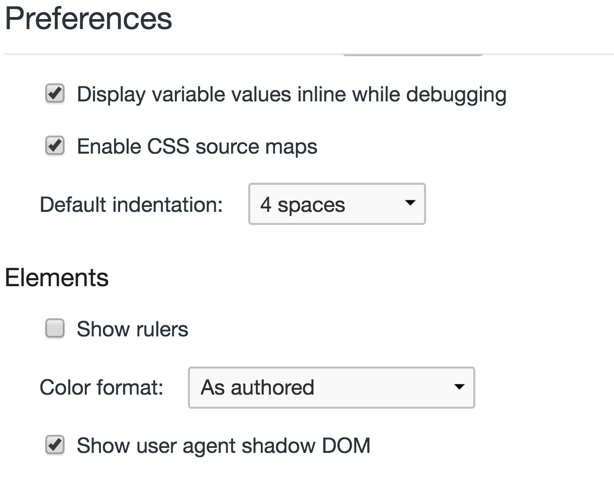
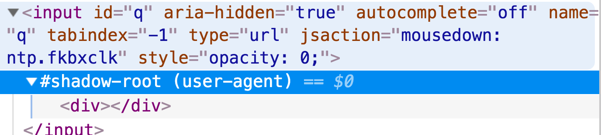
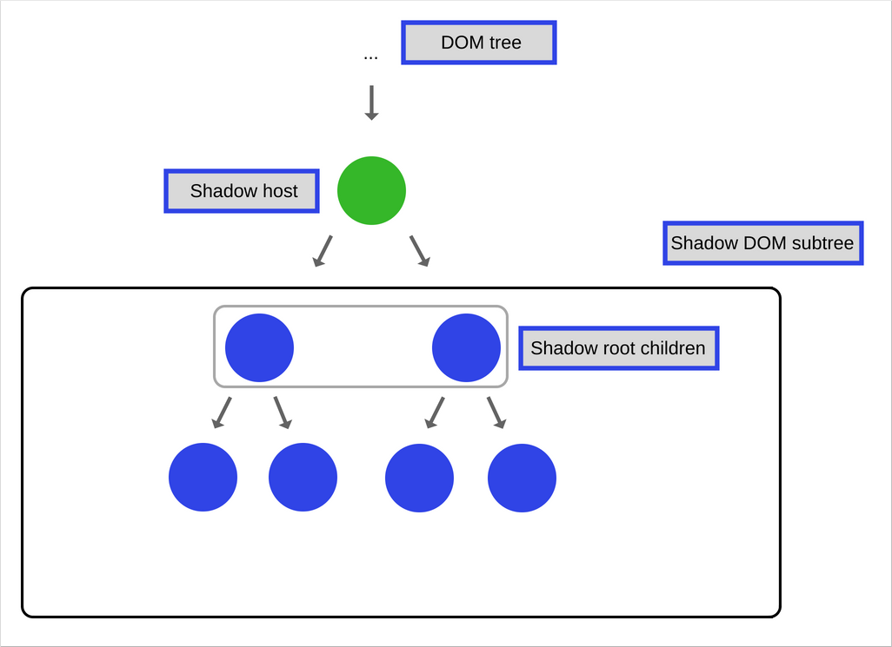

.hidden[

Отличное введение в `Shadow DOM` - https://developer.mozilla.org/en-US/docs/Web/Web_Components 
и подборка примеров по `Web Components` - https://github.com/mdn/web-components-examples
от MDN

---
  
  https://developer.mozilla.org/en-US/docs/Web/Web_Components/Using_shadow_DOM
  https://developer.mozilla.org/en-US/docs/Web/Web_Components/Using_templates_and_slots
  https://developers.google.com/web/fundamentals/web-components/shadowdom
  
  https://drafts.csswg.org/css-scoping/
  https://github.com/praveenpuglia/shadow-dom-in-depth
  https://gist.github.com/praveenpuglia/0832da687ed5a5d7a0907046c9ef1813
  https://dom.spec.whatwg.org/#trees
  http://robdodson.me/shadow-dom-css-cheat-sheet/
  https://medium.com/dev-channel/focus-inside-shadow-dom-78e8a575b73
  https://developer.mozilla.org/en-US/docs/Web/Web_Components
  https://github.com/mdn/web-components-examples
  https://blog.sessionstack.com/how-javascript-works-the-internals-of-shadow-dom-how-to-build-self-contained-components-244331c4de6e - before lesson

  https://www.html5rocks.com/en/tutorials/webcomponents/shadowdom-201/#toc-style-host
  http://w3c.github.io/webcomponents/publish/shadow/WD-shadow-dom-20151008
  https://css-tricks.com/almanac/selectors/r/root/
]


.center.icon[]

---

class: white
background-image: url(assets/title.svg)
.top.icon[]

# Modern JavaScript Frameworks
## Стили и Шаблоны
### Александр Коржиков

---

class: top white
background-image: url(assets/sound.svg)
.top.icon[]

.sound-top[
  # Как меня слышно и видно?
]

.sound-bottom[
  ## > Напишите в чат
  ### **+** если все хорошо
  ### **–** если есть проблемы cо звуком или с видео
]

---

# Changelog

- [Статья про Web Components](https://medium.com/@korzio/introduction-to-web-components-part-i-custom-elements-4de6713cef9d?source=friends_link&sk=d65a551d54c061251dbc05c2fc0560fe)
- Следующее занятие - расскажу про проекты

---

# Темы предыдущего занятия

.right-image[]

- Custom Elements
  - Specification
  - Standalone Elements
  - Built-in Elements
  - LifeCycle Hooks

---

# Темы

.right-image[]

- Наследование
  - Getters / Setters
- Shadow DOM
  - Dom
  - Slots
  - Events
  - Styles
- HTML Template

### Цели

### Понимать и работать с веб спецификациями `Shadow DOM` и `HTML Template`

---

# Docs

- [Shadow DOM v1: Self-Contained Web Components](https://developers.google.com/web/fundamentals/web-components/shadowdom)

- [Web Components - MDN](https://developer.mozilla.org/en-US/docs/Web/Web_Components)

- [CSS Scoping Module Level 1](https://drafts.csswg.org/css-scoping/)

- [How JavaScript works: the internals of Shadow DOM + how to build self-contained components
](https://blog.sessionstack.com/how-javascript-works-the-internals-of-shadow-dom-how-to-build-self-contained-components-244331c4de6e)

---

# Наследование

.right-image[]

### Вопрос

- Какие задачи решает наследование?
  
  - inheritance
  - polymorphism
  - encapsulation
  - abstraction
  
.hidden[
  `abstraction` is removing irrelevant data so a program is easier to understand
  
  Абстракция — отделение концепции от ее экземпляра;
  Полиморфизм — реализация задач одной и той же идеи разными способами;
  Наследование — способность объекта или класса базироваться на другом объекте или классе. Это главный механизм для повторного использования кода. Наследственное отношение классов четко определяет их иерархию;
  Инкапсуляция — размещение одного объекта или класса внутри другого для разграничения доступа к ним.
  
  https://gos-it.fandom.com/wiki/%D0%9E%D1%81%D0%BD%D0%BE%D0%B2%D0%BD%D1%8B%D0%B5_%D0%BF%D1%80%D0%B8%D0%BD%D1%86%D0%B8%D0%BF%D1%8B_%D0%9E%D0%9E%D0%9F:_%D0%B8%D0%BD%D0%BA%D0%B0%D0%BF%D1%81%D1%83%D0%BB%D1%8F%D1%86%D0%B8%D1%8F,_%D0%BD%D0%B0%D1%81%D0%BB%D0%B5%D0%B4%D0%BE%D0%B2%D0%B0%D0%BD%D0%B8%D0%B5,_%D0%BF%D0%BE%D0%BB%D0%B8%D0%BC%D0%BE%D1%80%D1%84%D0%B8%D0%B7%D0%BC
]
  
- Как реализовать наследование в `JavaScript`?

---

# Наследование

### `__proto__` ссылка на объект прототип

```javascript
var a = { b: 0 }
// not recommended
a.__proto__ = { c : 1 } 

// alternative
Object.getPrototypeOf(a) // Reflect.getPrototypeOf()
Object.setPrototypeOf(a, { c : 2 }) // Reflect.setPrototypeOf()
```

.half-image[]

---

# Наследование

.right-image[]

### Object.create(proto, [propertiesObject]) устанавливает аргумент значением `__proto__` 

```javascript
var b = Object.create({ a: 1 })
console.log(b.a === 1) // true
delete b.a
console.log(b.a === 1) // true
console.log(b.__proto__) // { a: 1 }
```

---

# Наследование

### `new Fn()` устанавливает `__proto__` равным `prototype` 

```javascript
function Fn() {}
Fn.prototype = { c: 1 }
var a = new Fn()
a.__proto__ // { c: 1 }
```

- Что будет, если вернуть из конструктора объект?

.center[]


---

# Задача

### Реализовать функцию `create` - `polyfill` для `Object.create`

```javascript
var create = function() { /* ... */ }

var b = create({ a: 1 })
b.a === 1 // true
delete b.a
b.a === 1 // ?
```

---

# Классы

### `class` - «синтаксический сахар» для задания конструктора и прототипа

```javascript
class Pie { 
  constructor(name) { 
    this.name = name 
  }
}

class Pizza extends Pie { 
  bake() { 
    super.bake() 
  }
}
```

---

# Классы

.right-code[
```javascript
class Pie { 
  constructor(name) { 
    this.name = name 
  }
}

class Pizza extends Pie { 
  bake() { 
    super.bake() 
  }
}
```
]


- `class C` - декларация класса
- `[extends P] ` - наследование
- `constructor(), methods()` - конструктор и методы класса
- `new C()` - создание инстансов класса
- `get / set` - функции доступа / присваивания
- `static` - статичные свойства и методы
- `super` - обращение к родительскому классу

---

# Object.defineProperty

- obj - объект применения
- prop - имя свойста
- descriptor - описание свойства

```
var obj = {}
var descriptor = { /* TBD */ }

Object.defineProperty(
  obj, 
  'prop', 
  descriptor
)
```

- `Object.defineProperties()`
- `Object.create()`

---

# Descriptors

- `configurable, enumerable, value, writable` - свойства доступа

```
Object.defineProperty(obj, 'prop', { 
  configurable: false,
})
Object.defineProperty(obj, 'prop', { 
  configurable: true 
})

// Uncaught TypeError: Cannot redefine property: prop1
```

---

# Descriptors

- `configurable, enumerable, value, writable` - свойства доступа
- `get, set` - функции доступа

```
var descriptor = { 
  get: function() { return 1 },
  set: function() {},
  value: 2,
}

// Uncaught TypeError: Invalid property descriptor. 
// Cannot both specify accessors and a value or writable attribute
```

---

# Самостоятельная работа

Использовать `Object.defineProperty()` для хранения и получения значений объекта

```
a.b // 1
a.b = 4 // 1 + 4
a.b // 5
```

---

# Getter / Setter

```
// get prop() {} 
// set prop(p) {}

// on object / prototype
var descriptor = { 
  get value() { return 1 },
  set value(param) {},
}

class Example { 
  get hello() { 
    return 'world' 
  }
}
```

---

class: center
## Inheritance
## Getters & Setters
## Q&A
## ->
## [Shadow DOM](new chrome page)

---

# How To

.half-image[
  
  
]

---

# Custom Elements

"A custom element is an element that is custom" © WHATWG

```javascript
customElements.define('hello-element',
  class extends HTMLElement {
    constructor() {
      super()
      this.attachShadow({
        mode: 'open'
      })
    }
    connectedCallback() {
      this.shadowRoot.innerHTML = '<a href="#">My link</a>'
    }
  }
)
```

```html
<hello-element test="test">???</hello-element>
```

---

# Shadow DOM

### "Shadow DOM fixes CSS and DOM. It introduces scoped styles to the web platform"

### "Shadow DOM removes the brittleness of building web apps"
 
© Eric Bidelman

---
 
# Features

- Isolated DOM - `document.querySelector()` не будет работать
- Composition - компонентный подход
- Scoped CSS - стили не применяются на документ
- Simplifies CSS - можно использовать простые селекторы

.center[
  ### Почти `iframe`!
]

---

# Shadow Definitions

.right-image[]

- Tree - отдельный `DOM`
- Root - `Document Fragment`
- Host - элемент "родитель"
- `mode = 'open' || 'closed'`

```
const host = document.createElement('div')
const shadowRoot = host.attachShadow({ mode: 'open'})
shadowRoot.innerHTML = '<h1>ShadowDOM</h1>'

// host.shadowRoot === shadowRoot
// shadowRoot.host === host
// openOrCloseShadowRoot ?!
```

---

# Shadow DOM

### "...a method of combining multiple DOM trees into one hierarchy and how these trees interact with each other within a document, thus enabling better composition of the DOM"
 
© W3C

```
const host = document.createElement('div')
const shadowRoot = host.attachShadow({
  mode: 'open'
})

shadowRoot.innerHTML = `
  <style>h3{ color: red; }</style>
  <h3>Shadow DOM</h3>
`
```

---
 
# Самостоятельная работа

Создать новый `Custom Element` с `Shadow DOM` внутри

```
class HelloComponent extends HTMLElement { 
/* ?
/* const shadowRoot = this.attachShadow({ mode: 'open' })
/* shadowRoot.innerHTML = '<h1>Hello Shadow DOM</h1>' */
}


// customElements.define ? 

<!-- ? -->
```

---

# Slots

### Slots are **placeholders** inside your component that users can fill with their own markup

```html
<p>
  <slot name="my-text">default</slot>
</p>

<my-paragraph>
  <ul slot="my-text">
    <li>different text</li>
    <li>in a list</li>
  </ul>
</my-paragraph>
```

---

# oh-my-slot

```
customElements.define('oh-my-slot', class extends HTMLElement {
  constructor() {
    super()
    this.attachShadow({
      mode: 'open'
    })
  }
  connectedCallback() {
    this.shadowRoot.innerHTML = `My Element
      <slot name="title">Default</slot>
      <slot>Default</slot>`
  }
})
```

```html
<oh-my-slot>
  <h1 slot="title">Title</h1>
  <pre>Code</pre>
</oh-my-slot>
```

---

# 3 DOMs

.right-image[]

- Light - пользователя
- Shadow - разработчика
- Flattened - результат 


```
this.shadowRoot.innerHTML = `My Element
  <slot name="title">Default</slot>
  <slot>Default</slot>`
```

```html
<oh-my-slot>
  <h1 slot="title">Title</h1>
  <pre>Code</pre>
</oh-my-slot>
```

---

# Events & API

### **slots**

- `assignedNodes()`
- `slotchange`

### **events**

- lose target
- custom events
- `composedPath()`

---

# Styles

### Shadow DOM позволяет описывать изолированные стили

```html
#shadow-root
<style>
  #tabs {
    display: inline-flex;
    ...
  }
</style>
<div id="tabs">
  ...
</div>
```

---

# Features

- CSS селекторы внутри Shadow DOM применяются локально
- CSS селекторы снаружи не применяются к компоненту

```html
#shadow-root
 <style>
 :host {
 display: block; 
/* by default, custom elements are display: inline */
/* :host(.blue) {color: blue;} */
 }
 </style>
```

- `:host` позволяет описывать стили применяемые к компоненте

- Снаружи `host` приритетнее

- `:host-context()` для контекста

---

# Вопросы

- Что не так в изолированных стилях?

.hidden[
  media query
  inherited and applied properties = нельзя знать все переменные изначально
  a11y
]

- Что с этим делать?

.hidden[
  css: all: initial
]

---

# CSS custom properties (variables)

```css
element { --main-bg-color: brown;}

element { background-color: var(--main-bg-color);}
element { color: var(--my-var, red);}
```

- Inherited
(можно определить на элементе host)
- Fallback
(можно задать стандартное значение)

---

# Custom styling

.right-code[
```css
::slotted(h1) {
  color: red;
}

@keyframes foo {
  from {
    color: red;
  }
  to {
    color: blue;
  }
  @apply --not-a-style-rule;
}
```
]

- `:defined` - известные элементы
- `::slotted`

- Deprecated  
  - @apply (CSS Mixins)
  - ::content
  - ::shadow/deep/ 

---

# Demo

- Использовать локальный `style` для нового `Custom Element`

- Переопределить стиль `host` элемента снаружи (`color` или `background`)
Задать `CSS custom properties (variables)`

---

# HTML Template

### "The template element is used to declare fragments of HTML that can be cloned and inserted in the document by script"

© WHATWG

```
<template id="mytemplate">
  
  <div class="comment"></div>
</template>
```

### <template> element's content is not rendered

---

# importNode

### `document.importNode()` creates a new copy of the specified Node

```
const template = document.querySelector('#mytemplate')

template.content.querySelector('img').src = 'logo.png'
const clone = document.importNode(template.content, true) 
document.body.appendChild(clone)
```

---

# Features

- Content is effectively inert until activated
- Any content within a template won't have side effects
- content is considered not to be in the document
- `<template>` can be placed anywhere 
- content is Yet Another documentFragment

---

# Template & Shadow DOM

```html
<template id="mytemplate">
  <style>
    :host {
      color: red
    }
  </style>
  
  <div class="comment">that's me</div>
</template>
```

```
const template = document.querySelector('#mytemplate')

const clone = document.importNode(template.content, true)
const div = document.createElement('div')
const root = div.attachShadow({ mode: 'open' })
root.appendChild(clone)

document.body.appendChild(div)
```

---

# Самостоятельная работа

### Добавить элемент с помощью `template` на страницу co `script` внутри, склонировать и добавить копию в документ, использовать `style` и `Shadow DOM`

```
<template id="mytemplate">
 <style> /* ... */ </style>
 <!-- ... -->
</template>
// ...
const root = div.attachShadow({ mode: 'open' })
```

### Переопределить стиль элемента снаружи

---

# HTML Template

### "Templates allow you to declare fragments of markup which are parsed as HTML, go unused at page load, but can be instantiated later on at runtime"

© Eric Bidelman

---

# На занятии

### Разобрали веб спецификации `Shadow DOM` и `HTML Template`

---

# Modern JavaScript Frameworks

.mario.mario-12[]

|  |  |  |  |  |  |
|:-------------:|:-------------:|:-------------:|:-------------:|:-------------:|:-------------:|
|  |  |  |  | |  |
| |  | |  | |  |
| |  | |
| |  | |

---

# Самостоятельная работа

Сделать приложение для показа дерева элементов с помощью `Custom Elements` `my-tree` и `my-leaf` 

```
{
  id: 1,
  items: [{
    id: 2,
    items: [{
      id: 3
    }]
  }]
}
```

---

class: white
background-image: url(assets/title.svg)
.top.icon[]

# Спасибо за внимание!

### Вы верите в `Shadow DOM`?
### Вы верите в `Web Components`?

.black[ 
### Пожалуйста, пройдите опрос в личном кабинете 
]
