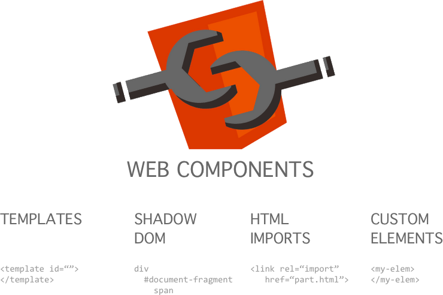

.hidden[
  https://jakearchibald.com/2017/es-modules-in-browsers/
  [Asynchronous and deferred JavaScript execution explained
Last revised on September 13th, 2010 -  Peter Beverloo](https://peter.sh/experiments/asynchronous-and-deferred-javascript-execution-explained/)
  
  https://github.com/Polymer/pwa-starter-kit
  https://github.com/Polymer/lit-element
  https://github.com/Polymer/lit-html
  
  https://medium.com/ing-blog/ing-%EF%B8%8F-web-components-f52aacc71d7a
]

.center.icon[]

---

class: white
background-image: url(assets/title.svg)
.top.icon[]

# Modern JavaScript Frameworks
## Обзор Web Components
### Александр Коржиков

---

class: top white
background-image: url(assets/sound.svg)
.top.icon[]

.sound-top[
  # Как меня слышно и видно?
]

.sound-bottom[
  ## > Напишите в чат
  ### **+** если все хорошо
  ### **–** если есть проблемы cо звуком или с видео
]

---

# Changelog

- ДЗ со * про `Lit-Element`

---

# Темы предыдущего занятия

.right-image[]

- Shadow DOM
  - Dom
  - Slots
  - Events
  - Styles
- HTML Template

---

# Темы

.right-image[]

- Введение в Polymer
- Hello Polymer
- Web Standards
  - Ajax
  - ES6 Templates literals
  - Type Module
- Обзор инструментов
- Lit-HTML
  - Lit Element
  - pwa-starter-kit

---

# Цели

.right-image[]

- Понимать основные концепции `Polymer` для создания элементов и приложений
- Ориентироваться в веб спецификациях, на базе которых работает `Lit-HTML`
- Сравнить альтернативные подходы и инструменты

---

# Docs

- [Vaadin Tutorials](https://vaadin.com/tutorials/lit-element/lit-element-templating-properties-and-events)

- [Official Guide](https://www.polymer-project.org/)

- [Google tutorials & guides](https://developers.google.com/web/fundamentals/web-components/)

- [LitElement](https://lit-element.polymer-project.org/)

- [PWA Starter Kit - Redux and state management](https://polymer.github.io/pwa-starter-kit/redux-and-state-management/)

---

# About

.right-image[]

### Polymer is a JavaScript library that helps you create custom reusable HTML elements, and use them to build performant, maintainable apps
### The Polymer library provides a set of features for creating custom elements. These features are designed to make it easier and faster to make custom elements that work like standard DOM elements

---

# History

.right-image[]

- Прошлое 
  - v1 - 2014-2015 - для Material Design
  - v2 - 2016+ 
  - v3 - 2018+
- Настоящее & Будущее - Lit-HTML, Lit-Element

---

# Ключевые особенности

- Использование стандартов и веб технологий
- Все - элемент
- Витрина готовых компонент 

### https://www.webcomponents.org/ 

## Технологии

- Web Components
- HTML, CSS декларативный подход описания приложения
- JavaScript- бизнес логика, polyfills

---

# Web Components

.right-image[]

### Что описывают эти стандарты?

- Custom Elements 
- HTML Templates 
- Shadow DOM 
- HTML Imports

---

# Web Components

.right-image[]

- `Custom Elements` для создания собственных HTML тэгов
- `HTML Templates` позволяет определять и использовать шаблоны для HTML 
- `Shadow DOM` инкапсулирует DOM и стили
- `HTML Imports` загружает HTML документы на страницу

---

# Пример Ajax

- XMLHttpRequest()
- `fetch()`
- WebSocket()
- JSONP

```
fetch(url)
  .then((response) => { /* ... */ })
  .then(/* ... */)

/*
 * When did you join github?
 * https://api.github.com/users/...
 */
```

---

# Polymer - все элемент

Например, `AJAX`

```bash
npm install @polymer/iron-ajax
```

```
<iron-ajax auto url="https://www.googleapis.com/youtube/v3/search" 
  params='{
    "part":"snippet", 
    "q":"polymer", 
    "key": "YOUTUBE_API_KEY", 
    "type": "video"
  }'
  handle-as="json"
  on-response="handleResponse"
  debounce-duration="300">
</iron-ajax>
```

[Demo](https://www.webcomponents.org/element/@polymer/iron-ajax/demo/demo/index.html)

[Demo2](/Users/RD25XO/Developer/experiments/notes/otus/polymer/1/2.1/index.html)

---

# Пример paper-tabs

```bash
npm init -f
npm install @polymer/paper-tabs
polymer serve
```

```html
<!-- head -->
<script type="module">
 import '@polymer/paper-tabs/paper-tabs.js'
 import '@polymer/paper-tabs/paper-tab.js'
</script>
<!-- body -->
<paper-tabs selected="1">
 <paper-tab>ITEM ONE</paper-tab>
 <paper-tab>ITEM TWO</paper-tab>
 <paper-tab>ITEM THREE</paper-tab>
</paper-tabs>
```

---

# Hello Polymer Element

```html
<script type="module">
 import { PolymerElement, html } from '@polymer/polymer'

 class MyElement extends PolymerElement {
  static get properties() { 
    return { 
      mood: String 
    }
  }
  static get template() {
    return html`
      <style>.mood { color: green } </style>
      Web Components are <span class="mood">[[mood]]</span>!
    `
  }
 }

 customElements.define('my-element', MyElement)
</script>

<my-element mood="awesome"></my-element>
```

---

# Type Module

```html
<script type="module" src="main.mjs"></script>
<script nomodule src="fallback.js"></script>

<script type="module">
  import {addTextToBody} from './utils.mjs'

  addTextToBody('Modules are pretty cool.')
</script>
```

- `use strict` 
- `var` are not global
- idempotent loading
- `defer`
- `nomodule`

[Modules in Browsers](https://cdn.rawgit.com/jakearchibald/6110fb6df717ebca44c2e40814cc12af/raw/7fc79ed89199c2512a4579c9a3ba19f72c219bd8/
)

.hidden[
  Browsers that understand `type=module` should ignore scripts with a `nomodule` attribute
]

---

# Инструменты

- `polymer-cli` - для создания, тестирования, разработки и демонстрации элементов и приложений

```bash
polymer init
polymer serve
polymer test
polymer build
```

- https://www.webcomponents.org/ - коллекции компонент, в том числе `routing, layout, pwa`

---

# Test

Можно сохранить в `package.json scripts test` - `polymer test -l chrome --skip-selenium-install`

- Web-Component-Tester
  - Mocha - test framework
  - Chai - assertion
  - Sinon - spies, stubs, and mocks
  - Selenium - для тестирования в разных браузерах 

- WebDriverIO
- Puppeteer

---

# Polyfills

```bash
npm install @webcomponents/webcomponentsjs 
```

- webcomponents-lite.js - все вместе + platform (ES6 Promise, ...)
- webcomponents-loader.js - для динамической загрузки
- WebComponentsReady - событие готовности 

https://www.webcomponents.org/polyfills/ 

---

class: center
## Examples
## Q&A

- [youtube](https://youtube.com)
- [chrome bookmarks](chrome://bookmarks)

---

# Lit-HTML

```
import {
  html,
  render
} from 'lit-html'

const helloTemplate = (name) =>
  html `<div>Hello ${name}!</div>`
  
render(helloTemplate('Steve'), document.body)
```

> ES6 Template Literal HTML render library that "lets you write HTML templates with JavaScript template literals, and efficiently render and re-render those templates to DOM"

---

# ES6 Templates literals

- multiline
- expressions
- tagged

```
console.log(`Fifteen is ${a + b}, \nnot ${2 * a + b}.`)

function myTag(strings, personExp, ageExp) { 
  var str0 = strings[0] // "that " 
  var str1 = strings[1] // " is a " 
  return str0 + personExp + str1
}

var output = myTag`that ${person} is a ${age}`
```

---

# Задача

### Написать `tagged template` функцию `factorial()`
- возвращающую текст-выражение первых `N` чисел факториала

```
factorial`multiply this ${4}` 
// => `multiply this 1 * 2 * 3 * 4 and get 24`
```

---

# Lit-HTML API

```
import {html, render} from 'lit-html'
const helloTemplate = (name) =>
  html`<div>Hello ${name}!</div>`
  
render(helloTemplate('Steve'), document.body)
```

- html ES6 template tag used => `TemplateResult`
- `render(TemplateResult, element)`

---

# Features

### Parses string and creates `<template>`

- Nested Nodes
- Async 
- Directives (until, repeat)
- Extend

```
const render = () => 
  html`<p> 
    ${until(
      fetch('content.txt').then((r) => r.text()), 
      html`<span>Loading...</span>`
    )}
</p>`
html`<button class$="primary">Buy Now</button>`
html`<button on-click=${(e)=> this.onClickHandler(e)}>Buy Now</button>`
```

---

# Demo

### [Pure Lit HTML render()](/Users/RD25XO/Developer/experiments/notes/otus/lit-html/pure.html)

- https://jsbin.com/nahocaq/1/edit?html,output

---

# Demo

### [Local development() of Tree App](/Users/RD25XO/Developer/experiments/notes/otus/polymer/3/lit-html/project/index.html)

---

# [Lit Element](https://lit-element.polymer-project.org/)

- unidirectional data flow 
- own lifecycle and hooks
- Lit-HTML with Shadow DOM instead of Polymer

```ts
import { LitElement, html, property, customElement } from 'lit-element'

@customElement('simple-greeting')
export class SimpleGreeting extends LitElement {
  @property() name = 'World'

  render() {
    return html`<p>Hello, ${this.name}!</p>`
  }
}
```

---

# [Lit Element](https://lit-element.polymer-project.org/)

```js
import { LitElement, html } from 'lit-element'

class SimpleGreeting extends LitElement {
  static get properties() {
    return { name: { type: String } }
  }

  constructor() {
    super()
    this.name = 'World'
  }
  
  render() {
    return html`<p>Hello, ${this.name}!</p>`
  }
}

customElements.define('simple-greeting', SimpleGreeting)
```

---

# pwa-starter-kit

Is a starting point for building PWAs

- All the PWA goodness (manifest, service worker)
- A responsive layout
- Application theming
- Example of using Redux for state management
- Offline UI
- Simple routing solution
- Fast time-to-interactive and first-paint using the PRPL pattern
- Easy deployment to prpl-server or static hosting
- Unit and integration testing starting points
- Documentation about other advanced patterns

---

# На занятии

- Разобрали основные концепции `Polymer` для создания элементов и приложений
- Рассмотрели техники, на базе которых работает `Lit-HTML`
- Сравнить альтернативные подходы и инструменты

---

# Modern JavaScript Frameworks

.mario.mario-10[]

|  |  |  |  |  |  |
|:-------------:|:-------------:|:-------------:|:-------------:|:-------------:|:-------------:|
|  |  |  |  | |  |
| |  | |  | |  |
| |  | |
| |  | |

---

# Самостоятельная работа*

Сделать приложение для показа дерева элементов с помощью `Lit-Element (Lit-HTML, Polymer)` - `my-tree` и `my-leaf` 

```
{
  id: 1,
  items: [{
    id: 2,
    items: [{
      id: 3
    }]
  }]
}
```

---

# Проектная работа

- [Revolut](https://www.revolut.com/en-NL/)

https://docs.google.com/document/d/16r_D2a6VHCT1FwKAW1TeMoE6SoanDECyPswze_tABZc/edit

- [djv](https://github.com/korzio/djv) 
- [note](https://github.com/korzio/note) - уже в это воскресенье
- [Vuemmerce](https://github.com/otusteamedu/Vuemmerce) - спросить Михаила

---

class: white
background-image: url(assets/title.svg)
.top.icon[]

# Спасибо за внимание!

- Как вам Polymer?

.black[ 
## Пожалуйста, пройдите опрос 
## в личном кабинете 
]
