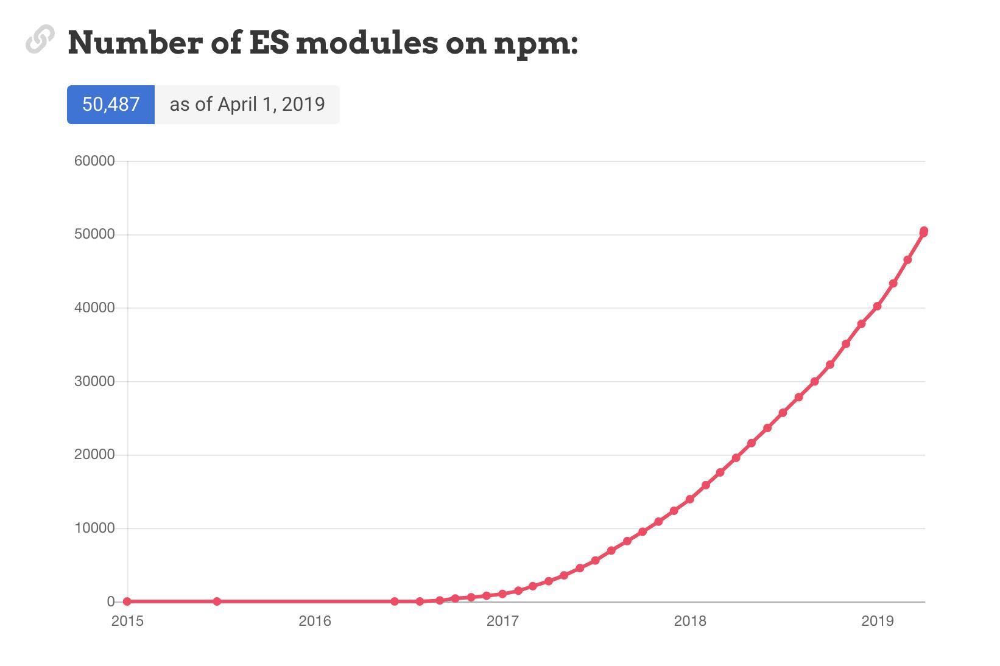

.hidden[
  - https://medium.com/@sdboyer/so-you-want-to-write-a-package-manager-4ae9c17d9527
  
  https://medium.com/@nodejs/announcing-a-new-experimental-modules-1be8d2d6c2ff
  
  
  https://hacks.mozilla.org/2018/03/es-modules-a-cartoon-deep-dive/
  http://exploringjs.com/es6/ch_modules.html
  
  Коллеги, добрый день!
  Сегодня у нас занятие "Модули в Node". Советую отличное введение -
  Modules Modules Modules [I] - Myles Borins, Google
  https://www.youtube.com/watch?v=W5CXzo4TZVU
  от одного из лидов коммюнити
]

.center.icon[]

---

class: white
background-image: url(assets/title.svg)
.top.icon[]

# Modern JavaScript Frameworks
## Основные концепции Node - Modules
### Александр Коржиков

---

class: top white
background-image: url(assets/sound.svg)
.top.icon[]

.sound-top[
  # Как меня слышно и видно?
]

.sound-bottom[
  ## > Напишите в чат
  ### **+** если все хорошо
  ### **–** если есть проблемы cо звуком или с видео
]

---

# Changelog

- `NodeConfEU 2019`

---

# Темы предыдущего занятия
.right-image[]

- CSS в React - CSS-модули и classNames
- Testing, Mobx, preact, inferno
- SSR, react-native

---

# Цели занятия

- Разобраться с шаблоном проектирования `Module` и вариантами его имплементации в `JavaScript`

- Импорт и экспорт зависимостей в `Node` с
  - `CommonJS`, 
  - `ES Modules` 

.half-image[]

---

# Содержание

.right-image[]

- Modules
  - Pattern
  - Classic
  - AMD 
  - CommonJS
  - ES Modules
  - Native ES Modules - Gil Tayar

---

# Back To NPM

.full-image[
  
]

---

# CLI


### Commands

- General

  - `init` - new package
  - `install` - dependencies
  - `start` - run application
  - `test` - run tests
  - `run` - any script

- Other

  - `ci` - install exact package versions
  - `npx` - run binary

---

# Зависимости

.right-code[
```
  "dependencies": {
    "commander": "^2.7.1",
    "lodash.get": "^4.0.0",
    "lodash.isequal": "^4.0.0",
    "validator": "^9.0.0"
  },
  "devDependencies": {
    "coveralls": "^3.0.0",
    "grunt": "^1.0.1",
    "grunt-browserify": "^5.2.0",
    "grunt-cli": "^1.2.0",
    "grunt-contrib-copy": "^1.0.0",
    "grunt-jscs": "^3.0.1",
    "grunt-lineending": "^1.0.0",
    "jasmine-node": "^1.14.5",
    "jasmine-reporters": "^2.2.1",
    "remapify": "^2.1.0"
  }
```
]

- `dependencies`
  - `devDependencies` разработчика
  - `peerDependencies` плагины
  - [bundleDependencies](/Users/RD25XO/Developer/experiments/notes/otus/node/node-1.0.0.tgz) дистрибутив (сокращает время установки зависимостей)
  - `optionalDependencies` необязательные
  
- `--global`
- `node_modules`

.hidden[
  Another great way to speed up installation time is to include all production dependencies in the published module. We can tell npm to bundle them with our module by adding them as bundleDependencies to our package.json:
  "bundleDependencies": [
    "config-chain",
    "nopt",
    "npmlog",
    "opener",
    "osenv",
    "request"
  ],
  Bundling the dependencies reduces the installation time a lot, as we omit all the small HTTP requests for each dependency and their dependencies during installation. With the current npm, installation time is reduced from 20 seconds to 5 seconds for a broadband connection. Bundling the dependencies also makes sure that our package is still installable even if a module was unpublished.
  When we now run npm publish, we will publish a highly optimized version of our package.
  
  https://learning.oreilly.com/library/view/the-cli-book/9781484231777/A456043_1_En_3_Chapter.html
]

---

# node_modules

.hidden[
  https://docs.npmjs.com/files/package-locks
  
  different versions of npm (or other package managers) may have been used to install a package, each using slightly different installation algorithms.

  a new version of a direct semver-range package may have been published since the last time your packages were installed, and thus a newer version will be used.

  A dependency of one of your dependencies may have published a new version, which will update even if you used pinned dependency specifiers (1.2.3 instead of ^1.2.3)

  The registry you installed from is no longer available, or allows mutation of versions (unlike the primary npm registry), and a different version of a package exists under the same version number now.
]

.right-code[
```
# A{B,C}, B{C}, C{D}
A
+-- B
+-- C
+-- D

# A{B,C}, B{C,D@1}, C{D@2}
A
+-- B
+-- C 
    +-- D@2
+-- D@1
```
]

- Locks
  - package-lock.json
  - npm-shrinkwrap.json
- Альтернативы
  - yarn
  - bower
  - [turbo](https://medium.com/stackblitz-blog/introducing-turbo-5x-faster-than-yarn-npm-and-runs-natively-in-browser-cc2c39715403), [resolver](https://github.com/stackblitz/core/tree/master/turbo-resolver)
- Proposals
  - tink
  - yarn pnp
  
---

# [Performance](https://github.com/pnpm/benchmarks-of-javascript-package-managers)

### The app's `package.json` [here](./fixtures/alotta-files/package.json)

| action  | cache | lockfile | node_modules| npm i | Yarn | pnpm | npm ci
|:---     |:---   |:---      |:---         |:--- |:--- |:--- |:--- |
| install |       |          |             | 5.8s | 32.9s | 50s | N/A |
| install | ✔     | ✔        | ✔           | 6.1s | 987ms | 2.5s | 19.8s |
| install | ✔     | ✔        |             | 16.9s | 12.9s | 10.1s | 10.2s |
| install | ✔     |          |             | 25.1s | 17.7s | 20.5s | N/A |
| install |       | ✔        |             | 17.1s | 23.4s | 39s | 11.2s |
| install | ✔     |          | ✔           | 7.1s | 11s | 14.3s | N/A |
| install |       | ✔        | ✔           | 6.7s | 980ms | 1.9s | 22.6s |
| install |       |          | ✔           | 6.2s | 18.3s | 46.1s | N/A

---

class: white
background-image: url(assets/title.svg)
.top.icon[]

# NPM Q&A

---

# Module

### Архитектурный шаблон проектирования, помогающий организовать отдельные части кода 

- Classic
- AMD 
- CommonJS
- ES Modules

---

# Classic 

```javascript
// Global module
var myModule = (function (jQ, _) {
  function privateMethod1() {
    jQ(".container").html("test")
  }
  return {
    publicMethod: function () {
      privateMethod1()
    }
  }
})(jQuery, _) 

myModule.publicMethod()
```

- Immediately-Invoked Function Expression (IIFE)
- Object Notation
- Namespace with `init()` method

---

# AMD - RequireJS

```javascript
define('myModule', // name
  ['jQuery'], // dependencies
  function myModuleFactory($) { // factory
    function writeTest() {
      $('.container').html('test')
    }
    return {
      init: () => {
        writeTest()
      }
    }
  }
)
// or
define(function (require, exports, module) {
  // ...
})
```

- `require()`
- `define()`

---

# CommonJS

```
// require
const circle =
  require('./circle.js')
// exports
exports.square =
  (r) => r ** 2
```

### Node

- `require()` - импорт
- `exports, module.exports` - экспорт API из модуля

```
exports.version = 123
module.exports = { build, version }
```

---

# Module Wrapper

- `require()` - импорт глобальных и локальных зависимостей
- `module, module.exports`

```
(function (exports, require, module, __filename, __dirname) {
  const circle = require('./circle.js') 
  exports.square = (r) => r ** 2
})
```

```
// Node - lib/internal/modules/cjs/loader.js
Module.wrap = function(script) {
  return Module.wrapper[0] + script + Module.wrapper[1];
};

Module.wrapper = [
  '(function (exports, require, module, __filename, __dirname) { ',
  '\n});'
];
```

---

# require

- `require()` кэширует модуль
- `require.cache` хранит загрузки
- `require.resolve()` возвращает путь до зависимости

### Вопрос

Что будет выведено в консоль?

```
const empty = require('./empty.js')
empty.test = 123
console.log(require('./empty.js').test)
console.log('finished')
```

- Demo `require('./b.js')`
- Karma example

.hidden[
  Хитрая прикладная задача, про которую я говорил на занятии, недавно решал, такая:
Есть враппер вокруг `karma`. Пользователи этого враппера могут локально вызвать CLI в своем проекте. При этом они должна подхватываться их конфигурация тестов, вместе с плагинами, которые они используют. Проблема в том, что карма подхватывает плагины из локации собственного executable файла, при этом зависимости враппера не учитываются. А враппер должен следить за результатами исполнения, в частности, используя репортер `karma-js-reporter`. Вопрос - как прокинуть `karma-js-reporter` в настройку пользовательского конфига, чтобы при этом подхватились все зависимости и результат выполнения был доступен во враппере?

node_modules/karma/lib/plugin.js

const jsReporterPromise = new Promise(resolve => {
      // Karma loads plugins from project location
      // js reporter is a part of ing-web-cli dependencies
      // to enable js reporter we have to
      // read plugins and reporters from project karma config
      // and provide them as options for further karma merge
      const { Config } = require(join(
        require.resolve("karma"),
        "..",
        "config.js",
      ));
      const config = new Config();
      require(configFile)(config);
      const { reporters, plugins } = config;

      Object.assign(options, {
        jsReporter: (details: string) => {
          resolve(details);
        },
        // plugins from project's config
        // karma-js-reporter from ing-web-cli dependency
        // karma-* for default plugins
        plugins: [...plugins, require.resolve("karma-js-reporter"), "karma-*"],
        // reporters from project's config
        // karma-js-reporter declaration
        reporters: [...reporters, "js"],
      });
    });

    const karmaServicePromise = new Promise((resolve, reject) => {
      // it is important that the karma dependency is resolved from the project,
      // else plugins and preprocessor don't work
      const karma = this.requireFromLocal("karma");
      const server = new karma.Server(options);

      this.log(`Running tests with config ${configFile}`);
      try {
        server.start();
        // @ts-ignore
        server.on("run_complete", (browsers, results) => {
          resolve(results);
        });
      } catch (error) {
        reject(`Error during running karma tests: ${error}`);
      }
    });

    return Promise.all([karmaServicePromise, jsReporterPromise])
      .then(([results, details]: any) => {
        Object.assign(this.info, { results, details });

        if (results.exitCode > 0) {
          this.log("Error during running tests");
          return 1;
        } else {
          this.log("All tests succesfull");
          return 0;
        }
      })
      .catch(error => {
        this.log(error);
        return 0;
      })
]

---

# Extensions

### **!Important! Deprecated**
### Define interpreter for other file extensions

```
var oldHook = require.extensions['.js']
require.extensions['.js'] = function (module, file) {
  var oldCompile = module._compile
  module._compile = function (code, file) {
    code = code + '; console.log(bar)'
    module._compile = oldCompile
    module._compile(code, file)
  }
  oldHook(module, file)
}

require('./')
```

---

# Вопрос

Что здесь происходит?

```
const cachedGlob = require('glob')
delete 
  require.cache[require.resolve('glob')]
 
const originalGlob = require('glob')
cachedGlob.Glob = originalGlob.Glob
```

.center[
  
]

---

# Порядок загрузки

### https://nodejs.org/api/modules.html#modules_all_together 

- `require('core')` - встроенные модули
- `require('/')` или './', '../' - откуда 
- `file, .js, .json, .node` - расширения файлов
- `X/index.js` - index
- `X/package.json` - "модуль"
- `node_modules` - загрузка по иерархии

---

# Циклические зависимости

- `b.js` > `require('./a')`
- `a.js` > `require('./b')`


Код первого модуля внутри второго будет *"незавершенным"*

#### Что будет выведено в консоль? 

```bash
node a
```

.right-code[
```
// b.js
const a = require('./a')
console.log(a.a)
exports.b = 'b'
```
]

```
// a.js
const b = require('./b')
console.log(b.b)
exports.a = 'a'
console.log('finished')
```

---

# ES6 Modules

.right-image[]

Поддерживается в расширении `*.mjs`

```
import * as core 
  from '@uirouter/core'
// complete module import

export default 'ui.router'
// default export
 
export const name = 'myName'
// named exports

import('./a').then(({ a }) => {
 console.log(a)
})
// dynamic import
```

---

# Features

```html
<script type="module" ...>
  ```

- Declarative
- Static declarations at the top level
- Strict mode
- Asynchronous
- Scoped
- [`--experimental-modules`](https://github.com/nodejs/node/commit/3d8cdf191d89298d97a0bda20a2a2ceffc7cf3f0)
- Imports are read-only views on exports

.hidden[
Scripts	Modules
HTML element	<script>	<script type="module">
Default mode	non-strict	strict
Top-level variables are	global	local to module
Value of this at top level	window	undefined
Executed	synchronously	asynchronously
Declarative imports (import statement)	no	yes
Programmatic imports (Promise-based API)	yes	yes
File extension	.js	.js
]

---

# 3rd party presentation

- [Native ES Modules - something almost, but not quite entirely unlike CommonJS](https://docs.google.com/presentation/d/1dFnr27ksIfYi7VHY4lqeEOiV7qpjhLSRnk4gQW5oaPI/edit#slide=id.p)

- Gil Tayar, November 2018, @giltayar

- https://github.com/giltayar/node-esm-tea

- [Node ES Modules - something almost, but not quite entirely unlike CommonJS - Gil Tayar](https://youtu.be/44kvI2W0Mww)

- https://medium.com/@giltayar/native-es-modules-in-nodejs-status-and-future-directions-part-i-ee5ea3001f71

---

# Задача

### Использовать Node@10 для стандартного импорта

- Импортировать `default export` из CJS в MJS
- Импортировать значение с помощью `dynamic import` из MJS в CJS

.half-image[]

---

class: white
background-image: url(assets/title.svg)
.top.icon[]

# Modules Q&A

---

# Docs

- [Node Modules API](https://nodejs.org/api/modules.html)

- [Learning JavaScript Design Patterns Addy Osman](https://addyosmani.com/resources/essentialjsdesignpatterns/book/)

- [ES modules: A cartoon deep-dive - Lin Clark](https://hacks.mozilla.org/2018/03/es-modules-a-cartoon-deep-dive/)

---

# На занятии

- Разобрали различие `CommonJS` и `ES Modules`

- Поняли как работают `require` и `exports` для экспорта и импорта зависимостей

---

# Modern JavaScript Frameworks

.mario.mario-14[]
<!-- .mario.mushroom[] -->

|  |  |  |  |  |  |
|:---:|:---:|:---:|:---:|:---:|:---:|
|  |  |  |  | |  |
|  |  |  |  | |  |
|  | |  |
|  | |  |

---

# Самостоятельная работа


---

class: white
background-image: url(assets/title.svg)
.top.icon[]

# Спасибо за внимание!
.black[ 
## Пожалуйста, пройдите опрос 
## в личном кабинете 
]

- Все ли темы были понятны? (да - нет)
- Легкий материал или нет? (1 просто - 10 сложно)

.hidden[

Node
Сборщики
Webpack
Rollup
...
]