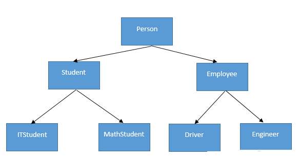
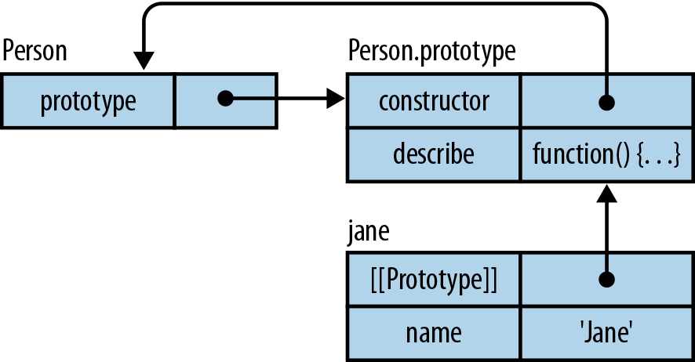
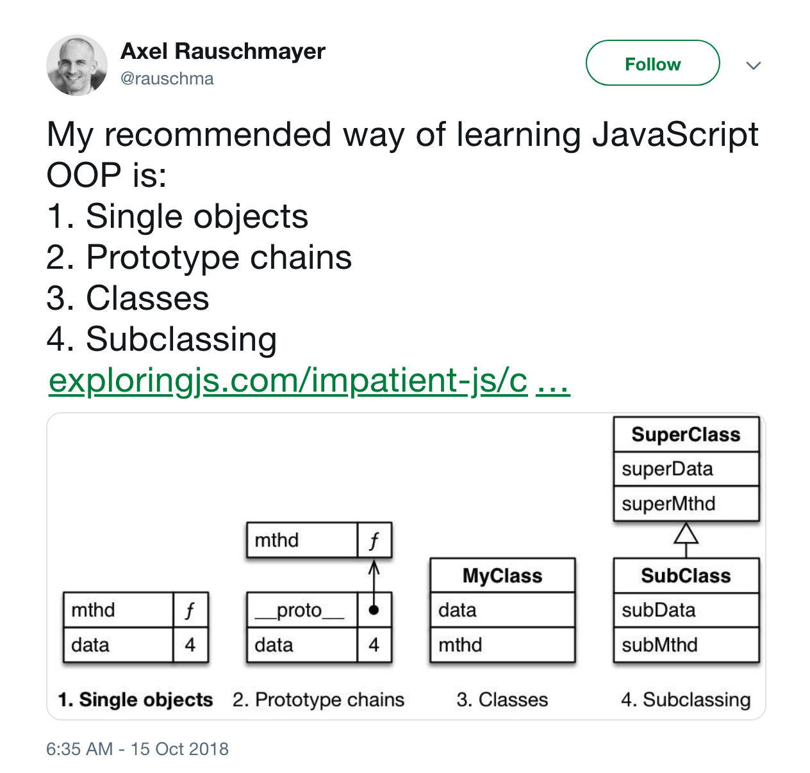
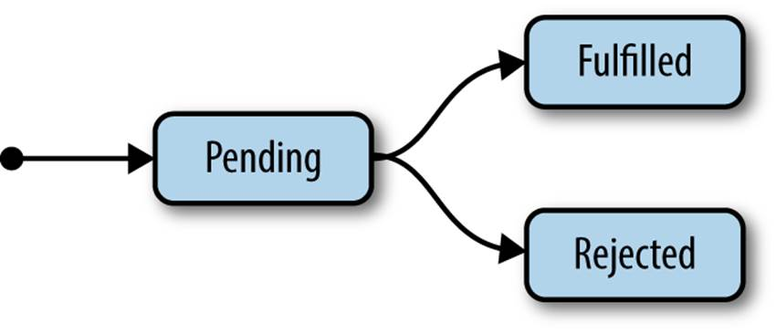
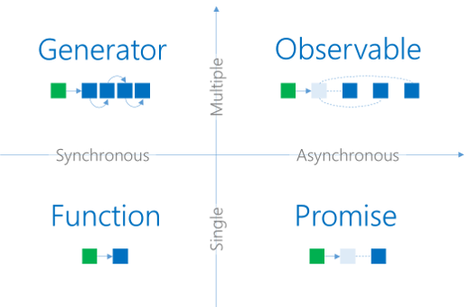
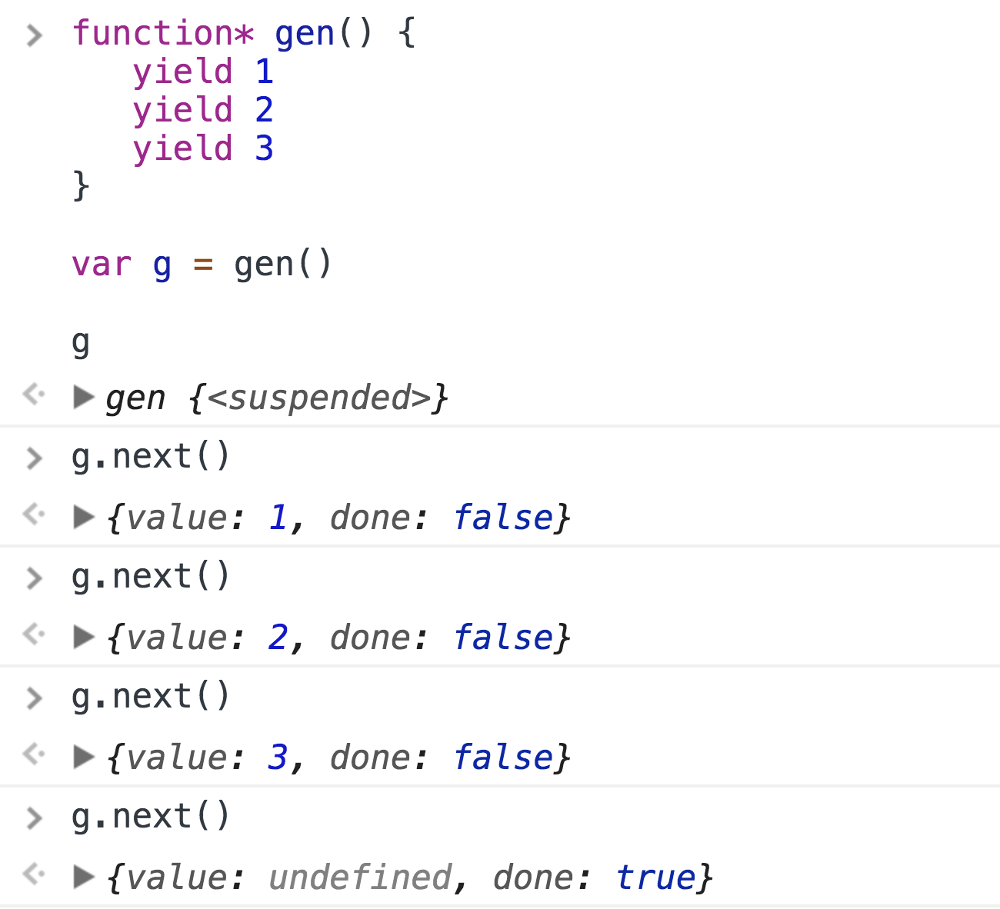

.hidden[
# TODO
- [Async functions - making promises friendly - Jake Archibald](https://developers.google.com/web/fundamentals/primers/async-functions)
- [Historical document on `Promises` specification](https://promisesaplus.com/)
- https://hackernoon.com/6-reasons-why-javascripts-async-await-blows-promises-away-tutorial-c7ec10518dd9
- https://medium.com/@stevekonves/three-javascript-async-patterns-1d2e7094860a
- https://developer.mozilla.org/en-US/docs/Web/JavaScript/Reference/Global_Objects/Promise
]

.center.icon[]

---

class: white
background-image: url(assets/title.svg)
.top.icon[]

# Modern JavaScript Frameworks
## Возможности JavaScript
### Александр Коржиков

---

class: top white
background-image: url(assets/sound.svg)
.top.icon[]

.sound-top[
  # Как меня слышно и видно?
]

.sound-bottom[
  ## > Напишите в чат
  ### **+** если все хорошо
  ### **–** если есть проблемы cо звуком или с видео
]

---

# Modern JavaScript Frameworks

.mario.mario-1[]

|  |  |  |  |  |
|:-------------:|:-------------:|:-------------:|:-------------:|:-------------:|:-------------:|
|  |  |  | |  |
|  |  |  | | |
|  |  |  
|  |  | |

---

# Темы предыдущего занятия
.right-image[]

- Типы данных
- Переменные 
- Функции
- Замыкания

---

# Вопрос - Замыкания

### Какой контекст будет у функции, если к ней применить `bind()` дважды и почему?

```js
var fn = function() {
  console.log(this)
}
var a = fn.bind(1)
a() // a?
var b = a.bind(2)
b() // b?
```

---

# Темы

.right-image[]

- Наследование
- Promise
- Async Patterns
- Обзор ES6 Features

---

# Цели Занятия

- Вспомнить и применять основные техники языка `JavaScript`
- `Promise` и другие асинхронные паттерны
- Попрактиковаться с технологиями `Promise`

---

# Вопрос
.right-image[]

- Какие задачи решает наследование?
- Что означают эти термины:
  
  - inheritance, 
  - polymorphism, 
  - encapsulation, 
  - abstraction?
  
  .hidden[
    https://medium.com/@cancerian0684/what-are-four-basic-principles-of-object-oriented-programming-645af8b43727
    
    `abstraction` is removing irrelevant data so a program is easier to understand
  ]
  
- Как реализовать наследование в `JavaScript`?

---

# Наследование

### `__proto__` ссылка на объект прототип

```javascript
var a = { b: 0 }
// not recommended
a.__proto__ = { c : 1 } 

// alternative
Object.getPrototypeOf(a) // Reflect.getPrototypeOf()
Object.setPrototypeOf(a, { c : 2 }) // Reflect.setPrototypeOf()
```

.half-image[]

---

# Наследование

.right-image[]

### Object.create(proto, [propertiesObject]) устанавливает аргумент значением `__proto__` 

```javascript
var b = Object.create({ a: 1 })
console.log(b.a === 1) // true
delete b.a
console.log(b.a === 1) // true
console.log(b.__proto__) // { a: 1 }
```

---

# Наследование

### `new Fn()` устанавливает `__proto__` равным `prototype` 

```javascript
function Fn() {}
Fn.prototype = { c: 1 }
var a = new Fn()
a.__proto__ // { c: 1 }
```

- Что будет, если вернуть из конструктора объект?

.center[]

---

# Задача

### Реализовать функцию `create` - `polyfill` для `Object.create`

```javascript
var create = function() { /* ... */ }

var b = create({ a: 1 })
b.a === 1 // true
delete b.a
b.a === 1 // ?
```

---

# Классы

### `class` - «синтаксический сахар» для задания конструктора и прототипа

```javascript
class Pie { 
  constructor(name) { 
    this.name = name 
  }
}

class Pizza extends Pie { 
  bake() { 
    super.bake() 
  }
}
```

---

# Классы

.right-code[
```javascript
class Pie { 
  constructor(name) { 
    this.name = name 
  }
}

class Pizza extends Pie { 
  bake() { 
    super.bake() 
  }
}
```
]

- `class C` - декларация класса
- `[extends P] ` - наследование
- `constructor(), methods()` - конструктор и методы класса
- `new C()` - создание инстансов класса
- `get / set` - функции доступа / присваивания
- `static` - статичные свойства и методы
- `super` - обращение к родительскому классу

---

# Private

```
class Pie {
 #test = 1
 static #test = 1
 
 log() {
   console.log(this.#test)
 }
}
```

---

class: center
## Inheritance
## Q&A

---

# Promise

### Техника написания асинхронного кода


.hidden[
  
]

---

# Promise

- `resolve()` - успешное завершение
- `reject()` - выполнено с ошибкой

```
new Promise((resolve, reject) => {
  resolve('Hello')
})

// Alternative
Promise.resolve(value)
Promise.reject(reason)
```

---

# Promise callbacks

- `then()` - вызвана при `resolve()` с результатом 
- `catch()` - при `reject`

```
Promise.resolve(1) // reject() 
  .then((a) => { console.log(a); throw 'Oh no!' }) 
  .catch(reason => { console.error(reason) })
  
// Alternative
// then(onThen, onCatch)
```

- Chaining...

  - `reject()` может быть неявно спровоцировано исключением
  - `reject()` следует до `catch()`

---

# Вопрос

### Что будет выведено в консоль?

```
Promise.resolve(1)
  .then(console.log)
  .then(console.log)
```

### А здесь?

```
Promise.reject()
  .then(() => { throw 3 })
  .catch(() => 4)
  .then((a) => console.log(a))
```

---

# More

- `finally()` - выполнится при любом исходе
- `all()` - параллельные promises

```
Promise.resolve()
  .finally(() => 'done')// parallel
  
Promise.all([promise, promise2])
  .then(() => 'then')
```

- `race()` - как только один из promise-ов завершится
- `...`

---

# Задача

.hidden[
### Написать `polyfill` для `Promise.all()`, ожидающий исполнение всех `Promise` аргументов и возвращающий все результаты

```
promiseAll([
  promise, 
  promise2
])
.then(([res1, res2]) => 'done')
```
]

### Написать функцию `setTimeoutPromise`, которая возвращает `Promise`, переходящий в "settled" состояние после переданного промежутка времени

```js
setTimeoutPromise(1000)
  .then(() => console.log('done'))

// alternative
setTimeout(
  () => console.log('done'), 
  1000
)
```

---

# async / await

### «синтаксический сахар» для работы с `Promise`

- `await` внутри `async`
- `return` возвращается `Promise`

```
const promiseFn = () => 
  new Promise(resolve => 
    setTimeout(() => resolve(3.14), 500)
  )

async function asyncFn() { 
  const Pi = await promiseFn() 
  console.log(Pi)
}

asyncFn()
```

---

# Задача

### Переписать, используя `async / await`

```
function getResponseSize(url) {
  return fetch(url).then(response => {
    const reader = response.body.getReader()
    let total = 0

    return reader.read().then(function processResult(result) {
      if (result.done) return total

      const value = result.value
      total += value.length
      console.log('Received chunk', value)

      return reader.read().then(processResult)
    })
  })
}
```

- [В чем различие между разными подходами?](https://gist.github.com/korzio/9aa3d7519fea9db1eed59938578b6170)

.hidden[
```
async function getResponseSize(url) {
  const response = await fetch(url)
  const reader = response.body.getReader()
  let total = 0
  let result = { value: '', done: false }
  
  do {
    result = reader.read()
    
    const value = result.value
    total += value.length
    console.log('Received chunk', value)
  } while (!result.done)
}
```
]

---

# Вопрос

### Что здесь не так?

```
new Promise((resolve, reject) => {
  const result = doSomething()
  if (result) {
    resolve(result)
  }

  doSomethingElse()
  reject(new Error('Empty result'))
})
```

---

class: center

## Promise
## Q&A
## ->
## Async Patterns

---

# Async Patterns

.right-image[
  
]

- `Callback`
- `Promise`
- Async / Await
- Generator / Iterator
- `Observable`

---

# Iterators

```
const iterable = {
 [Symbol.iterator]() {
   let step = 0
   const iterator = {
     next() {
       if (step <= 2) {
         step++
       }
       switch (step) {
         case 1:
           return { value: 'hello', done: false }
         case 2:
           return { value: 'world', done: false }
         default:
           return { value: undefined, done: true }
       }
     }
   }
   return iterator
 }
}
```

- Как можно итерироваться?

.hidden[
- Symbol.iterator()
- iterator factory  
- { next() }
- ({ value, done })

var it = iterable[Symbol.iterator]()
for (i of iterable) {
  console.log(i)
}
]

---

# Generator

Специальные функции - генераторы `function*` могут останавливать свое исполнение с помощью конструкций `yield` и `yield*`, возвращая множества значений

.half-image[
  
]

```
new GeneratorFunction('a', 'yield a * 2') 
```

---

# Пример [iterating async requests](https://gist.github.com/korzio/52774b2cf2281662ca0e6ef4600bf6bd)

```
async function get(n) {
  return new Promise(r => setTimeout(() => r(n), n * 100))
}

async function* asyncGenerator(arr) {
  let anyResolve

  arr.map(get).forEach(async request => {
    const anyResult = await request
    anyResolve(anyResult)
  })

  while(true) {
    yield await new Promise((resolve) => {
      anyResolve = resolve
    })
  }
}

(async function() {
  for await (let num of asyncGenerator([4, 3, 2, 1, 0])) {
    console.log(num)
  }
})()
```

---

# ES6 Features

.right-image[]

- Template Literals
- Parameters Handling - defaults, rest, spread
- Modules
- Symbol - iterators, generators
- Data Structures - Set, Map, Typed Arrays
- Proxy & Reflect
- ...

---

.hidden[
# Задача

### Если остается время
### Реализовать функцию `reduce` - `polyfill` для `Array.prototype.reduce`

```javascript
// example
[[0, 1], [2, 3], [4, 5]].reduce((memo, currentValue) => {
  return memo.concat(currentValue) 
}, [])

reduce(
 [1, 2, 3, 4], // arguments
 (a, b) => a + b, // action
 0 // initial value
) // 10
```
---
]

# На занятии

- Разобрали теорию и задачи, возникающие при работе с технологией Promise
- Вспомнили что такое наследование и его реализацию в JavaScript

---

# Что почитать
.right-image[]

### ECMAScript 6 (2015)

- http://es6-features.org/ - кратко
- http://speakingjs.com/es5/ - Speaking JavaScript
- https://learn.javascript.ru/promise


---

# Modern JavaScript Frameworks

.mario.mario-2[]

|  |  |  |  |  |
|:-------------:|:-------------:|:-------------:|:-------------:|:-------------:|:-------------:|
|  |  |  | |  |
|  |  |  | | |
|  |  |  
|  |  | |

---

# Самостоятельная работа

Написать функцию promiseReduce, которая получает на вход `asyncFunctions`, `reduce`, `initialValue`. 

promiseReduce поочередно вызывает переданные асинхронные функции и выполняет reduce функцию сразу при получении результата до вызова следующей асинхронной функции.

```
function promiseReduce(asyncFunctions, reduce, initialValue) {/* ? */}

const fn1 = () => Promise.resolve(1)
const fn2 = () => new Promise(resolve => {
 setTimeout(() => resolve(2), 1000)
})

promiseReduce([fn1, fn2], (memo, value) => memo * value, 2)
/* => 4 */
```

---

class: white
background-image: url(assets/title.svg)
.top.icon[]

# Спасибо за внимание!
.black[ 
## Пожалуйста, пройдите [опрос](https://otus.ru/polls/7204/)
## в личном кабинете 
]

- Все ли темы были понятны? (да - нет)
- Легкий материал или нет? (1 просто - 10 сложно)
