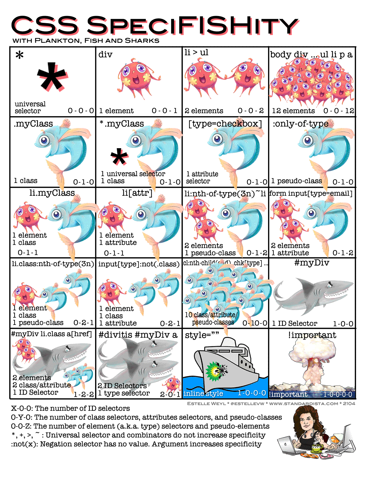
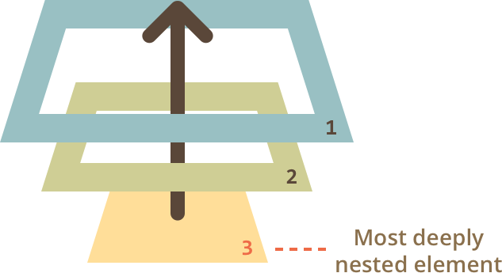
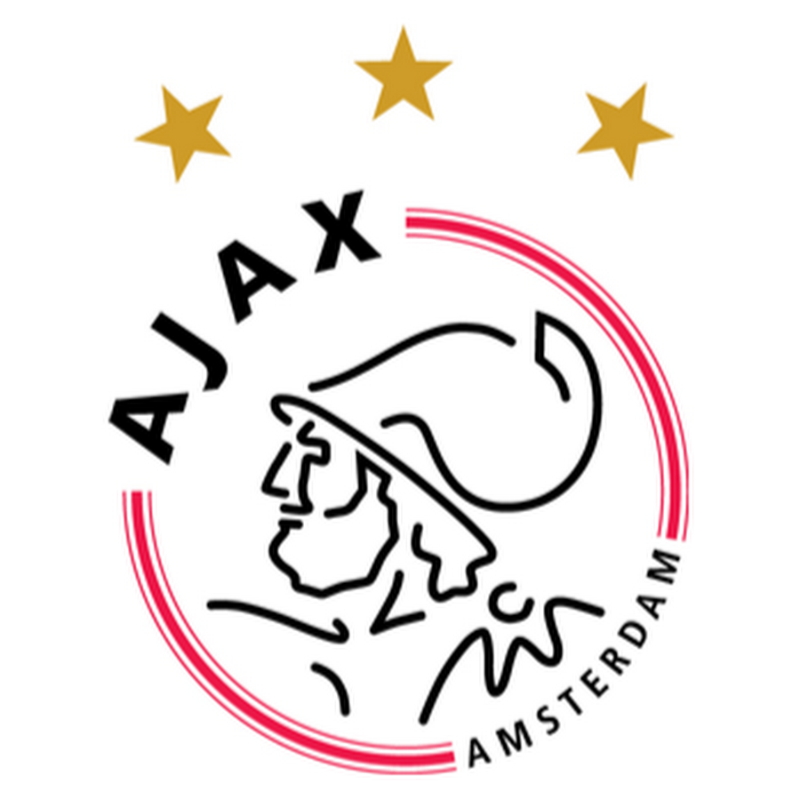

.hidden[
  [Constructing the Object Model](https://developers.google.com/web/fundamentals/performance/critical-rendering-path/constructing-the-object-model)

  [How is specificity calculated?](https://developer.mozilla.org/en-US/docs/Web/CSS/Specificity)  
  
  https://developers.google.com/web/updates/2018/06/feature-policy
  https://developer.mozilla.org/en-US/docs/Web/CSS/Specificity
  https://developers.google.com/web/fundamentals/security/csp/
  https://javascript.info/browser-environment
  
  https://developers.google.com/web/tools/chrome-devtools/ 
  http://learn.javascript.ru/document 
  https://classroom.udacity.com/courses/ud860
  https://classroom.udacity.com/courses/ud884
  
  Всем привет! Сегодняшнее занятие "JavaScript in Browser", но чтобы подвести итоги по Node
  https://www.youtube.com/watch?v=M3BM9TB-8yA
  https://www.youtube.com/watch?v=z6JRlx5NC9E
  
  https://loopback.io/
]

.center.icon[]

---

class: white
background-image: url(assets/title.svg)
.top.icon[]

# Modern JavaScript Frameworks
## JavaScript - Работа с браузером
### Александр Коржиков

---

class: top white
background-image: url(assets/sound.svg)
.top.icon[]

.sound-top[
  # Как меня слышно и видно?
]

.sound-bottom[
  ## > Напишите в чат
  ### **+** если все хорошо
  ### **–** если есть проблемы cо звуком или с видео
]

---

# Темы предыдущего занятия

.right-image[]

- Наследование
- Promise
- .strike[Async Patterns]
- Обзор ES6 Features

---

# Темы

- Вспомнить и освоить теорию и практические задачи, специфичные для браузерной разработки на языке JavaScript
- Попрактиковаться с Chrome DevTools

|  |  |
|:-----------:|:-----------:|
| DOM API | DevTools |
| Events |  |

---

# Browser Environment

.right-image[]

- `DOM` - модель `HTML` документа
- `window` - глобальный объект в браузере
- `JavaScript` 😀

### Что к чему относится?

.left-code[
```
1. DOM
2. window
3. JavaScript
```

```
/*a*/ console.log(123)
/*b*/ document.querySelector('div')
/*c*/ new Date()
```
]

---

# DOM

### Модель HTML документа

.right-code[
```html
<div id="test">
  <div>
    <p></p>
  </div>
  <span></span>
</div>
```
]

- .strike[BOM]
- CSSOM
- AOM

[Constructing the Object Model](https://developers.google.com/web/fundamentals/performance/critical-rendering-path/constructing-the-object-model)

<br>

.half-image[]

---

# CSS Selectors

```html
<div id="id">
  <div class="class">
    <p class="c1 c2"></p>
  </div>
  <span></span>
</div>

<style>
  #id { color: red; }
  .class { color: blue; }
  div { color: white; }
</style>
```

### [Как высчитывается специфичность CSS селекторов?](https://developer.mozilla.org/en-US/docs/Web/CSS/Specificity) 

---

# CSS Selectors

```html
<div id="id">
  <div class="class">
    <p class="c1 c2"></p>
  </div>
  <span></span>
</div>
```

### [Как высчитывается специфичность CSS селекторов?](https://developer.mozilla.org/en-US/docs/Web/CSS/Specificity) 

.right-code[
- cascade
- inline styles
- !important
]

- div, p, div > span
- .class, .c1.c2
- `#id`

---

# Специфичность

.half-image[
  [](https://specifishity.com/)
]

---

# DOM API

### Поиск элементов

- `querySelector()`
- `querySelectorAll()`
- `getElementById()`
- ...?

```
document.querySelectorAll('div') 
===
document.getElementsByTagName('div')?
```

---

# Вопрос

```
document.getElementById("test").querySelectorAll(":first-child")
```

### Что будет выбрано?

```html
<div id="test">
  <div>
    <p></p>
  </div>
  <span>
    <a href=""></a>
  </span>
</div>
```

.center[]

---

# HTMLElement

- .blue[getAttribute(), setAttribute()] - управление атрибутами
- .green[className, classList] - класс элемента
- .green[innerHTML, value, parentNode] - свойства
- .blue[appendChild(), insertBefore(), ...] - структурные методы 

### В чем отличие между атрибутами и свойствами?

- Класс `HTMLElement` является прородителем всех типов элементов

---

# Events

.right-code[
```
element.addEventListener(
 eventType, handler, phase
) 

element.removeEventListener(
 eventType, handler, phase
)

// 'on' + eventType
element.onclick = handler 
```
]

- `click`
- `mousedown, mouseup,` ...
- `submit, input, focus`
- ...?

## Спуск и всплытие

.right-image[]

- Сначала спуск (`capturing`), потом всплытие (`bubbling`)

---

# Вопрос

- Какие события не всплывают?
- Как это проверить?
- Что с этим делать?

.center[]

---

# Events

- Какие события не всплывают?
- Как это проверить?
- Что с этим делать?

```
var n = document.getElementById("numPeople"),
    r = document.getElementById("result")

document.addEventListener("focus", (e) => {
  r.innerHTML += "focus event triggered"
}, true)

n.addEventListener("focus", (e) => {
  r.innerHTML += "focus event triggered on element"
}, false)
```

---

# Events

- .green[type] - тип события
- .green[target, currentTarget] - элементы
- .blue[preventDefault()] - отмена стандартного поведения
- .blue[stopPropagation(), stopImmediatePropagation()] - отмена всплытия

- `Delegation`

### В чем отличие `stopPropagation()` от `stopImmediatePropagation()`?

.center[]

---

# Ajax

.right-image[]

### `Asynchronous JavaScript And Xml` 
### Отправка запроса и получение ответа на сервер без перезагрузки страницы

### Вопрос
### Какие существуют способы отправить запрос на сервер?

---

# Ajax

.right-image[]

- `XMLHttpRequest()`
- fetch()
- WebSocket()
- JSONP

```
var req = new XMLHttpRequest()
req.open('GET', '/xhr/test.html', true) 
req.onreadystatechange = function () {
  if (req.readyState == 4) {
    if (req.status == 200) {
      alert(req.responseText)
    }
  }
}
req.send(null)
```

---

# fetch

- XMLHttpRequest()
- `fetch()`
- WebSocket()
- JSONP

```
fetch('https://api.fixer.io/latest')
  .then((resp) => resp.json())
  .then(({
    rates: {
      RUB
    }
  }) => {
    console.log(`1 EUR = ${RUB} RUB`)
  })
```

---

# Ajax

- XMLHttpRequest()
- `fetch()`
- WebSocket()
- JSONP

```
fetch(url)
  .then((response) => { /* ... */ })
  .then(/* ... */)

/*
 * When did you join github?
 * https://api.github.com/users/...
 */
```

---

# WebSocket

- XMLHttpRequest()
- fetch()
- `WebSocket()` - двунаправленная коммуникация
- JSONP

```js
var ws = new WebSocket('wss://echo.websocket.org/')

ws.addEventListener('message', function (event) {
  console.log('Message from server ', event.data)
})

ws.addEventListener('open', function (event) {
  ws.send('Hello Server!')
})
```

### [Demo](https://websocket.org/echo.html)

---

# Chrome DevTools - Demo

.right-image[]

- Console
- Sources
- Network
- Application
- Device Mode
- ...

---

# Console Tricks

.right-image[]

- debugger
- $0
- [$0]
- copy
- table
- Copy > Copy as cURL
- ...?

---

# Задача

### Какая функция отработает быстрее?

### http://output.jsbin.com/feloni/3/quiet 

.center[]

---

# Docs

.right-image[]

- [Документ и объекты страницы](http://learn.javascript.ru/document)

- [Browser Rendering Optimization](https://classroom.udacity.com/courses/ud860)

- [Website Performance Optimization](https://classroom.udacity.com/courses/ud884)

- [Chrome DevTools (кратко)](http://learn.javascript.ru/debugging-chrome)

- [Chrome DevTools](https://developers.google.com/web/tools/chrome-devtools/)

---

# На занятии

- Рассмотрели инструменты доступные разработчику для отладки web страниц
- Разобрали теорию и задачи, возникающие при работе с браузерной средой 
- Вспомнили что такое DOM API, как работают события в браузере

---

# Modern JavaScript Frameworks

.mario.mario-3[]
.mario.mushroom[]

|  |  |  |  |  |
|:-------------:|:-------------:|:-------------:|:-------------:|:-------------:|:-------------:|
|  |  |  | |  |
|  |  |  | | |
|  |  |  
|  |  | |

---

# Самостоятельная работа

Написать алгоритм и функцию `getPath()`, находяющую уникальный css-селектор для элемента в документе.
Уникальный селектор может быть использован `document.querySelector()` и возвращать исходный элемент. 
`document.querySelectorAll()`, вызванный с этим селектором, не должен находить никаких элементов, кроме исходного.

```
$0 // HTMLElement
getPath($0) // => "..."
```

---

class: white
background-image: url(assets/title.svg)
.top.icon[]

# Спасибо за внимание!
.black[ 
## Пожалуйста, пройдите [опрос](https://otus.ru/polls/7205/)
## в личном кабинете 
]