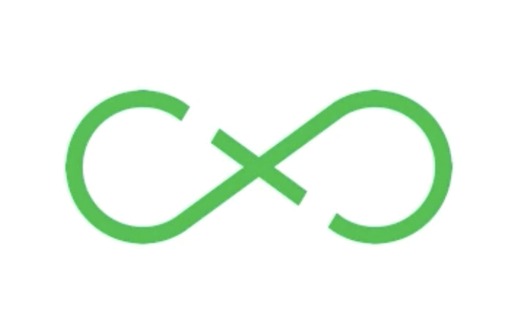

.hidden[
  https://medium.com/@sarahelson81/choosing-the-right-javascript-framework-in-2018-ca09a79a8af3
  https://medium.com/@ZombieCodeKill/choosing-a-javascript-framework-535745d0ab90
  https://medium.freecodecamp.org/a-real-world-comparison-of-front-end-frameworks-with-benchmarks-2018-update-e5760fb4a962
  https://developers.google.com/web/tools/lighthouse/audits/first-meaningful-paint
  https://www.youtube.com/watch?v=TRrL5j3MIvo&list=PLwlRaq9jfxEdPxd2ZgvZNlVHA51s0AFGq&index=17
]

.center.icon[]

---

class: white
background-image: url(assets/title.svg)
.top.icon[]

# Modern JavaScript Frameworks
## Summary
### Александр Коржиков

---

class: top white
background-image: url(assets/sound.svg)
.top.icon[]

.sound-top[
  # Как меня слышно и видно?
]

.sound-bottom[
  ## > Напишите в чат
  ### **+** если все хорошо
  ### **–** если есть проблемы cо звуком или с видео
]

---

# Changelog

- Даты для консультации по самостоятельной работе - 15 июня?
- Сдача проектной работы и онлайн афте пати - 2 июля?

---

# Docs

- https://vuejs.org/v2/guide/comparison.html <br> Comparison with Other Frameworks

- https://developers.google.com/web/ <br> Web Fundamentals

- https://bitbucket.org/korzio/choosing-frontend-framework-criterias/src/master/

- https://tooling.js.org/

- https://medium.com/dailyjs/a-realworld-comparison-of-front-end-frameworks-2020-4e50655fe4c1

---

# Agenda

- Выделять характеристики проектов и окружения
- Решать задачи выбора и сравнения фреймворков, понимать их преимущства и недостатки

## Темы

- Technologies
- Summary
- Comparison
- Самостоятельный проект

---

# Modern JavaScript Frameworks

.mario.mushroom[]
.mario.castle[]
.mario.mario-final[]

|  |  |  |  |  |
|:-------------:|:-------------:|:-------------:|:-------------:|:-------------:|:-------------:|
|  |  |  | |  |
|  |  |  | | |
|  |  |  
|  |  | |

---

# Missing Technologies

.center.right-code[
  ### Какую бы технологию добавили бы Вы?
  
]

- React Native / NativeScript
- Augmented / Virtual Reality
- A11Y / Styles
- Tools - Lighthouse
- Elm / EmberJS / Aurelia
- GraphQL
- Electron
- Tensorflow

.hidden[
- Node Architecture
- Node Frameworks Overview
]

---

# Вопрос

## Как можно сравнивать технологии?

.center[]

---

# SQuaRE

### Systems and software Quality Requirements and Evaluation

.center[]

*Comprehensive specification and evaluation of the quality of software and software-intensive computer systems is a key factor in ensuring value to stakeholders. This can be achieved by defining the necessary and desired quality characteristics associated with the stakeholders' goals and objectives for the system © ISO 25010*

---

# Functional Suitability

.full-image[]

---

# Technical

### Features

- scaffolding / testing / building projects (CLI)
- state management
- server-side rendering
- styles
...

### Performance efficiency

- size
- performance / speed
...

---

# Size

### of framework or set of libraries

- React+Redux — 156k or 167k with plugins
Angular 1 – 158k minimum, 240k with router, HTTP and animation - system
- Polymer — 222k minimum, 302k (spec compliant)
- Aurelia — 252k minimum, 302k with standard plugin
- Ember — 435k including router
- Angular 2 — 698k minimum, 919k with RxJS, 1023k with RxJS and router and HTTP client

*2016*

---

# Size
### of framework or set of libraries

Name  | Size
:------------- | :-------------
Ember 2.2.0     | 435K
Ember 1.13.8    | 486K
Angular 2       | 566K
Angular 2 + Rx  |    **766K**
Angular 1.4.5   |    143K  
Vue 2.4.2 | 58.8K
Inferno 1.2.2 | 48K
Preact 7.2.0 | **16K**
React 0.14.5 + React DOM |          **133K**
React 0.14.5 + React DOM + Redux |  139K
React 16.2.0 + React DOM | 97.5K

---

# Size

.center.half-image[]

---

# Performance

### First Meaningful Paint 
### https://developers.google.com/web/tools/lighthouse/audits/first-meaningful-paint


.center.half-image[]


---

# Performance

**create rows**: Duration for creating 1000 rows after the page loaded
<br>  
**replace all rows**: Duration for updating all 1000 rows of the table (with 5 warmup iterations)
<br>  
**partial update**: Time to update the text of every 10th row for a table with 10000 rows (with 5 warmup iterations)
<br>  
**select row**: Duration to highlight a row in response to a click on the row. (with 5 warmup iterations)
<br>  
**swap rows**: Time to swap 2 rows on a 1K table. (with 5 warmup iterations)
<br>  
**create many rows**: Duration to create 10,000 rows
<br>  
**startup time**: Duration for loading and parsing the javascript code and rendering the page
<br>  <br>  

https://rawgit.com/krausest/js-framework-benchmark/master/webdriver-ts-results/table.html 

---

# Performance

.right-code.half-image[]

- Compatibility
- Standards compliance
- Browsers Support
- Programming Language

...


---

# Web Standards Usage

- **Aurelia**: HTML, ES 2016, Web Components
- **Polymer**: HTML, ES 2015, Web Components
- **Ember**: HTML, ES 2015
- **Angular**: ES 2016 (TypeScript). Non Compliant: NG2 Markup and Dart
- **AngularJS**: HTML, ES5. Non Compliant: Modules, Dependency Injection
- **React**: ES 2015. Non Compliant: JSX

---

# Usability

- Learning path
- Popularity and community size
- Support
- License

...

### Portability

- Adaptability
- Replaceability

...

---

# Reliability / Security

- *degree to which a system, product or component performs specified functions under specified conditions for a specified period of time*

- maturity
- availability
- recoverability

- *degree to which a product or system protects information and data so that persons or other products or systems have the degree of data access appropriate to their types and levels of authorization*

- confidentiality
- integrity

---

# Maintainability

- Modularity
- Reusability
- Testability
...

### Maintainability Index

*Oman and Hagemeister, Idaho University 1991*

```
MI = MAX(0, (171 - 5.2 * ln(V) - 0.23 * (G) - 16.2 * ln(LOC))*100 / 171)

// V = Halstead Volume
// G = Cyclomatic Complexity
// LOC = count of source Lines Of Code (SLOC)
```

---

# Quality in use model

- **Effectiveness** - accuracy and completeness with which users achieve specified goals
- **Efficiency** - resources expended in relation to the accuracy and completeness with which users achieve goals
- **Satisfaction** - degree to which user needs are satisfied when a product or system is used in a specified context of use
- **Freedom from risk** - degree to which a product or system mitigates the potential risk...
- **Context coverage** - degree to which a product or system can be used...

---

# Questions

- What is the product? 
- What is the app you are going to build?
- Who are the clients?
- What is the codebase?
- Who is the team?

---

# ExtJS Questions

### Before you start work on your next project, ask yourself these four questions

- How can you make your development teams more productive?
- Can you accurately estimate the development effort involved in making long-lived enterprise applications?
- Can your developers easily re-use code across the company's complete application portfolio, regardless of the end-user device or platform?
- Can you accurately predict the long-term maintenance requirements of an application across its entire lifecycle and potential end-point delivery platforms?

---

class: white
background-image: url(assets/title.svg)
.top.icon[]

# Quality Q&A

---

# Личный проект

- Нет времени на раскачку
- Определиться с проектом к следующему занятию
- Описать идею и план исполнения (несколько предложений)
- Месяц самостоятельной работы
- Консультация

---

# Идеи проектов

- Task Runner для создания части Continuous Integration цикла
- Reciept Roulette для управления и рекомендации рецептов
- Elements Dashboard - магазин Web компонент, созданных на одном из библиотек. В приложении можно видеть рейтинг, демонстрацию и документацию зарегистрированных элементов

- NodeJS CLI для решения задач
- `package.json` scripts implementation
- make a Test Framework - `describe(), it()` with prehardcoded TDD design, it even commits when on each phase of TDD
- `bitbucket notebook`
- Chrome extension - disable youtube adverts

[Projects](../project.md)

---

# Защита проекта

- Определиться с датой (не более 5 человек на занятие) и написать в общий канал в slack
- Презентация проекта на 5-10 минут
- Рефлексия об использованой технологии

---

# Modern JavaScript Frameworks

.mario.mushroom[]
.mario.castle[]
.mario.mario-final[]

|  |  |  |  |  |
|:-------------:|:-------------:|:-------------:|:-------------:|:-------------:|:-------------:|
|  |  |  | |  |
|  |  |  | | |
|  |  |  
|  |  | |

---

class: white
background-image: url(assets/title.svg)
.top.icon[]

# Спасибо!
# Удачи!
