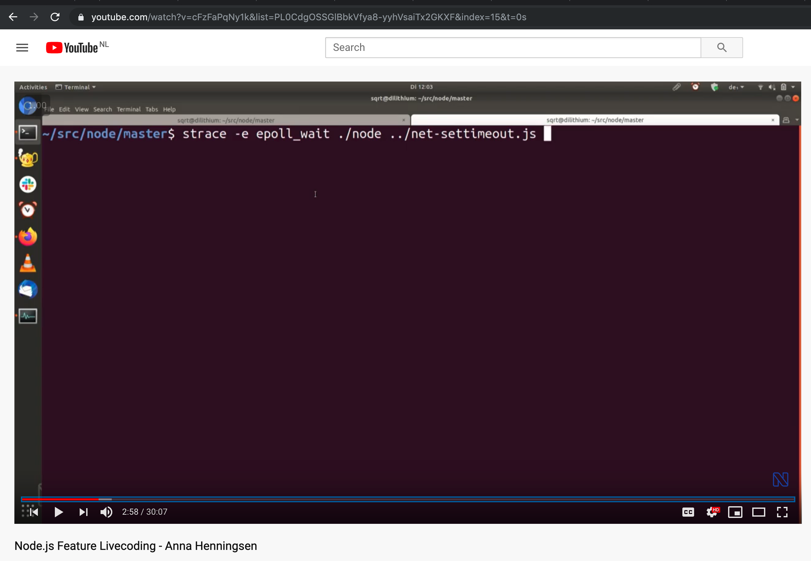
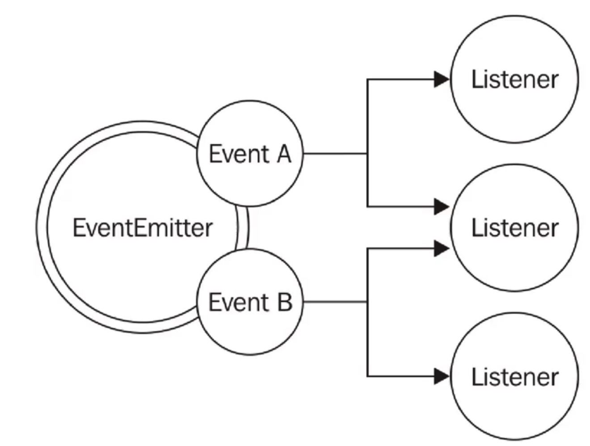
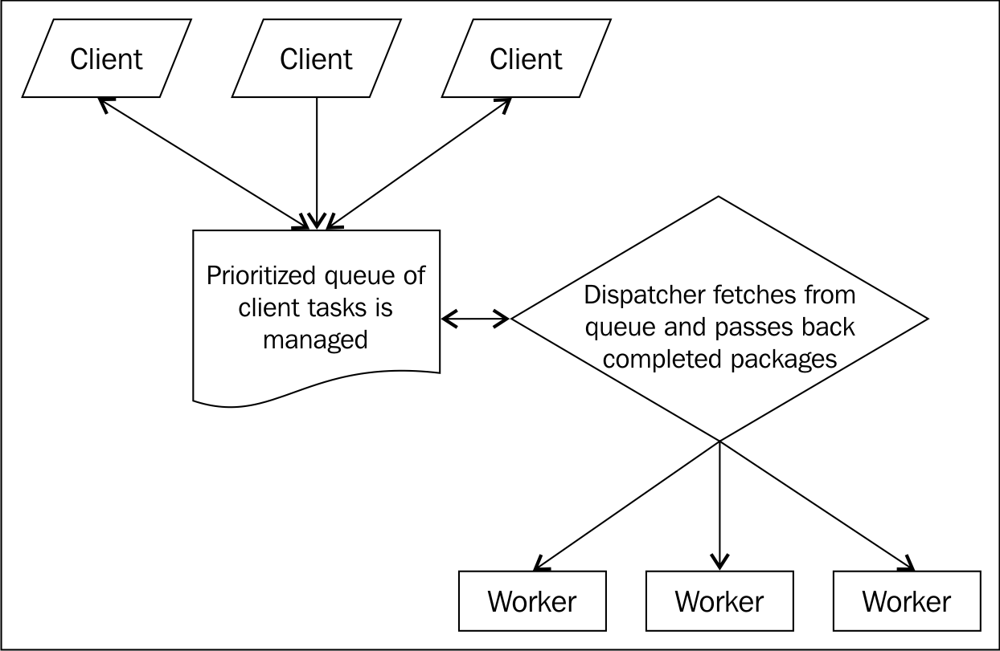

.center.icon[]

.hidden[
  - [Event-driven programming](http://www.princeton.edu/~achaney/tmve/wiki100k/docs/Event-driven_programming.html)
  
  Сегодня говорим о Event Loop
  An Introduction to libuv - http://nikhilm.github.io/uvbook/basics.html#event-loops
  
  [LXJS 2012 - Bert Belder - libuv](https://www.youtube.com/watch?v=nGn60vDSxQ4)
  
  /Users/RD25XO/Developer/experiments/notes/otus/node/event-loop/2016 Node Interactive.pdf
  https://drive.google.com/file/d/0B1ENiZwmJ_J2a09DUmZROV9oSGc/view
  
  https://www.youtube.com/watch?v=PNa9OMajw9w
  
  https://www.pluralsight.com/tech-blog/running-node.js-in-production/
  
  ## Debug Event Loop

  
  
  https://developer.ibm.com/page/2?s=nodejs&orderby=date&order=desc&category_name=&type=tutorials
  
]

---

class: white
background-image: url(assets/title.svg)
.top.icon[]

# Modern JavaScript Frameworks
## Events, Timers, Event Loop
### Александр Коржиков

---

class: top white
background-image: url(assets/sound.svg)
.top.icon[]

.sound-top[
  # Как меня слышно и видно?
]

.sound-bottom[
  ## > Напишите в чат
  ### **+** если все хорошо
  ### **–** если есть проблемы cо звуком или с видео
]

---

# Темы предыдущего занятия

.right-image[]

- Modules
  - Pattern
  - Classic
  - AMD 
  - CommonJS
  - ES Modules
  - Native ES Modules - Gil Tayar

---

# Темы и Цели

- Понимать `Event Loop` и особенности работы `Timers` в окружении `Node`

.right-image[]

- Events
- Event Loop
- Timers

---

# Events

### `Observer` определяет объект `(subject)`, который может сообщать своим подписчискам `(subscribers, listeners)` об изменении своего состояния

.right-code[
- `Observer` - подписка на события и уведомления
- Синхронное исполнение хэндлеров
]

.left-image[
  
]

<br>

```
const EventEmitter = require('events')
class MyEmitter extends EventEmitter {}
const myEmitter = new MyEmitter()
myEmitter.on('event', () => {
  console.log('an event occurred!')
})
myEmitter.emit('event') 
console.log('after')
```

---

# Events

.right-image[
  
]

### Специальные события


- `error` - произошла ошибка
- `newListener` - добавился новый подписчик
- `removeListener` - подписчик удалился 

```
const EventEmitter = require('events')
class MyEmitter extends EventEmitter {}
const myEmitter = new MyEmitter()
myEmitter.emit('error')
```

---

# Events API

- `on(), once(), prependListener()` - подписаться на события
- `emit()` - триггерить событие
- `removeListener()` - удалить подписку
- `listeners()` - вывести список хэндлеров

```
const EventEmitter = require('events')
const myEmitter = new EventEmitter()
myEmitter.on('event', (a, b) => { 
  console.log(a, b, this) 
  // prints a b {}
})

myEmitter.emit('event', 'a', 'b')
```

---

# Вопрос

### Что будет выведено в консоль?


```
const EventEmitter = require('events')

class WithLog extends EventEmitter {
  execute(taskFunc) {
    console.log('Before executing')
    this.emit('begin')
    taskFunc()
    this.emit('end')
    console.log('After executing')
  }
}

const withLog = new WithLog()

withLog.on('begin', () => console.log('About to execute'))
withLog.on('end', () => console.log('Done with execute'))

withLog.execute(() => console.log('*** Executing task ***'))
```

.hidden[
  https://medium.freecodecamp.org/understanding-node-js-event-driven-architecture-223292fcbc2d
]

---

# Вопрос

```
const EventEmitter = require('events')

class MyThing extends EventEmitter {
  constructor() {
    this.emit('thing1')
  }
}

const mt = new MyThing()
mt.on('thing1', function onThing1() {
  console.log('thing1')
})
```

- Что не так с этим кодом?
- Что будет выведено в консоль?
- Как можно исправить?

.hidden[
  https://nodesource.com/blog/understanding-the-nodejs-event-loop/
]

---

class: white
background-image: url(assets/title.svg)
.top.icon[]

# Events Q&A

---

# Event Driven

### Событийно ориентированная парадигма - приложение подписывается на события и исполняют соответствующие функции обработчики
  
.right-image[

]

### Вопрос
### `JavaScript` однопоточный?

---

# Вопрос

### Что будет выведено в консоль?

```
console.log('script start')

setTimeout(function () {
  console.log('setTimeout')
}, 0)

Promise.resolve()
  .then(function () {
    console.log('promise1')
  })
  .then(function () {
    console.log('promise2')
  })
  
console.log('script end')
```

---

# Event Loop

### При старте `Node` инициализируется `Event Loop`, исполняется переданный скрипт вместе с синхронными вызовами (`API, setTimeout, process.nextTick`), после чего происходит работа `Event Loop`

```javascript
const http = require('http') 
const hostname = '127.0.0.1'
const port = 3000
const server = http.createServer((req, res) => {
  res.statusCode = 200 
  res.setHeader('Content-Type', 'text/plain') 
  res.end('Hello World\n')
}) 

server.listen(port, hostname, () => {
  console.log(`Server running at http://${hostname}:${port}/`)
})
```

- В чем преимущество?

---

# События

- Файл доступен для чтения
- Время ожидания таймера закончилось
- Что еще?

```
while there are still events to process: 
  e = get the next event if there is a callback associated with e: 
  call the callback
 
while (queue.waitForMessage()) { 
  queue.processNextMessage()
}
```
© libuv

```
let stop = false
setTimeout(() => {
  stop = true
}, 1000)
while (stop === false) {}
```

---

# Patterns


.right-code[
- [`Reactor`](https://en.wikipedia.org/wiki/Reactor_pattern) - ожидание доступа к ресурсу без блокировки программы

- > most worker threads spend their time waiting—for more instructions, a sub-task to complete

]

.half-image[]
.half-image[]


---

# Phases

<!-- Исполнение очереди операций / callbacks на каждой фазе -->

```
   ┌───────────────────────────┐
┌─>│           timers          │ // setTimeout, setInterval
│  └─────────────┬─────────────┘
│  ┌─────────────┴─────────────┐
│  │     pending callbacks     │
│  └─────────────┬─────────────┘
│  ┌─────────────┴─────────────┐
│  │       idle, prepare       │ // system
│  └─────────────┬─────────────┘      ┌───────────────┐
│  ┌─────────────┴─────────────┐      │   incoming:   │
│  │           poll            │<─────┤  connections, │
│  └─────────────┬─────────────┘      │   data, etc.  │
│  ┌─────────────┴─────────────┐      └───────────────┘
│  │           check           │ // setImmediate
│  └─────────────┬─────────────┘
│  ┌─────────────┴─────────────┐
└──┤      close callbacks      │
   └───────────────────────────┘
```

---

# Timers

- `setTimeout(), setInterval()` - как обычно
- `setImmediate()` - специальный таймер, работает в фазе `check`

```
const timeoutObj = setTimeout(() => {
  console.log('timeout')
}, 1500)

const immediateObj = setImmediate(() => {
  console.log('immediate')
})

const intervalObj = setInterval(() => {
  console.log('interval')
}, 500)

clearImmediate(immediateObj)
```

---

# Cancel timers

- `clearTimeout(), clearImmediate(), clearInterval()`
- `ref(), unref()` - установка / отмена таймеров по ссылке

```
const timerObj = setTimeout(() => {
  console.log('will i run?')
}) 

clearTimeout(timerObj)

timerObj.unref() 

setImmediate(() => {
  timerObj.ref()
})
```

---

# nextTick

### "Наиболее быстрое" исполнение асинхронных операций
### **в фазах** `Event Loop`

```
console.log('start')

process.nextTick(() => { 
  console.log('nextTick')
})

console.log('scheduled')

// start
// scheduled
// nextTick
```

### Как это продемонстрировать?

---

# 3rd party presentation

- [Node.js](https://otus.ru/media/a9/ec/356-7490-a9ec37.pdf?filename=356.pdf)

- Alexander Lobashev, RaiffeisenBank, 2018, t.me/alobashev

- [РИТ++ 2018](https://youtu.be/TWkkshKU6nQ?t=838)

---

# Timers vs Immediate

### Что будет выведено в консоль?

```
setTimeout(() => { 
  console.log('timeout')
}, 0)
setImmediate(() => { 
  console.log('immediate')
})
```

### А здесь?

```
const fs = require('fs')
fs.readFile(__filename, () => { 
  setTimeout(() => { console.log('timeout') }, 0) 
  setImmediate(() => { console.log('immediate') })
})
```

---

# Вопрос

### Что будет выведено в консоль?

```
const fs = require('fs')
setTimeout(() => console.log('timeout'))
setImmediate(() => console.log('immediate'))
fs.readFile('./events.js', () => console.log('fs'))
```

### А здесь?

```
const fs = require('fs')
fs.readFile('./events.js', () => { 
  console.log('fs') 
  setTimeout(() => console.log('timeout')) 
  setImmediate(() => console.log('immediate'))
})
```

---

# Вопрос

### Что будет выведено в консоль?

```js
const fs = require('fs')

setTimeout(() => console.log('timeout out'))
setImmediate(() => console.log('immediate out'))

fs.readFile('./events.js', (err, data) => {
  console.log('fs')
  process.nextTick(() => console.log('next in'))
  setTimeout(() => console.log('timeout in'))
  setImmediate(() => console.log('immediate in'))
})

const next = () => {
  console.log('next')
  // process.nextTick(next)
}

process.nextTick(next)
```

---

# Вопрос

- Is event loop a part of libuv or v8?
- Is event queue a part of event loop? are event queue generated by libuv or v8 engine or event loop itself?
- What is the connection between libuv and v8 engine?
- If event loop is single threaded, does libuv come into picture to create multiple threads to handle File I/O?
- Does browsers have event loop mechanism or just Node.js does?

.left[
*(c) https://stackoverflow.com/questions/49811043/relationship-between-event-loop-libuv-and-v8-engine*
]

.center[
  
]


.hidden[
  The event loop is, first and foremost, a high-level concept that's a fundamental part of the JavaScript programming model. Practically, every V8 embedder needs to implement an event loop. V8 provides a default implementation, which embedders can replace or extend.

I don't understand the question. (I guess the answer is "yes", but what's the difference between "event loop" and "event queue"?)

None. (Except that Node.js uses both.)

Yes, the event loop is single-threaded.

Yes, browsers have an event loop too (see question 1).
]

---

# Test your understanding

https://developer.ibm.com/tutorials/learn-nodejs-the-event-loop/#answers-to-multiple-choice-questions

### [История про падающий скрипт](https://github.com/karma-runner/karma/blob/master/lib/server.js#L74)

---

# Docs

- [The Node.js Event Loop, Timers, and process.nextTick()](https://nodejs.org/en/docs/guides/event-loop-timers-and-nexttick/)

- [Jake Archibald - Tasks, microtasks, queues and schedules](https://jakearchibald.com/2015/tasks-microtasks-queues-and-schedules/) 

- [The Node.js Event Loop: Not So Single Threaded](https://www.youtube.com/watch?v=zphcsoSJMvM)

- [LXJS 2012 - Bert Belder - libuv](https://www.youtube.com/watch?v=nGn60vDSxQ4)

- [A Short Introduction to Node.js Event Loop - youtube](https://www.youtube.com/watch?v=tEQafbkx09I)

- [A Short Introduction to Node.js Event Loop - medium](https://medium.com/@korzio/a-short-introduction-to-node-js-event-loop-558f6f2c2af7?source=friends_link&sk=d0e5ab9eb21c5d73db4e736241ef9ed8)


---

# Modern JavaScript Frameworks

.mario.mario-12[]
<!-- .mario.mushroom[] -->

|  |  |  |  |  |  |
|:-------------:|:-------------:|:-------------:|:-------------:|:-------------:|:-------------:|
|  |  |  | |  |  |
|  |  |  | |  | |
|  |  |  |

---

# На занятии

- Познакомились с понятием Event Loop 
- Разобрали особенности работы Events, Timers и nextTick

---

# Самостоятельная работа

### Напишите скрипт `tree` для вывода списка файлов и папок файловой системы. 

.left-code[
```
foo/ 
├── bar/ 
│├── bar1.txt
│├── bar2.txt 
│└── baz/ 
├── f1.txt 
└── f2.txt
```
]

.right-code[
```js
{
  "files": [
    "foo/f1.txt",
    "foo/f2.txt",
    "foo/bar/bar1.txt",
    "foo/bar/bar2.txt"
  ],
  "dirs": [
    "foo",
    "foo/bar",
    "foo/bar/baz"
  ]
}
```
]

---

class: white
background-image: url(assets/title.svg)
.top.icon[]

# Спасибо за внимание!
.black[ 
## Пожалуйста, пройдите [опрос](https://otus.ru/polls/9780/)
## в личном кабинете 
]

- Все ли темы были понятны? (да - нет)
- Легкий материал или нет? (1 просто - 10 сложно)