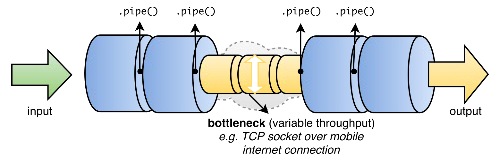
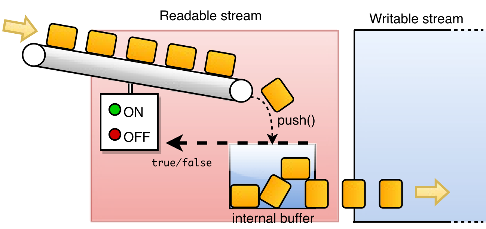
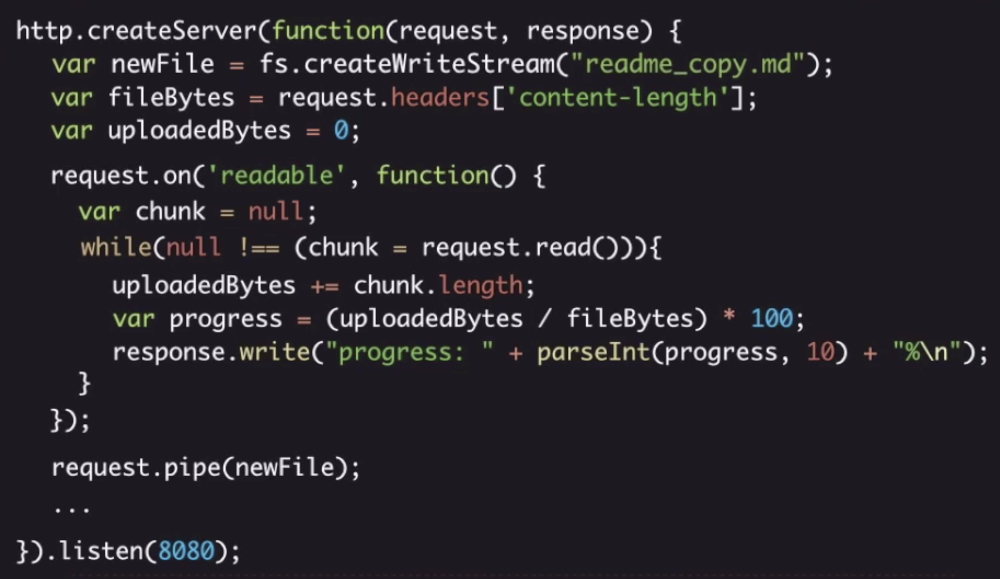

.hidden[
  https://r.va.gg/2014/06/why-i-dont-use-nodes-core-stream-module.html
  https://nodejs.org/en/docs/guides/backpressuring-in-streams/
]

.center.icon[]

---

class: white
background-image: url(assets/title.svg)
.top.icon[]

# Modern JavaScript Frameworks
## Streams, Errors
### Александр Коржиков

---

class: top white
background-image: url(assets/sound.svg)
.top.icon[]

.sound-top[
  # Как меня слышно и видно?
]

.sound-bottom[
  ## > Напишите в чат
  ### **+** если все хорошо
  ### **–** если есть проблемы cо звуком или с видео
]

---

# Темы предыдущего занятия

.right-image[]

- Events
  - EventEmitter
- Event Loop
- Timers
  - `setTimeout()`
  - `setInterval()`
  - `process.nextTick()`
  - `setImmediate()`

---

# Темы и Цели

.right-image[]

- Streams
  - Примеры и типы потоков
  - API
  - Pipe
  - Iterable Streams
- Errors 
  - Стандартные ошибки
  - Способы обработки ошибок

- > Использовать классы, объекты и функции стандартной библиотеки модуля `Streams`
- > Работать с ошибками при написании серверного `JavaScript` кода

---

# Streams

### Абстрактный интерфейс для работы с потоками данных

```
const stream = require('stream')
```

- Что является потоком в `Node`?
- Для чего нужны потоки?

.center[

]

---

# Примеры потоков

- Объекты `request`, `response` HTTP сервера

```
const server = http.createServer((req, res) => {
  res.statusCode = 200 
  res.end()
})
```

- Стандартные потоки ввода-вывода `process.stdin`, `process.stdout`

```
process.stdin.setEncoding('utf8')
process.stdin.on('readable', () => { 
  const chunk = process.stdin.read()
  // ...
})
 
process.stdout.write('end')
// console.log('end')
```

---

# Types of Streams

- Readable - для чтения
- Writable - для записи
- Duplex - комбинация
- Transform - модификация данных
- [PassThrough](https://gist.github.com/bowin/e18dd9afdbac597507d92b489fb0f4f7) - простейший Transform

.right-image[]

> Transform streams are Duplex streams where the output is in some way related to the input 

🤔

.hidden[
  passthrough https://gist.github.com/bowin/e18dd9afdbac597507d92b489fb0f4f7
]

---

# Readable API

Streams являются `EventEmitter`

- `on('data')`
- `on('readable')`
- `read()` для чтения

```
let body = []
request.on('data', (chunk) => { 
  body.push(chunk)
})
.on('end', () => { 
  body = Buffer.concat(body).toString()
})
```

---

# Writable API

Является `EventEmitter`

- `write()`, `end()` для Writable

```
response.write('<html>')
response.write('<body>')
response.write('<h1>Hello, World!</h1>')
response.write('</body>')
response.write('</html>')
response.end()
```

---

# HTTP Server

```
const http = require('http')
http.createServer((request, response) => {
  const { headers, method, url } = request
  let body = [] 
  
  request.on('data', (chunk) => {
    body.push(chunk)
  })
  .on('end', () => {
    body = Buffer.concat(body).toString() 
    response.statusCode = 200 
    response.setHeader('Content-Type', 'application/json') 
    const responseBody = { headers, method, url, body }
    response.write(JSON.stringify(responseBody)) 
    response.end()
  })
})
.listen(8080)
```

- Что можно добавить?

---

# Задача

Использовать стандартные потоки `process.stdin`, `process.stdout` для ввода имени из командной строки

```bash
node index.js

enter your name
Alex
your name is Alex
```

```
http.createServer((request, response) => {
  request.on('data', () => {
    /* ... */
  })
  .on('end', () => {
    response.write(/* ... */) 
    response.end()
  })
})
```

---

# Объекты аргументы

.hidden[
  https://medium.freecodecamp.org/do-you-want-a-better-understanding-of-buffer-in-node-js-check-this-out-2e29de2968e8
]

- `Buffer, String` стандартно
- `Object` опционально с `objectMode`

```
const stream = require('stream')
const readable = (function() { 
  const data = [] 
  const $ = new stream.Readable({ objectMode: true, read() {} }) 
  $.push({ a: 1 }) 
  return $
})()

readable.on('data', (data) => { 
  console.log(data)
})
```

---

# Создание потоков

- `new Writable()` - конструктор
- `class MyWritable extends Writable` - класс

```
const stream = require('stream')
const writable = (function(){ 
  const data = [] 
  const $ = new stream.Writable({ 
    write(chunk, encoding, callback) { 
      data.push(chunk.toString()) 
      callback() 
    } 
  }) 
  return $
})()

writable.write('some data')
writable.end('done writing data')
writable.on('finish', () => { 
  console.log('All writes are now complete.')
})
```

---

# Pipe

`Readable.pipe()` связывает поток, передавая все данные в `Writable`

```
readable.on('data', (chunk) => { 
  writable.write(chunk)
})

readable.on('end', () => { 
  writable.end()
})
// -> 
readable.pipe(writable)
```

.half-image[]

---

# Buffering


- `highWaterMark` - размер буфера
- `writable.write()` - `true / false`
- `drain` - событие продолжения

.half-image[]

---

# Задача

Использовать стандартные потоки и `pipe` для вывода вводимых данных

```bash
node index.js

abc
abc
123
123
```

---

# finished()

### Удобный способ подписаться на завершение потока

```js
const finished = util.promisify(stream.finished)
const rs = fs.createReadStream('archive.tar')

async function run() {
  await finished(rs)
  console.log('Stream is done reading.')
}

run().catch(console.error)
rs.resume()
```

---

# pipeline()

### Удобный способ скомбинировать pipe и дождаться завершения потоков

```js
const pipeline = util.promisify(stream.pipeline)

async function run() {
  await pipeline(
    fs.createReadStream('archive.tar'),
    zlib.createGzip(),
    fs.createWriteStream('archive.tar.gz')
  )
  console.log('Pipeline succeeded.')
}

run().catch(console.error)
```


---

class: center

## Async Patterns

---

# Async Patterns

.right-image[
  
]

- `Callback`
- `Promise`
- Async / Await
- Generator / Iterator
- `Observable`

---

# Iterators

```
const iterable = {
 [Symbol.iterator]() {
   let step = 0
   const iterator = {
     next() {
       if (step <= 2) {
         step++
       }
       switch (step) {
         case 1:
           return { value: 'hello', done: false }
         case 2:
           return { value: 'world', done: false }
         default:
           return { value: undefined, done: true }
       }
     }
   }
   return iterator
 }
}
```

- Как можно итерироваться?

---

# Iterating

```
const str = 'hi'
const iterator = str[Symbol.iterator]()
iterator.next() // {value: "h", done: false}
iterator.next() // {value: "i", done: false}
iterator.next() // {value: undefined, done: true}
iterator.next() // {value: undefined, done: true}
```

Или

```
for (i of iterable) {
  console.log(i)
}
```

.hidden[
- Symbol.iterator()
- iterator factory  
- { next() }
- ({ value, done })

var it = iterable[Symbol.iterator]()
for (i of iterable) {
  console.log(i)
}
]

---

# Generator

Специальные функции - генераторы `function*` могут останавливать свое исполнение с помощью конструкций `yield` и `yield*`, возвращая множества значений

.half-image[
  
]

```
new GeneratorFunction('a', 'yield a * 2') 
```

---

# Пример [iterating async requests](https://gist.github.com/korzio/52774b2cf2281662ca0e6ef4600bf6bd)

```
async function get(n) {
  return new Promise(r => setTimeout(() => r(n), n * 100))
}

async function* asyncGenerator(arr) {
  let anyResolve

  arr.map(get).forEach(async request => {
    const anyResult = await request
    anyResolve(anyResult)
  })

  while(true) {
    yield await new Promise((resolve) => {
      anyResolve = resolve
    })
  }
}

(async function() {
  for await (let num of asyncGenerator([4, 3, 2, 1, 0])) {
    console.log(num)
  }
})()
```

---

# Iterable Streams
 
### Чтение файлов
 
```
for await (const k of readable) {
  data += k
}

const readStream = fs.createReadStream('./test.txt', { encoding: 'utf8' })

async function print() { 
  for await (const chunk of readStream) {
    console.log(chunk)
  }
}
  
print()
```

---

# Iterable Streams

### Создание потоков

```js
const { Readable } = require('stream')

async function * generate() {
  yield 'a'
  yield 'b'
  yield 'c'
}

const readable = Readable.from(generate())

readable.on('data', (chunk) => {
  console.log(chunk)
})
```

---

# Iterable Streams

### Pipeline на стероидах

```js
const pipeline = util.promisify(stream.pipeline)
const fs = require('fs').promises

async function run() {
  await pipeline(
    fs.createReadStream('lowercase.txt'),
    async function* (source) {
      for await (const chunk of source) {
        yield String(chunk).toUpperCase()
      }
    },
    fs.createWriteStream('uppercase.txt')
  )
  console.log('Pipeline succeeded.')
}

run().catch(console.error)
```

.hidden[
  /Users/RD25XO/Developer/experiments/notes/otus/node/stream/for-await-of.js
]

---

# Задача

### Прочитать и отдать файл на HTTP Server с помощью асинхронных итераторов

```js
const readStream = fs.createReadStream('./test.txt', { encoding: 'utf8' })
```

---

# Пример

.full-image[]

- Что делает этот код?
- Как бы мы могли использовать итераторы в этом примере?

---

class: white
background-image: url(assets/title.svg)
.top.icon[]

# Streams Q&A

---

# Errors

- Стандартные типы ошибок JavaScript
- Системные ошибки при использовании API
- Assertion Errors
- User Errors

---

# Вопрос - Стандартные ошибки

### Что к чему относится?

.left-code[
```
1. EvalError 
2. SyntaxError
3. RangeError
4. ReferenceError
5. TypeError
6. URIError
```
]

.right-code[
```
/*a*/ var a = undefinedVariable
/*b*/ throw new EvalError('error')
/*c*/ decodeURIComponent('%')
/*d*/ eval('hoo bar')
/*e*/ undefined.not()
/*f*/ [].length = 'Wat?'
```
]

---

# Вопрос

Какие способы обработки ошибок вы знаете?

```
require('fs')
  .readdir('not exist', () => { 
    throw new Error('test') 
  })
```

---

# Способы обработки ошибок

- try / catch / finally 
- callback(err, res)
- on('error')
- Promise.reject()

```
try { 
  require('not exist')
} 
catch(e) { 
  debugger
} 
finally { 
  console.log('go on')
}
```

---

# Вопрос

### Что здесь не так?

```
try { 
  require('fs')
    .readdir('not exist', () => { 
      throw new Error('test') 
    })
} catch(e) { 
  console.log('error')
}
```

---

# Создание ошибок

### Конструктор
- .red[new Error(message)]

### Свойства
- error.message
- error.code - строка константа `E_ERROR_TITLE`
- error.stack с .green[Error.captureStackTrace(error)]

---

# Process Events

.right-image[]

### EventEmitter
- .blue['error'] - всегда определять обработчик

### Process
- .blue['uncaughtException'] - возможность последнего слова
- .blue['unhandledRejection'] - необработанные Promise

---

# Demo

С помощью `process.on('uncaughtException')` перехватить и залогировать собственный тип ошибки (без использования конструктора `Error`, но включая стэк)

```bash
node error.js
Error
./errors/error.js:2:9)
    at emitOne (events.js:116:13)
    at process.emit (events.js:211:7)
    at process._fatalException (bootstrap_node.js:374:26)
```

---

# How To Error

- .green[DO] use Promises / async / await with catch() 
- .green[DO] use Error class
- .red[DO NOT] throw 'strings or something'
- .green[DO] use central error handling and logging
- .red[DO NOT] continue with unknown 'uncaughtException'
- .green[DO] 'unhandledRejection' handling

---

class: white
background-image: url(assets/title.svg)
.top.icon[]

# Errors Q&A

---

# Docs


.right-image[]

- [Streams API](https://nodejs.org/api/stream.html)

- [Backpressuring in Streams](https://nodejs.org/en/docs/guides/backpressuring-in-streams/)

- [Why I don't use Node's core 'stream' module - Rod Vagg](https://r.va.gg/2014/06/why-i-dont-use-nodes-core-stream-module.html)

---

# На занятии

- Работали с классами, объектами и функциями стандартной библиотеки модуля `Streams`
- Разобрали примеры обработки ошибок при написании серверного `JavaScript` кода

---

# Modern JavaScript Frameworks

.mario.mario-12[]
<!-- .mario.mushroom[] -->

|  |  |  |  |  |  |
|:-------------:|:-------------:|:-------------:|:-------------:|:-------------:|:-------------:|
|  |  |  | |  |  |
|  |  |  | |  | |
|  |  |  |

---

# Задача

### Отсортировать файл со случайными целыми числами размером 100 МБ, в условиях ограниченной оперативной памяти - 50 МБ. Решение должно быть построено с использованием потоков.

---

class: white
background-image: url(assets/title.svg)
.top.icon[]

# Спасибо за внимание!
.black[ 
## Пожалуйста, пройдите [опрос](https://otus.ru/polls/9781/)
## в личном кабинете 
]