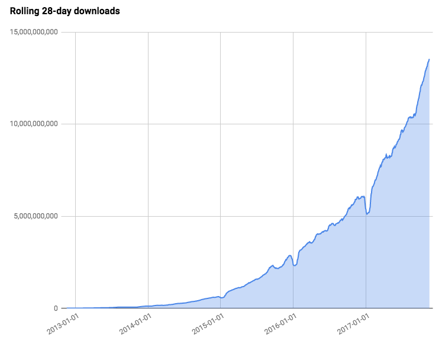

.hidden[
TODO https://blog.npmjs.org/post/617484925547986944/npm-v7-series-introduction?utm_campaign=CLI%20Roadmap&utm_source=hs_email&utm_medium=email&utm_content=87696853&_hsenc=p2ANqtz-9JdDErHfJyor2o5jCcOxL0T5roGsZl_0BSg7xNCjmIj5drc6Vc-jdphfe3brPkOmpcKHMP-llb1f4Hc1JldO4wP3bXiA&_hsmi=87735566

- [Async functions - making promises friendly - Jake Archibald](https://developers.google.com/web/fundamentals/primers/async-functions)
- [Historical document on `Promises` specification](https://promisesaplus.com/)
- https://hackernoon.com/6-reasons-why-javascripts-async-await-blows-promises-away-tutorial-c7ec10518dd9
- https://medium.com/@stevekonves/three-javascript-async-patterns-1d2e7094860a
- https://developer.mozilla.org/en-US/docs/Web/JavaScript/Reference/Global_Objects/Promise
]

.center.icon[]

---

class: white
background-image: url(assets/title.svg)
.top.icon[]

# Modern JavaScript Frameworks
## Введение в Node
### Александр Коржиков

---

class: top white
background-image: url(assets/sound.svg)
.top.icon[]

.sound-top[
  # Как меня слышно и видно?
]

.sound-bottom[
  ## > Напишите в чат
  ### **+** если все хорошо
  ### **–** если есть проблемы cо звуком или с видео
]

---

# Modern JavaScript Frameworks

.mario.mario-1[]

|  |  |  |  |  |  |
|:-------------:|:-------------:|:-------------:|:-------------:|:-------------:|:-------------:|
|  |  |  | |  |  |
|  |  |  | |  | |
|  |  |  |

---

# Темы предыдущего занятия

|  |  |
|:-----------:|:-----------:|
| DOM API | DevTools |
| Events |  |

---

# Цели занятия

- Запускать приложения на платформе `Node`
- Работать с пакетным менеджером `NPM`
- Управлять зависимостями и автоматизировать задачи с помощью `package.json`

---

# Содержание

- Node
  - About
  - Пример Web сервера
.right-image[]
  - Структура
  - Стандартные модули
  - Примеры Callbacks

  

- Пакетный менеджер `npm`
  - Возможности `package.json`
  - CLI

---

# Node

### Асинхронная среда исполнения `JavaScript`, основанная на событийной модели, для создания эффективных сетевых приложений

#### Пример web сервера

```javascript
const http = require('http') 
const hostname = '127.0.0.1'
const port = 3000
const server = http.createServer((req, res) => {
  res.statusCode = 200 
  res.setHeader('Content-Type', 'text/plain') 
  res.end('Hello World\n')
}) 

server.listen(port, hostname, () => {
  console.log(`Server running at http://${hostname}:${port}/`)
})
```

```bash
node server.js
```

- Какие особенности Вы бы отметили из этого примера?

---

# Особенности

- Исполнение `JavaScript` файлов с помощью комманды node 
  
  - REPL

- `CommonJS` формат модулей для загрузки зависимостей
  
  - `ES Modules`

.right-image[
  
]

- Стандартная библиотека модулей

- API основанное на асинхронном паттерне Callbacks

- [`ES2015` синтаксис](http://node.green/)

- Демо (VSCode + [Chrome Debug](chrome://inspect))

.hidden[
  node --inspect-brk simple.js
]

---

# История

.right-image[
  
]

- *Server side `JavaScript` Platform* - Ryan Dahl, 2009

- Asyncronous (non-blocking) I/O

- Chromium `JavaScript` Engine -> V8

- **Node.js** Foundation

---

# Структура

- Библиотека написана на `C++` и `JavaScript` 

- `V8` - платформа исполнения `JavaScript` от Google (Chromium, Chrome, Opera, Brave, Yandex Browser)

- Event Loop - асинхронный событийный цикл с `libuv`

- Модули для работы с операционной системой

.right-image[
  
]

### Patterns

- Callback
- Observer
- Module
- Reactor

---

# Задача

Установить node и npm
https://nodejs.org/en/download/

```bash
node --version
npm --version
```

Создать и запустить `server.js`

```
echo "console.log(process.argv)" > server.js
```

```bash
node server hello world
```

### Лучше использовать [`Node Version Manager (nvm)`](https://github.com/nvm-sh/nvm)

---

# Вопрос

### А Вы знаете какие модули включены в стандартный дистрибутив `Node`?

<br>

.center[
  
]

---

# Стандартные модули

.right-code[
- **Protocols**
  - http(s)
  - net
  - dns
- **System**
  - os
  - v8
  - async_hooks 
  - perf_hooks
  - trace_events
]
- **Main**
  - fs
  - timers
  - streams  
- **Utilities**
  - path
  - util
  - zlib
  - crypto
- **Processes**
  - child_process
  - cluster
  - worker_threads

---

# Utilities

```
const querystring = require('querystring')

querystring.parse(`q=shell+ls+regex&
rlz=1C5CHFA_enNL772ED772&
oq=shell+ls+by+reg&
aqs=chrome.1.63i27j0a4.4221e0b9&
sourceid=chrome&ie=UTF-8
`)

{
  "q": "shell ls regex",
  "rlz": "1C5CHFA_enNL772ED772",
  "oq": "shell ls by reg",
  "aqs": "chrome.1.63i27j0a4.4221e0b9",
  "sourceid": "chrome",
  "ie": "UTF-8"
}
```

- querystring

---

# Utilities

```
const path = require('path')

path.join('/Users', 'alex', 'Sites')
// =>
'/Users/alex/Sites'

path.parse('/home/user/dir/file.txt')

{
  root: '/',
  dir: '/home/user/dir',
  base: 'file.txt',
  ext: '.txt',
  name: 'file'
}
```

- querystring
- path

---

# Utilities

```javascript
const url = require('url')
url.parse('https://github.com/korzio')

// Url 
{
  protocol: 'https:',
  slashes: true,
  auth: null,
  host: 'github.com',
  port: null,
  hostname: 'github.com',
  hash: null,
  search: null,
  query: null,
  pathname: '/korzio',
  path: '/korzio',
  href: 'https://github.com/korzio' 
}
```

- querystring
- path
- url

---

# Utilities

```javascript
const util = require('util')
const assert = require('assert')

util.types.isDate(value)
// or deprecated
util.isDate(value)
// or inherit
util.inherits(MyStream, EventEmitter)

assert.equal(1, 1)
assert.deepEqual({ a: 1 }, { a: 1 })
```

- querystring
- path
- url
- util
- assert

---

# Callbacks

Функция, переданная в качестве аргумента коду, который предполагает исполнить его в какой-то момент времени. Исполнение может быть **синхронным** или **асинхронным**.

```javascript
const server = http.createServer((req, res) => {
  res.statusCode = 200
  res.setHeader('Content-Type', 'text/plain')
  res.end('Hello World\n')
})

server.listen(port, hostname, () => {
  console.log(`Server running at http://${hostname}:${port}/`)
})
```

В `Node` по умолчанию **callback** выполняется с "ошибкой" и результатом `асинхронно`

```
fs.readFile('/etc/passwd', (err, data) => {
  if (err) throw err
  console.log(data)
})
```

---

# Задача

Создать простой веб сервер

```js
const http = require('http') 
const server = http.createServer((req, res) => {
  res.statusCode = 200
  res.setHeader('Content-Type', 'text/plain')
  res.end('Hello World\n')
})
```

Прочитать локальный `html` файл

```js
const fs = require('fs')
fs.readFile('./index.html', (err, text) => {
  console.log(text)
})
```

Отдать с сервера `html` и показать корректно для браузера

---

# Callback Types

#### Только ошибки

```
fs.access('/etc/passwd', fs.constants.R_OK, (err) => {
  console.log(err ? 'no access!' : 'read')
})
```

#### `Node` поддерживает `Promises`

```
util.promisify()
fs.promises.*
```

#### Тип возвращаемого значения

```
http.request('https://example.com', (error, response, body) => {
  ...
})
``` 

---

# Question

- Какие примеры `callback` паттерна в `JavaScript` Вы знаете?
- Вы знакомы с `promisify` функционалом?
- Есть ли разница между `Promise` и `Callback` паттернами?

<br>

.center[
  
]


---

# Anti-Pattern - http://callbackhell.com/

```
fs.readdir(source, function (err, files) {
  if (err) {
    console.log('Error finding files: ' + err)
  } else {
    files.forEach(function (filename, fileIndex) {
      console.log(filename)
      gm(source + filename).size(function (err, values) {
        if (err) {
          console.log('Error identifying file size: ' + err)
        } else {
          console.log(filename + ' : ' + values)
          aspect = (values.width / values.height)
          widths.forEach(function (width, widthIndex) {
            height = Math.round(width / aspect)
            console.log('resizing ' + filename + 'to ' + height + 'x' + height)
            this.resize(width, height).write(dest + 'w' + width + '_' + filename, function(err) {
              if (err) console.log('Error writing file: ' + err)
            })
          }.bind(this))
        }
      })
    })
  }
})
```

---

# Globals

.right-image[
  
]

- `global` объект - аналог `window`

- объекты `JavaScript`

- *timeouts* почти как в браузере

- `console` 

- `process` репрезентация текущего процесса

---

class: white
background-image: url(assets/title.svg)
.top.icon[]

# Node Q&A

---

# NPM

### Package Manager for JavaScript


- CI

```bash
npm --version
```

- Registry

```bash
npm i
```

- Website https://npmjs.com/ 

---

# В числах


.right-image[
    
]

### Всего зарегистрировано 1,256,923 пакетов

### Скачиваний

- за неделю - 18,759,621,128
- за месяц - 78,285,658,326
- `react` - 8,413,064
- `djv` - 23,330

### **Node** 2017

25,000,000

.right-code[
  
]

*Всего* 1,024,716,169

### *Звезд во Вселенной*

1,000,000,000,000,000,000,000 

---

# package.json

```
{
  "name": "package",
  "description": "",
  "version": "1.0.0",
  "main": "index.js",
  "scripts": {
    "test": "echo \"Error: no test specified\" && exit 1"
  },
  "repository": {
    "type": "git",
    "url": "https://github.com/.../package.git"
  },
  "keywords": [],
  "author": "",
  "license": "ISC",
  "bugs": {
    "url": "https://github.com/.../issues"
  },
  "homepage": "https://github.com/.../package"
}
```

---

# Semantic Versioning

- Спецификация 
https://semver.org/ 

- Калькулятор
https://semver.npmjs.com/ 

```bash
npm install semver
```

| Status | Stage | Version |
|:---|:---|:---|
| First release | New product | 1.0.0 |
| Bug fix | patch | 1.0.1 |
| New Feature | minor | 1.1.1 |
| Breaking change | major | 2.0.0 |

***

- Какие альтернативные нотации версионирования Вы знаете?

---

# CLI


- Основные
  - init
  - install
  - start 
  - test
  - run
  
- Дополнительные
  - ci 
  - npx 

---

# Самостоятельная работа

Создать новый `npm` пакет

```bash
mkdir ... && cd ... 
npm init # read & answer
```

Сохранить зависимость

```bash
npm install --save-dev ... 
# copy & paste package.json > chat
```

Запустить скрипты

```bash
echo "" > server.js # create file
npm start
npm test # npm run test
```

---

# Зависимости

.right-code[
```
  "dependencies": {
    "commander": "^2.7.1",
    "lodash.get": "^4.0.0",
    "lodash.isequal": "^4.0.0",
    "validator": "^9.0.0"
  },
  "devDependencies": {
    "coveralls": "^3.0.0",
    "grunt": "^1.0.1",
    "grunt-browserify": "^5.2.0",
    "grunt-cli": "^1.2.0",
    "grunt-contrib-copy": "^1.0.0",
    "grunt-jscs": "^3.0.1",
    "grunt-lineending": "^1.0.0",
    "jasmine-node": "^1.14.5",
    "jasmine-reporters": "^2.2.1",
    "remapify": "^2.1.0"
  }
```
]

- `dependencies`
  - `devDependencies` разработчика
  
- `--global`
- `node_modules`

.hidden[
  Another great way to speed up installation time is to include all production dependencies in the published module. We can tell npm to bundle them with our module by adding them as bundleDependencies to our package.json:
  "bundleDependencies": [
    "config-chain",
    "nopt",
    "npmlog",
    "opener",
    "osenv",
    "request"
  ],
  Bundling the dependencies reduces the installation time a lot, as we omit all the small HTTP requests for each dependency and their dependencies during installation. With the current npm, installation time is reduced from 20 seconds to 5 seconds for a broadband connection. Bundling the dependencies also makes sure that our package is still installable even if a module was unpublished.
  When we now run npm publish, we will publish a highly optimized version of our package.
  
  https://learning.oreilly.com/library/view/the-cli-book/9781484231777/A456043_1_En_3_Chapter.html
]

---

class: white
background-image: url(assets/title.svg)
.top.icon[]

# NPM Q&A

---

# Docs

### Node core concepts

- https://nodejs.org/api/

- https://nodejs.org/en/docs/guides/ 

### package manager for javascript


- https://docs.npmjs.com/

---

# На занятии

- Запускать приложения на платформе Node
- Использовать NPM для создания, добавления зависимостей и использования скриптов

---

# Самостоятельная работа

- Создать локальный веб сервер `server`, отвечающий на запросы каждые 100ms

- Создать скрипт `request`, принимающий на вход 
  - количество запросов `N`
  - тип запросов - параллельный или последовательный

<br>

### Скрипт `request` должен отправлять `N` последовательных или параллельных `HTTP` запросов к локальному серверу `server`

---

class: white
background-image: url(assets/title.svg)
.top.icon[]

# Спасибо за внимание!
.black[ 
## Пожалуйста, пройдите [опрос](https://otus.ru/polls/9771/)
## в личном кабинете 
]

- Все ли темы были понятны? (да - нет)
- Легкий материал или нет? (1 просто - 10 сложно)
