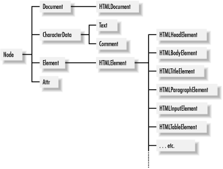
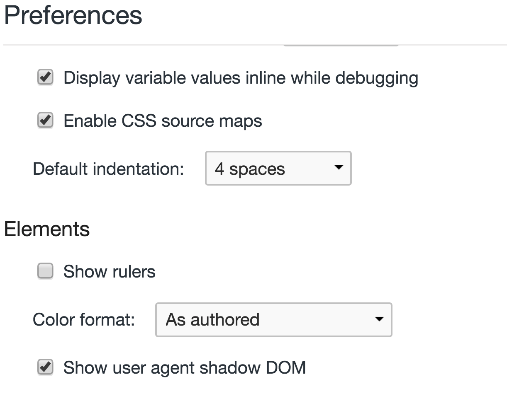
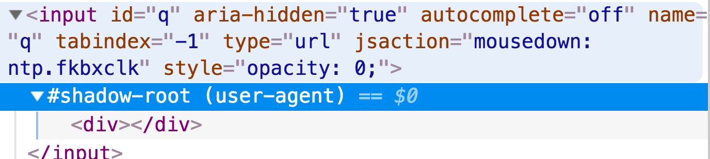
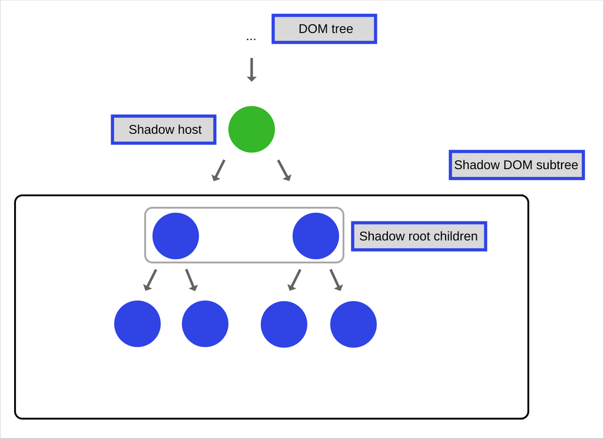

class: title

## Web Components
### .oc-blue-4.ri-twitter-fill[] AlexKorzhikov

.photo[
  
]

.right.bottom[
  ### 23 июля 2020
]

---

class: top white
background-image: url(assets/sound.svg)
.top.icon[]

.sound-top[
  # Как меня слышно и видно?
]

.sound-bottom[
  ## > Напишите в чат
  ### **+** если все хорошо
  ### **–** если есть проблемы cо звуком или с видео
]

---

# Темы предыдущего занятия

.right-image[]

- Unit-тестирование
- TDD
- Mocks
- BDD

### Functional Programming с `JavaScript` 
### -> перенесен

---

# Темы

.right-image[
  
]

- Custom Elements
  - Standalone Elements
  - Built-in Elements
  - LifeCycle Hooks
  
- Shadow DOM
  - DOM
  - Slots
  - Styles

### Цели

- Понимать и работать с веб спецификациями `Custom Elements`, `Shadow DOM`

---

# Custom Elements


### "Custom elements provide a way for authors to build their own fully-featured DOM elements"

### "A custom element is an element that is custom" 🤔

.right[
  © WHATWG
  
  
  
]

---

# Все суть компоненты

### Например, select, input & form

```html
<select>
<option value="1">7</option>
</select>
```

### Что если нам нужен multi-select?

```html
<multi-select>
  <option value="1">8</option>
  <option value="2">13</option>
</multi-select>
```

---

# Пример

```html
<script>
class HelloWorldElement extends HTMLElement {
  connectedCallback() {
    this.textContent = "Hello World"
  }
}
customElements.define('hello-world-element', HelloWorldElement);
</script>
```

### Как использовать?

---

# Декларация

```
customElements.define("flag-icon", FlagIcon) 
// [a-z](PCENChar)* '-' (PCENChar)*

// use createElement
const flagIcon = document.createElement("flag-icon")
flagIcon.country = "jp"
document.body.appendChild(flagIcon)

// use new
const flagIcon = new FlagIcon()
flagIcon.country = "jp"
document.body.appendChild(flagIcon)
// use HTML document 
```

---

# Самостоятельная работа

### Создать `hello-component` элемент, который покажет `alert` на странице

```
class HelloComponent extends HTMLElement { // ?}

// customElements.define ? 

<!-- ? -->
```

### Какое значение у `display hello-component` элемента в `DOM`?

---

# Вопрос

- Сложно ли создать собственный `button`?
- Что для этого нужно сделать?

.center[]

---

# HTMLElement

```
class HelloComponent extends HTMLElement { }
```



---

# Customized Built-in Elements

- `reuse && extend` - встроенное поведение
- `extends && is` - обязательные аттрибуты

```
class PlasticButton extends HTMLButtonElement {
  constructor() {
    super() // ... 
  }
}

customElements.define("plastic-button",
  PlasticButton, { extends: "button" }
)

document.createElement("button", {
  is: "plastic-button"
}) 
```

```html
<button is="plastic-button">Click Me!</button>
```

---

# Демо

### [Создать custom label для активации ссылки](/Users/RD25XO/Developer/experiments/notes/otus/polymer/2/label.html)

- Напоминает что-нибудь?
- Что бы Вы предложили реализовать для примера `customized built-in elements`?

---

# CustomElementRegistry

.right-image[
  
]

- `window.customElements` - registry instance
- `define()`
- `get()`
- `whenDefined()`
- `upgrade()`

### Что будет, если декларировать `custom element` после его создания?

---

# Flow

```html
<example-element></example-element>
```

```
const inDocument = document.querySelector('example-element')
const outOfDocument = document.createElement('example-element')

console.assert(inDocument instanceof HTMLElement)
console.assert(outOfDocument instanceof HTMLElement)

class ExampleElement extends HTMLElement {}
customElements.define('example-element', ExampleElement)

console.assert(inDocument instanceof ExampleElement)
console.assert(!(outOfDocument instanceof ExampleElement))

// upgraded
document.body.appendChild(outOfDocument)
console.assert(outOfDocument instanceof ExampleElement)
```

---

# LifeCycle

.right-image[
  
]

- `constructor` (0)
- `attributeChangedCallback` (1) <= static `observedAttributes()`
- `connectedCallback` (2) - `DOM`
- `disconnectedCallback` (N) - `DOM`
- `adoptedCallback` (?) => "new document"

---

#  Attribute Change

```
class HelloWorldElement extends HTMLElement {
  static get observedAttributes() {
    return ['name']
  }
  attributeChangedCallback(name, oldValue, newValue) {
    this._name = newValue
  }
  connectedCallback() {
    this.name = this.getAttribute('name') || 'World'
  }
  get name() {
    return this._name
  }
  set name(name) {
    this.setAttribute('name', name)
    this.render()
  }
  render() {
    this.textContent = `Hello ${this.name}`
  }
}
```

---

# [Самостоятельная работа](/Users/RD25XO/Developer/experiments/notes/otus/polymer/2/lifecycle.html)

### Убедиться что [все хуки](https://jsfiddle.net/n5kyou86/1/) исполнились (с помощью консоли и ...?)

- `connectedCallback`
- `disconnectedCallback`
- `attributeChangedCallback`
- `adoptedCallback`
- `constructor`

.hidden[
  document.implementation.createHTMLDocument("New Document")
]

---

# Features & Requirements

- `Custom Elements` can be upgraded
- call `super()`
- work to be deferred to `connectedCallback()`
- constructor for state, default values, event listeners & shadow root

---

class: center
## Custom Elements
## Q&A

---

# How To

.half-image[
  
  
]

---

# Shadow DOM

### "Shadow DOM fixes CSS and DOM. It introduces scoped styles to the web platform"

### "Shadow DOM removes the brittleness of building web apps"
 
© Eric Bidelman

---
 
# Features

- Isolated DOM - `document.querySelector()` не будет работать
- Composition - компонентный подход
- Scoped CSS - стили не применяются на документ
- Simplifies CSS - можно использовать простые селекторы

.center[
  ### Почти `iframe`!
]

---

# Shadow Definitions

.right-image[]

- Tree - отдельный `DOM`
- Root - `Document Fragment`
- Host - элемент "родитель"
- `mode = 'open' || 'closed'`

```
const host = document.createElement('div')
const shadowRoot = host.attachShadow({ mode: 'open'})
shadowRoot.innerHTML = '<h1>ShadowDOM</h1>'

// host.shadowRoot === shadowRoot
// shadowRoot.host === host
// openOrCloseShadowRoot ?!
```

---

# Shadow DOM

### "...a method of combining multiple DOM trees into one hierarchy and how these trees interact with each other within a document, thus enabling better composition of the DOM"
 
© W3C

```
const host = document.createElement('div')
const shadowRoot = host.attachShadow({
  mode: 'open'
})

shadowRoot.innerHTML = `
  <style>h3{ color: red; }</style>
  <h3>Shadow DOM</h3>
`
```

---

# Slots

### Slots are **placeholders** inside your component that users can fill with their own markup

```html
<p>
  <slot name="my-text">default</slot>
</p>

<my-paragraph>
  <ul slot="my-text">
    <li>different text</li>
    <li>in a list</li>
  </ul>
</my-paragraph>
```

---

# oh-my-slot

```
customElements.define('oh-my-slot', class extends HTMLElement {
  constructor() {
    super()
    this.attachShadow({
      mode: 'open'
    })
  }
  connectedCallback() {
    this.shadowRoot.innerHTML = `My Element
      <slot name="title">Default</slot>
      <slot>Default</slot>`
  }
})
```

```html
<oh-my-slot>
  <h1 slot="title">Title</h1>
  <pre>Code</pre>
</oh-my-slot>
```

---

# [3 DOMs](/Users/RD25XO/Developer/experiments/notes/otus/polymer/2/slot.html)

.right-image[]

- Light - пользователя
- Shadow - разработчика
- Flattened - результат 


```
this.shadowRoot.innerHTML = `My Element
  <slot name="title">Default</slot>
  <slot>Default</slot>`
```

```html
<oh-my-slot>
  <h1 slot="title">Title</h1>
  <pre>Code</pre>
</oh-my-slot>
```

---

# Styles

### Shadow DOM позволяет описывать изолированные стили

```html
#shadow-root
<style>
  #tabs {
    display: inline-flex;
    ...
  }
</style>
<div id="tabs">
  ...
</div>
```

---

# Features

- CSS селекторы внутри Shadow DOM применяются локально
- CSS селекторы снаружи не применяются к компоненту

```html
#shadow-root
 <style>
 :host {
 display: block; 
/* by default, custom elements are display: inline */
/* :host(.blue) {color: blue;} */
 }
 </style>
```

- `:host` позволяет описывать стили применяемые к компоненте

- Снаружи `host` приоритетнее

- `:host-context()` для контекста

---

# [Demo](/Users/RD25XO/Developer/experiments/notes/otus/polymer/3/shadow-dom styles.html)

- Использовать локальный `style` для нового `Custom Element`
- Переопределить стиль `host` элемента снаружи (`color` или `background`)

---

# CSS custom properties (variables)

```css
element { --main-bg-color: brown;}

element { background-color: var(--main-bg-color);}
element { color: var(--my-var, red);}
```

- Inherited
(можно определить на элементе host)
- Fallback
(можно задать стандартное значение)

---

# Custom styling

.right-code[
```css
::slotted(h1) {
  color: red;
}

@keyframes foo {
  from {
    color: red;
  }
  to {
    color: blue;
  }
  @apply --not-a-style-rule;
}
```
]

- `:defined` - известные элементы
- `::slotted`

- Deprecated  
  - @apply (CSS Mixins)
  - ::content
  - ::shadow/deep/ 
  
---

# [CSS Shadow Parts](https://www.youtube.com/watch?v=yVrvOueeb3s)

```html
<template id="tabbed-custom-element">
  <div part="tab active">Tab 1</div> 
  <div part="tab">Tab 2</div> 
  <div part="tab">Tab 3</div>
</template>

<tabbed-custom-element></tabbed-custom-element>
```

- `parts, exportparts`
- `custom-element::part(foo) {}`
- `::part(part)`

---


# Docs

- [Статьи про Web Components](https://medium.com/@korzio/introduction-to-web-components-part-i-custom-elements-4de6713cef9d?source=friends_link&sk=d65a551d54c061251dbc05c2fc0560fe)

- [WHATWG Specification](https://html.spec.whatwg.org/multipage/custom-elements.html)

- [Polymer Guide](https://www.polymer-project.org/3.0/docs/devguide/custom-elements)

- [Google I/O 2014 - Polymer and Web Components change everything you know about Web development](https://www.youtube.com/watch?v=8OJ7ih8EE7s)

- [Web Components - MDN](https://developer.mozilla.org/en-US/docs/Web/Web_Components)

- [How JavaScript works: the internals of Shadow DOM + how to build self-contained components](https://blog.sessionstack.com/how-javascript-works-the-internals-of-shadow-dom-how-to-build-self-contained-components-244331c4de6e)

### На занятии

- Разобрали веб спецификацию `Custom Elements`, `Shadow DOM`

---

# Modern JavaScript Frameworks

.mario.mario-10[]

|  |  |  |  |  |  |
|:-------------:|:-------------:|:-------------:|:-------------:|:-------------:|:-------------:|
|  |  |  | |  |  |
|  |  |  | |  | |
|  |  |  |

---

# Самостоятельная работа


---

class: title

## Спасибо за внимание!
### Пожалуйста, пройдите [**опрос**](https://otus.ru/polls/12711/) в личном кабинете

.right.bottom[
  ### 23 июля 2020
]
