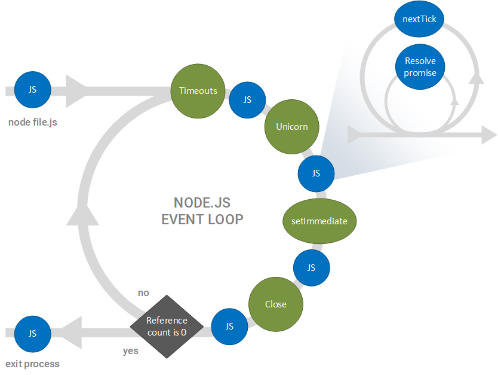
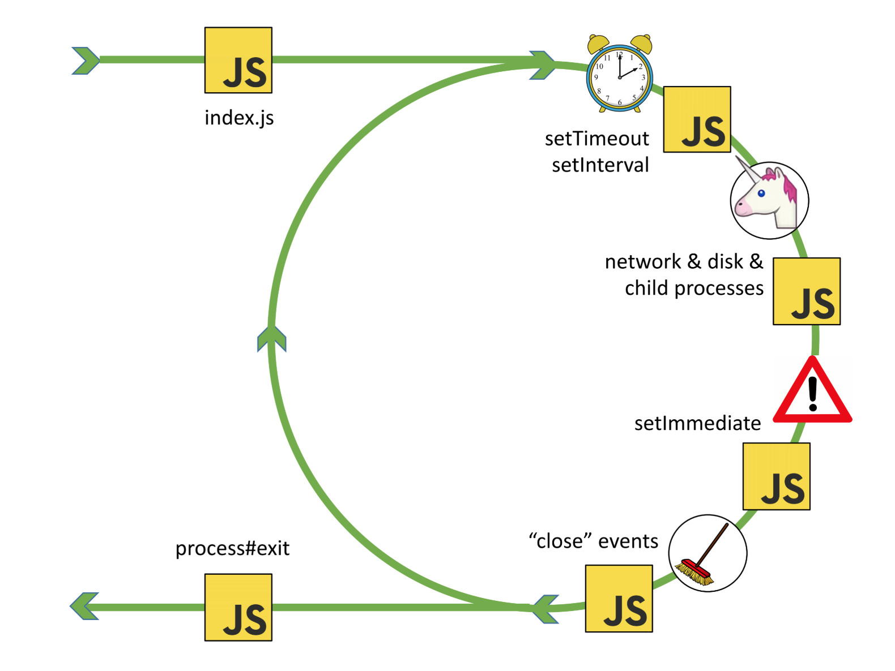

class: title

## Events, Timers, Event Loop
### .oc-blue-4.ri-twitter-fill[] AlexKorzhikov

.photo[
  
]

.right.bottom[
  ### 13 января 2022
]

.hidden[


  - [Event-driven programming](http://www.princeton.edu/~achaney/tmve/wiki100k/docs/Event-driven_programming.html)

  Сегодня говорим о Event Loop
  An Introduction to libuv - http://nikhilm.github.io/uvbook/basics.html#event-loops

  [LXJS 2012 - Bert Belder - libuv](https://www.youtube.com/watch?v=nGn60vDSxQ4)

  /Users/RD25XO/Developer/experiments/notes/otus/node/event-loop/2016 Node Interactive.pdf
  https://drive.google.com/file/d/0B1ENiZwmJ_J2a09DUmZROV9oSGc/view

  https://www.youtube.com/watch?v=PNa9OMajw9w

  https://www.pluralsight.com/tech-blog/running-node.js-in-production/

  ## Debug Event Loop

  

  https://developer.ibm.com/page/2?s=nodejs&orderby=date&order=desc&category_name=&type=tutorials

]

---

class: top white
background-image: url(assets/sound.svg)
.top.icon[]

.sound-top[
  # Как меня слышно и видно?
]

.sound-bottom[
  ## > Напишите в чат
  ### **+** если все хорошо
  ### **–** если есть проблемы cо звуком или с видео
]

---

# Темы предыдущего занятия

.right-image[]

- Modules
  - Pattern
  - Classic
  - AMD
  - CommonJS
  - ES Modules
  - Native ES Modules - Gil Tayar


### Какие типы зависимостей помните?
### В чем отличия работы ES Modules от CommonJS?
### Как думаете, `yarn` заменит `npm` или нет?
---

# Темы и Цели

.right-image[]

- Понимать `Event Loop` и особенности работы `Timers` в окружении `Node`

.right-image[]

- Events
- Event Loop
- Timers
  - `setTimeout()`
  - `setInterval()`
  - `process.nextTick()`
  - `setImmediate()`

---

# Events

### `Observer` определяет объект `(subject)`, который может сообщать своим подписчискам `(subscribers, listeners)` об изменении своего состояния

.right-code[
- `Observer` - подписка на события и уведомления
- Синхронное исполнение хэндлеров
]

.left-image[
  
]

```js
const EventEmitter = require('events')
class MyEmitter extends EventEmitter {}
const myEmitter = new MyEmitter()
myEmitter.on('event', () => {
  console.log('an event occurred!')
})
myEmitter.emit('event')
console.log('after')
```

---

# Events

.right-image[
  
]

### Специальные события


- `error` - произошла ошибка
- `newListener` - добавился новый подписчик
- `removeListener` - подписчик удалился

```js
const EventEmitter = require('events')
class MyEmitter extends EventEmitter {}
const myEmitter = new MyEmitter()
myEmitter.emit('error')
```

---

# Events API

- `on(), once(), prependListener()` - подписаться на события
- `emit()` - триггерить событие
- `removeListener()` - удалить подписку
- `listeners()` - вывести список хэндлеров

```js
const EventEmitter = require('events')
const myEmitter = new EventEmitter()
myEmitter.on('event', (a, b) => {
  console.log(a, b, this)
  // prints a b {}
})

myEmitter.emit('event', 'a', 'b')
```

---

# Вопрос

### Что будет выведено в консоль?

```js
const EventEmitter = require('events')

class WithLog extends EventEmitter {
  execute(taskFunc) {
    console.log('Before executing')
    this.emit('begin')
    taskFunc()
    this.emit('end')
    console.log('After executing')
  }
}

const withLog = new WithLog()

withLog.on('begin', () => console.log('About to execute'))
withLog.on('end', () => console.log('Done with execute'))

withLog.execute(() => console.log('*** Executing task ***'))
```

.hidden[
  https://medium.freecodecamp.org/understanding-node-js-event-driven-architecture-223292fcbc2d
]

---

# Вопрос

```js
const EventEmitter = require('events')

class MyThing extends EventEmitter {
  constructor() {
    super()
    this.emit('thing1')
  }
}

const mt = new MyThing()
mt.on('thing1', function onThing1() {
  console.log('thing1')
})
```

- Что не так с этим кодом?
- Что будет выведено в консоль?
- Как можно исправить?

.hidden[
  https://nodesource.com/blog/understanding-the-nodejs-event-loop/
]

---

# Задача

### Как реализовать "холодную" подписку на события на JavaScript?

```js
// ColdEmitter - ?
const a = new ColdEmitter()
a.emit('wait')

a.on('wait', () => {
  console.log('still executed')
})
```

.center[
  
]

TODO Homework?

---

# Задача

### Реализовать "холодную" подписку на события на JavaScript


```js
// ColdEmitter - ?
const a = new ColdEmitter()
// 1. сохранить событие 'wait' в внутренней очереди, переопределить emit
// -- структура внутренней очереди может содержать все коллбэки, которые уже были выполнены
// -- { name: 'wait', callbacks: [] } коллбэки вначале пустые
a.emit('wait')

// 2. когда новое событие инициируется, вызывается каждый зарегистрированный коллбэк один раз
// -- сравниваются функции коллбэка события с выполненными
// 3. когда новый коллбэк зарегистрирован для 'wait', коллбэк должен быть вызван
// 4. 'newListener' может помочь проверить, какие коллбэки все еще нужно выполнить
a.on('wait', () => {
  console.log('still executed')
})
```

---

class: qa

## Events Q&A
### ➡️ Event Loop

---

# Event Driven

### Событийно ориентированная парадигма - приложение подписывается на события и исполняют соответствующие функции обработчики

.right-image[

]

### `JavaScript` однопоточный?

---

# Вопрос

### Что будет выведено в консоль?

```js
console.log('script start')

setTimeout(function () {
  console.log('setTimeout')
}, 0)

Promise.resolve()
  .then(function () {
    console.log('promise1')
  })
  .then(function () {
    console.log('promise2')
  })

console.log('script end')
```

---

# Event Loop

### При старте `Node` инициализируется `Event Loop`, исполняется переданный скрипт вместе с синхронными вызовами (`API, setTimeout, process.nextTick`), после чего происходит работа `Event Loop`

```javascript
const http = require('http')
const hostname = '127.0.0.1'
const port = 3000
const server = http.createServer((req, res) => {
  res.statusCode = 200
  res.setHeader('Content-Type', 'text/plain')
  res.end('Hello World\n')
})

server.listen(port, hostname, () => {
  console.log(`Server running at http://${hostname}:${port}/`)
})
```

- В чем преимущество?
- `Event Loop` в браузере ([1](https://www.jsv9000.app/), [2](http://latentflip.com/loupe/))


---

# События

- Файл доступен для чтения
- Время ожидания таймера закончилось
- Что еще?

```
while there are still events to process:
  e = get the next event if there is a callback associated with e:
  call the callback

while (queue.waitForMessage()) {
  queue.processNextMessage()
}
```
© libuv

```js
let stop = false
setTimeout(() => {
  stop = true
}, 1000)
while (stop === false) {}
```

---

# Patterns

.right-code[
- [`Reactor`](https://en.wikipedia.org/wiki/Reactor_pattern) - ожидание доступа к ресурсу без блокировки программы

- > most worker threads spend their time waiting—for more instructions, a sub-task to complete

]

.half-image[]
.half-image[]

---

# Phases

- Исполнение очереди операций / callbacks в каждой фазе

```
   ┌───────────────────────────┐
┌─>│           timers          │ // setTimeout, setInterval
│  └─────────────┬─────────────┘
│  ┌─────────────┴─────────────┐
│  │     pending callbacks     │
│  └─────────────┬─────────────┘
│  ┌─────────────┴─────────────┐
│  │       idle, prepare       │ // system
│  └─────────────┬─────────────┘      ┌───────────────┐
│  ┌─────────────┴─────────────┐      │   incoming:   │
│  │           poll            │<─────┤  connections, │
│  └─────────────┬─────────────┘      │   data, etc.  │
│  ┌─────────────┴─────────────┐      └───────────────┘
│  │           check           │ // setImmediate
│  └─────────────┬─────────────┘
│  ┌─────────────┴─────────────┐
└──┤      close callbacks      │
   └───────────────────────────┘
```

---

# Timers

- `setTimeout(), setInterval()` - как обычно
- `setImmediate()` - специальный таймер, работает в фазе `check`

```
const timeoutObj = setTimeout(() => {
  console.log('timeout')
}, 1500)

const immediateObj = setImmediate(() => {
  console.log('immediate')
})

const intervalObj = setInterval(() => {
  console.log('interval')
}, 500)

clearImmediate(immediateObj)
```

---

# Cancel timers

- `clearTimeout(), clearImmediate(), clearInterval()`
- `ref(), unref()` - установка / отмена таймеров по ссылке

```
const timerObj = setTimeout(() => {
  console.log('will i run?')
})

clearTimeout(timerObj)

timerObj.unref()

setImmediate(() => {
  timerObj.ref()
})
```

---

# nextTick

### "Наиболее быстрое" исполнение асинхронных операций
### **в фазах** `Event Loop`

```
console.log('start')

process.nextTick(() => {
  console.log('nextTick')
})

console.log('scheduled')

// start
// scheduled
// nextTick
```

### Как это продемонстрировать?

---

# 3rd party presentation

- [Node.js](https://cdn.otus.ru/media/private/a9/ec/356-7490-a9ec37.pdf?hash=Ors8hbIBTlPms_WiUfz2rg&expires=1673585045)

- Alexander Lobashev, RaiffeisenBank, 2018, t.me/alobashev

- [РИТ++ 2018](https://youtu.be/TWkkshKU6nQ?t=838)

---

# All Together

.full-image[]

---

# Timers vs Immediate

### Что будет выведено в консоль?

```
setTimeout(() => {
  console.log('timeout')
}, 0)
setImmediate(() => {
  console.log('immediate')
})
```

### А здесь?

```
const fs = require('fs')
fs.readFile(__filename, () => {
  setTimeout(() => { console.log('timeout') }, 0)
  setImmediate(() => { console.log('immediate') })
})
```

---

# Вопрос

### Что будет выведено в консоль?

```
const fs = require('fs')
setTimeout(() => console.log('timeout'))
setImmediate(() => console.log('immediate'))
fs.readFile('./events.js', () => console.log('fs'))
```

### А здесь?

```
const fs = require('fs')
fs.readFile('./events.js', () => {
  console.log('fs')
  setTimeout(() => console.log('timeout'))
  setImmediate(() => console.log('immediate'))
})
```

---

# Вопрос

### Что будет выведено в консоль?

```js
const fs = require('fs')

setTimeout(() => console.log('timeout out'))
setImmediate(() => console.log('immediate out'))

fs.readFile('./events.js', (err, data) => {
  console.log('fs')
  process.nextTick(() => console.log('next in'))
  setTimeout(() => console.log('timeout in'))
  setImmediate(() => console.log('immediate in'))
})

const next = () => {
  console.log('next')
  process.nextTick(next)
}

process.nextTick(next)
```

---

# [UV_THREADPOOL_SIZE](https://nodejs.org/api/cli.html#uv_threadpool_sizesize)

```js
const fs = require('fs');
const crypto = require('crypto')

const start = Date.now();
process.env.UV_THREADPOOL_SIZE = 1

setTimeout(() => console.log('timer 1 expired'), 0)

fs.readFile('text-flie.txt', () => {
  console.log('I/O finished')

  console.log('---------------------------------')
  setTimeout(() => console.log('timer 2 expired'), 0)
  setTimeout(() => console.log('timer 3 expired'), 3000)
  setImmediate(() => console.log('setImmediate 1 is finished'))
  process.nextTick(() => console.log('process.nextTick()'))

  crypto.pbkdf2('mypassword', 'salt', 100000, 1024, 'sha512', () => {
    console.log(Date.now() - start, 'password encrypted')
  })
})

console.log('this is a top-level code')
```

.hidden[
  crypto.pbkdf2('mypassword', 'salt', 100000, 1024, 'sha512', () => {
    console.log(Date.now() - start, 'password encrypted')
  })

  crypto.pbkdf2('mypassword', 'salt', 100000, 1024, 'sha512', () => {
    console.log(Date.now() - start, 'password encrypted')
  })

  crypto.pbkdf2('mypassword', 'salt', 100000, 1024, 'sha512', () => {
    console.log(Date.now() - start, 'password encrypted')
  })
]

---

background-image: linear-gradient(150deg,rgb(142, 81, 208),rgb(174, 132, 207)), url(static/t0.gif)
class: white

# Покажи и расскажи 🙀

1. Блокировка Event Loop с синхронными операциями
2. Есть ли ограничение на количество callbacks в очереди на фазу?
3. Event Loop запускается только после завершения выполнения всей программы
4. Будет ли завершена программа Node.js, если в Event Loop нет коллбэков для обработки?
5. Какой из вариантов правильный?

- Очередь `process.nextTick()` и очередь микрозадач для `Promise` будут выполнены сразу после завершения текущей фазы
- Все коллбэки, переданные в `process.nextTick()`, будут разрешены до продолжения работы `Event Loop`

---

background-image: linear-gradient(150deg,rgb(142, 81, 208),rgb(174, 132, 207)), url(static/t0.gif)
class: white

# [Вопрос](https://stackoverflow.com/questions/49811043/relationship-between-event-loop-libuv-and-v8-engine)

.right-image[[](https://stackoverflow.com/questions/49811043/relationship-between-event-loop-libuv-and-v8-engine*)]


- Является ли `Event Loop` частью `libuv` или `v8`?
- Является ли очередь событий частью `Event Loop`?
- Создается ли очередь событий `libuv` или `v8` runtime или `Event Loop` самим?
- Какая связь между `libuv` и `v8` runtime?
- Если `Event Loop` является однопоточным, то играет ли роль `libuv` в создании нескольких потоков для обработки ввода-вывода файлов?
- Имеют ли [браузеры](https://github.com/atotic/event-loop) механизм `Event Loop` или только `Node.js`?

.hidden[
  The event loop is, first and foremost, a high-level concept that's a fundamental part of the JavaScript programming model. Practically, every V8 embedder needs to implement an event loop. V8 provides a default implementation, which embedders can replace or extend.

I don't understand the question. (I guess the answer is "yes", but what's the difference between "event loop" and "event queue"?)

None. (Except that Node.js uses both.)

Yes, the event loop is single-threaded.

Yes, browsers have an event loop too (see question 1).

https://youtu.be/x9RP-M6q2Mg?t=97


# [Test your understanding](https://developer.ibm.com/tutorials/learn-nodejs-the-event-loop/)

.half-image[]

.hidden[
  https://developer.ibm.com/tutorials/learn-nodejs-the-event-loop/#answers-to-multiple-choice-questions
]

> - Would a Node.js application terminate if the event loop has no callbacks to process?

]

---

# И еще раз об Event Loop

.full-image[
  
]

- "Await" не блокирует Event Loop, докажите это!

.hidden[
```js
const timeout = (time) => {
  return new Promise((resolve, reject) => {
    setTimeout(resolve, time)
  })
}

const randomFn = async () => {
  await timeout(1000)
  console.log(3)
}

console.log(1)

randomFn().then(()=> {
  console.log(2)

  setInterval(() => {
    console.log('here')
  }, 100)
})

```
]

---

# Docs

- [The Node.js Event Loop, Timers, and process.nextTick()](https://nodejs.org/en/docs/guides/event-loop-timers-and-nexttick/)

- [Jake Archibald - Tasks, microtasks, queues and schedules](https://jakearchibald.com/2015/tasks-microtasks-queues-and-schedules/)

- [The Node.js Event Loop: Not So Single Threaded](https://www.youtube.com/watch?v=zphcsoSJMvM)

- [LXJS 2012 - Bert Belder - libuv](https://www.youtube.com/watch?v=nGn60vDSxQ4)

- [A Short Introduction to Node.js Event Loop - youtube](https://www.youtube.com/watch?v=tEQafbkx09I)

- [A Short Introduction to Node.js Event Loop - medium](https://medium.com/@korzio/a-short-introduction-to-node-js-event-loop-558f6f2c2af7?source=friends_link&sk=d0e5ab9eb21c5d73db4e736241ef9ed8)

- [Node.js Event Loop - StackOverflow](https://stackoverflow.com/questions/25568613/node-js-event-loop)

- [A complete guide to the Node.js event loop](https://blog.logrocket.com/a-complete-guide-to-the-node-js-event-loop/)

---

# На занятии

- Познакомились с понятием Event Loop
- Разобрали особенности работы Events, Timers и nextTick

## Рефлексия

- Все ли темы были понятны? (да - нет)
- Легкий материал или нет? (1 просто - 10 сложно)

---

# Самостоятельная работа

.center[]

---

class: title

## Спасибо за внимание!
### Пожалуйста, пройдите [опрос](https://otus.ru/polls/56154/) в личном кабинете

.right.bottom[
  ### 13 января 2022
]
